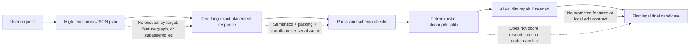
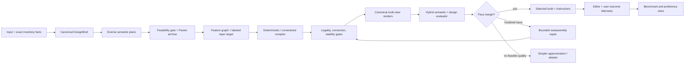

# LEGO Generation Quality Ceiling: Evidence-Backed Diagnosis and Improvement Program

Research date: 2026-07-17
Project: HackThe6ix inventory-constrained LEGO-style generator
Evidence base: live repository inspection, the verified project snapshot, and nine independently researched evidence tracks. External conclusions prioritize direct brick-generation and assembly research; adjacent evidence is used only where direct evidence is incomplete.

## 1. Executive diagnosis

The system has not primarily hit a **legality ceiling** or a proven **17-shape ceiling**. It has hit an **objective, representation, and search ceiling**.

The current pipeline is quite capable of returning schema-valid, inventory-valid, connected stacks. That is exactly what its deterministic feedback measures. It does not independently score whether a result resembles the requested object, realizes the selected suggestion's defining features, has good proportions, uses color intentionally, or looks like a crafted design. A pipeline cannot reliably optimize qualities that never become a selection or repair signal.

The second bottleneck is the transition from intent to geometry. The suggestion flow throws away `inventory_reasoning` and passes only `prompt_metadata`; the structure plan remains mostly prose; and one placement response must simultaneously solve semantic interpretation, proportion, discrete 3D layout, inventory allocation, support, connectivity, and long JSON serialization. Direct brick-generation research points toward connection-aware sequential or graph representations, explicit geometric targets, and verifier-guided rollback—not unconstrained one-shot pose sequences. [BrickNet](https://openaccess.thecvf.com/content/CVPR2026/html/Kulits_BrickNet_Graph-Backed_Generative_Brick_Assembly_CVPR_2026_paper.html), [BrickGPT](https://openaccess.thecvf.com/content/ICCV2025/html/Pun_Generating_Physically_Stable_and_Buildable_Brick_Structures_from_Text_ICCV_2025_paper.html), and earlier [constructable brick-sculpture work](https://diglib.eg.org/items/82e2ee53-fa57-4929-ac81-85acd0d9f855) all separate target/representation, legality, and physical or sequential checks more strongly than the current pipeline.

The highest-leverage next move is therefore not a blind model swap. It is to establish a small trustworthy quality benchmark, preserve a canonical design brief through every stage, and test whether a small pool of distinct plans contains better builds that a calibrated multi-view scorer can select. In parallel, instrument the Backboard tool trajectory and run a fixed-model native Gemini control. These tests identify how much quality is available without a rewrite and whether the longer-term target should be a hybrid semantic planner plus deterministic/search-based compiler.

### Ranked root causes

| Rank | Root cause | Confidence | Expected impact | Why it ranks here |
|---:|---|---|---|---|
| 1 | No trustworthy semantic/design-quality objective or benchmark | High | Very high, both flows | Legality already passes frequently while users remain dissatisfied; no current stage can reject a legal but bad design. |
| 2 | Lossy intent representation and raw one-shot coordinate placement | High | High, both flows | Important semantic state is prose or discarded, while exact placement carries too many coupled responsibilities in one long response. |
| 3 | Suggestion feasibility and continuity are not construction-grounded | High for mechanism; medium-high for lift | Very high for Problem A; medium for Problem B | Ideas are shown before any sketch/build is evaluated, and the selected reasoning is discarded. |
| 4 | One-candidate generation with no calibrated search, reranking, or local semantic repair | High for absence; medium for visual lift | Medium-high | Research shows candidate coverage can improve, but only a validated selector can turn coverage into product quality. |
| 5 | Stage/model/provider controls are under-measured and partly lost in translation | High for code facts; low-medium for causal contribution | Moderate reliability; low direct aesthetic impact | Flash-Lite is used for feasibility-sensitive stages, Backboard converts native schema to text, and tool trajectories are hidden; none is yet proven to cause the visual ceiling. |

**Catalog expressivity is a real constraint, but not yet a ranked root cause.** The existing deterministic car and daisy fixtures already demonstrate recognizable composition with the same rectangular catalog. The only defensible ceiling test is a same-inventory comparison against skilled or deterministic reference builds. BrickGPT also demonstrates broad object generation with a restricted eight-brick vocabulary, although its data, sizes, and construction assumptions differ materially from this product.

### Top three actions to start with

1. Freeze a 24-case diagnostic suite, add complete end-to-end outcome telemetry, and collect the first blinded pairwise quality baseline.
2. Introduce a persistent `DesignBrief` with stable feature IDs, feasibility claims, feature anchors, proportion bands, color/part budgets, and relaxation priorities; pass it through suggestion, planning, placement, repair, logs, and export.
3. Run two bounded offline tests: N=4 diverse semantic plans with human-oracle versus automatic selection, and Backboard versus native Gemini under the same model, prompt, inventory, schema, and tool outputs.

## 2. Current-system failure map

### Problem A: inventory-driven suggestions

```mermaid
flowchart LR
    I["Confirmed inventory"] --> S["One-pass suggestion call"]
    S --> O["Up to five prose ideas"]
    O --> C["User selects idea"]
    C --> L["Only prompt_metadata survives"]
    L --> P["Fresh structure plan"]
    P --> X["One-shot exact coordinates"]
    X --> V["Legality validation and repair"]
    V --> R["Rendered result"]

    S -. "No diversity history" .-> O
    S -. "No provisional build or feasibility gate" .-> O
    O -. "inventory_reasoning discarded" .-> L
    P -. "No stable feature IDs or geometric anchors" .-> X
    R -. "No semantic or design score" .-> V
```

The suggestion case fails because the system controls the noun but does not control the **design opportunity**. It asks a language model for plausible-sounding objects, not for a diverse set of construction-grounded concepts. Inventory fit is asserted in prose; impossible affordances can survive; and no provisional layer sketch, feature graph, part allocation, or quick build is scored before display. Repeated examples in the prompt and no cross-refresh archive further encourage common objects.

The selected build then drifts because the only persistent artifact is a user-ready sentence that was intentionally stripped of dimensions, piece counts, specific parts, and construction detail. The exact inventory rationale, feature feasibility, and intended approximation strategy vanish. The downstream planner reinterprets the idea, and placement reinterprets it again. There is no stable ID connecting “mug handle,” “hydrant side nozzles,” or “bench backrest” to a geometric region or final bricks.

### Problem B: direct user requests

Direct requests remove the ideation problem but retain the shared bottlenecks: weak geometric intent, overloaded coordinate emission, one candidate, legality-only acceptance, and global repair. This explains the observed pattern of technically valid but simplistic stacked masses. A stronger model can improve feature recall or spatial consistency, but it remains asked to maintain long hidden state without a quality-aware search loop.

### What is created, lost, and never measured

| Stage | Information created | Information lost or weakened | Missing evaluation |
|---|---|---|---|
| Suggestion | Label, prompt metadata, inventory rationale | Rationale and feasibility are discarded at click; no persistent candidate ID/brief | Novelty, cross-refresh diversity, build feasibility, expected final quality |
| Structure | Required features, budgets, prose strategy | No machine-checkable anchors, envelope, occupancy, symmetry, or dependency graph | Plan feasibility, feature completeness, internal contradictions |
| Placement | Exact bricks and coordinates | Semantic intent becomes free-form `feature` strings; no protected region/subassembly state | Resemblance, proportion, silhouette, feature realization |
| Validation | Strong legality diagnostics | “Valid” is easily mistaken for “good” | Aesthetics, creativity, semantic fidelity, assembly sequence, handling robustness |
| Repair | Can remove illegal inventory and rewrite invalid geometry | Full-model rewrite can regress good regions; no feature locks or edit radius | Targeted improvement, regression, edit locality |
| Product | Render and editor actions | No joined run-to-user-outcome record | Acceptance, regeneration, edits, abandonment, build completion |

## 3. Root-cause matrix

| Suspected cause | Project evidence | External evidence | Confidence | A/B impact | Smallest discriminating experiment | Confirmation / weakening result |
|---|---|---|---|---|---|---|
| Missing quality evaluator | Validator checks legality only; valid outputs remain disliked | Text-to-3D evaluation separates quality and alignment; TIFA-style decomposed questions expose missing features. [T3Bench](https://arxiv.org/abs/2310.02977), [TIFA](https://openaccess.thecvf.com/content/ICCV2023/html/Hu_TIFA_Accurate_and_Interpretable_Text-to-Image_Faithfulness_Evaluation_with_Question_Answering_ICCV_2023_paper.html) | High | Both | Rank fixed legal candidate pools with deterministic metrics, calibrated VLM, and blinded humans | Confirmed if calibrated ranking beats first-sample selection; weakened if human-oracle selection finds no better candidate. |
| Lossy semantic handoff | `inventory_reasoning` discarded; no feature IDs/anchors | Graph/program representations retain relational structure and editability. [BrickNet](https://openaccess.thecvf.com/content/CVPR2026/html/Kulits_BrickNet_Graph-Backed_Generative_Brick_Assembly_CVPR_2026_paper.html), [ShapeAssembly](https://arxiv.org/abs/2009.08026) | High | A very high; B medium | Current text vs text+rationale vs canonical brief, fixed downstream models | Confirmed by at least 10-point feature-retention lift from the brief. |
| Raw one-shot coordinates | Placement handles semantics, packing, inventory, legality, and serialization in one response | Direct brick work uses connection graphs, sequential checks, rejection, rollback, or explicit target geometry. [BrickGPT](https://openaccess.thecvf.com/content/ICCV2025/html/Pun_Generating_Physically_Stable_and_Buildable_Brick_Structures_from_Text_ICCV_2025_paper.html), [BrECS](https://openreview.net/forum?id=0mRfQOnkqk) | High mechanism; medium best replacement | Both | Prose/raw coordinates vs typed brief + layer target + deterministic/checking compiler | Confirmed by higher feature coverage, prefix survival, and preference under equal model/cost. |
| No search/candidate selection | One suggestion response, one plan, one placement; valid first sample returns | Repeated sampling improves coverage, while proxy selection and majority voting can plateau or regress. [Large Language Monkeys](https://arxiv.org/abs/2407.21787), [reward overoptimization](https://arxiv.org/abs/2210.10760) | High absence; medium quality lift | Both | N={1,2,4,8} per stage; measure oracle pass@N and automatic selection@N separately | Confirmed if pass@4 rises >=15 points and selector captures >=70% of the human-oracle gain. |
| Underpowered/misallocated models | Flash-Lite handles suggestion and structure; no stage isolation benchmark | Frontier models remain imperfect on 3D/spatial tasks; model capability spread is real. [Gemini 3.5 Flash card](https://deepmind.google/models/model-cards/gemini-3-5-flash/), [3DSRBench](https://openaccess.thecvf.com/content/ICCV2025/papers/Ma_3DSRBench_A_Comprehensive_3D_Spatial_Reasoning_Benchmark_ICCV_2025_paper.pdf) | Medium | Both | Freeze upstream artifacts and swap one stage/model/thinking level at a time | Confirmed by >=10-point legal-and-semantic or feature-recall lift; weakened if gains are mostly prose/schema. |
| Provider/tool translation | Schema becomes prompt text; inline inventory becomes optional retrieval; tool trace absent | Native Gemini supports schema and tools; multi-turn tool use remains fragile. [Gemini structured output](https://ai.google.dev/gemini-api/docs/structured-output), [BFCL](https://proceedings.mlr.press/v267/patil25a.html) | High facts; low causal confidence | Primarily reliability | Instrument 100 Backboard traces; fixed-model Backboard/native factorial | Confirmed by skipped/wrong retrieval, unheeded validation, or >=10-point native lift; weakened by complete traces and no outcome gap. |
| 17-shape catalog | Only rectangular bricks/plates, but strong deterministic fixtures exist | Restricted brick vocabularies can still produce diverse objects; broader catalogs add connection complexity | Unknown contribution | Both, object-family dependent | Skilled same-inventory references, then one-family-at-a-time expansions | Catalog is dominant only if human-reference gap is small and added families yield >=10 preference/feature points. |

Facts above come from the live code, verified snapshot, official documentation, or published experiments. Claims about which intervention will improve this exact product remain proposals until the specified paired tests are run.

## 4. Research synthesis

### The most transferable direct evidence

- **BrickGPT** shows that structured brick generation benefits from rejecting invalid actions and rolling back to a stable prefix. Its ablation separates basic validity from physical stability, demonstrating that one validator cannot stand in for all quality dimensions. The transfer is strong for incremental checking and rollback, but its training data, part vocabulary, and model sizes do not match this exact 17-shape inventory setting.
- **BrickNet** argues that relative typed connections are a better generative primitive than long absolute-pose sequences. It also shows that improved likelihood does not automatically produce better perceptual text alignment. The transfer is strong for connection-aware representations and separate perceptual evaluation; it is weaker for exact inventory conditioning, which the work identifies as unfinished.
- **Constructable brick-sculpture and budget-aware assembly systems** demonstrate that inventory/type constraints, connectivity, weak-point repair, color, and building instructions can be handled algorithmically when an explicit target exists. The key lesson is not “use a solver”; it is “give the solver a geometric/semantic target and keep hard constraints separate from perceptual objectives.”
- **Test-time search research** shows that more samples expand coverage, but selection becomes the bottleneck in non-verifiable domains. LEGO legality is executable; resemblance and craftsmanship are not. Best-of-N is therefore worthwhile only after measuring the gap between human-oracle and automatic selection.
- **Text-to-3D and faithfulness evaluation** supports canonical multi-view rendering and decomposed feature questions, but generic VLM or embedding scores require LEGO-specific calibration. A front-view-only score can reward a flat facade, and a prompt-aware judge can be gamed by labels or color cues.

### What does not transfer cleanly

- Large public LDraw or unrestricted-part corpora do not directly match small, exact-inventory, 17-shape builds. Part-set overlap, model size, official-set bias, unsupported connections, collision cleanup, licensing, and near-duplicate geometry must be audited.
- Math/code test-time compute has exact verifiers; LEGO aesthetics do not. Its coverage/selection distinction transfers, but reported pass@N gains do not predict visual-quality gains.
- Generic text-to-image metrics can detect missing colors or features but do not understand clutch, support, negative-space construction, or whether a detail is achieved with legal bricks.
- A global CP-SAT/MILP formulation does not create taste. Without semantic envelopes and a calibrated objective, it will return legal, compact, generic masses more consistently.

### Evidence-backed conclusion

The durable direction is a **hybrid pipeline**: AI owns open-ended interpretation, approximation choices, semantic features, and high-level geometric intent; deterministic code or checked search owns exact inventory, legal placements, connection constraints, and reproducibility; a separately calibrated evaluator owns candidate selection; local repair operates on named subassemblies and protected features.

## 5. Near-term improvement plan

### Within 48 hours

1. **Freeze a diagnostic suite.** Start with 24 prompt-inventory cases: 12 inventory-suggestion cases and 12 direct requests. Include easy iconic objects, proportion-sensitive objects, negative-space objects, symmetric animals/vehicles, color-dependent objects, and deliberate out-of-distribution requests. Run three baseline repeats per case.
2. **Join the lifecycle in telemetry.** Add `run_manifest`, `final_result`, `quality_scores`, `experiment_assignment`, `user_outcome`, and `edit_summary` events keyed by run/case/inventory/prompt/model/prompt-version/schema/renderer versions. Log candidate lineage, tool calls, validator inputs/results, repair diffs, tokens, latency, and cost.
3. **Define the first human rubric and render harness.** Fixed transparent-background RGB/mask renders from front, rear, left, right, top, and four upper-isometric views. Score recognizability, required features, silhouette, proportions, 3D depth, color blocking, detail economy, creativity, visible defects, and preference.
4. **Create same-inventory anchors.** Use the current deterministic car and daisy plus at least six new skilled builds across object families. They are lower-bound anchors, not universal gold answers.
5. **Instrument Backboard tool rounds before blaming the provider.** Record retrieval and validation calls, candidate hashes, outputs, and post-tool revisions. Fail the trace assertion if a placement finalizes without exact inventory grounding or validation of the precursor candidate.

### Within one to two weeks

1. **Add a canonical `DesignBrief`.** Required fields: stable `brief_id`; object and approximation policy; required/optional feature IDs; human-readable visual tests; anchor/envelope ranges; symmetry/proportion relations; dominant/accent color budgets; part-category budgets; target count; allowed fallbacks; forbidden affordances; and provenance from inventory facts.
2. **Make suggestion generation construction-aware.** Generate 12–20 cheap ideas, deduplicate by object family and silhouette descriptors, feasibility-check 6–8, require a coarse feature/layer sketch for finalists, and show five non-dominated candidates. Preserve the selected brief unchanged downstream.
3. **Run N=4 at the plan stage, not four expensive placements.** Keep two or three semantically distinct plans after hard feasibility gates; place only the best one or two. Measure oracle pass@N separately from automatic selection.
4. **Add a calibrated hybrid scorer.** Legality is a gate. Ranking uses weighted feature coverage, anchor error, silhouette/proportion/color measures, structural margin, human-calibrated multi-view judgment, diversity, and cost. Keep dimensions visible rather than collapsing them prematurely.
5. **Run provider/model factorial tests.** Backboard vs native Gemini; inline inventory vs forced retrieval; prompt-only schema vs native schema; Flash-Lite vs 3.5 Flash/Pro-class at one stage at a time. Hold everything else fixed.
6. **Change repair from rewrite to bounded issue resolution.** Critique emits issue objects with feature ID, region, view evidence, severity, confidence, protected invariants, edit radius, and brick budget. Accept only if the target improves, legality holds, protected scores do not regress, and unrelated-brick changes stay within budget.

### Expected signal, ceiling, cost, and rollback

| Change | Expected signal | Likely ceiling | Latency/token effect | Rollback criterion |
|---|---|---|---|---|
| Canonical brief | +10 points required-feature retention and suggestion/build agreement | Does not solve placement by itself | Small-to-moderate prompt growth | Two controlled replications fail to gain 5 preference points |
| Diverse feasibility-gated suggestions | Higher feasible precision and menu preference; fewer repeated families | Cheap sketches may weakly predict final geometry | More cheap planning calls; fewer wasted placements | Feasibility score fails to correlate with final preference |
| Native schema/provider control | Fewer parse/repair calls; more reliable grounding | Does not create aesthetics | Likely lower repair cost; provider-specific code | No reliability/cost benefit and no semantic lift in fixed-model A/B |
| N=4 semantic plans | Higher oracle pass@N and human-selected quality | Saturates if candidates are correlated or scorer is weak | Roughly 2–4x planning, not placement | Pass@4 gain <15 points or selector captures <70% of oracle gain |
| Multi-view scorer | Better candidate selection and localized diagnosis | Cannot rescue absent candidate quality | One render set + critic per finalist | Human agreement <75% or mutation tests reveal systematic gaming |
| Local repair | Higher defect fix rate with feature preservation | Local optimum; may need replan | Bounded extra pass | New-defect rate >10% or unrelated-brick median change >10% |

## 6. Longer-term architecture options

| Architecture | Semantic fidelity | Visual potential | Legality | Effort | Runtime cost | Data need | Main failure mode |
|---|---|---|---|---|---|---|---|
| Improved all-LLM stages | Medium | Medium | Medium-high with existing validator | Low-medium | Medium-high with candidates/critique | Internal benchmark and preferences | Correlated raw-coordinate failures; expensive global repair |
| **Semantic planner + deterministic/search compiler** | **High if brief/targets are strong** | **High with calibrated objective** | **High by construction** | **High** | **Controllable/anytime** | Reference briefs, targets, objective calibration | Legal but ugly optima; solver domain explosion |
| Candidate generation → render → critique → refine | High when coverage exists | High | High after gates | Medium-high | Highest | Human-calibrated multi-view preferences | Proxy gaming and latency |
| Domain-adapted graph/sequential brick generator | Medium-high | Potentially high | High with connection-aware decoding/rollback | Very high | Medium after training | Large licensed, normalized, inventory-conditioned corpus | Dataset mismatch and weak novel-object generalization |

The recommended target is the second architecture with a bounded portion of the third: a semantic/occupancy/connection compiler, followed by multi-view selection and at most one or two locality-constrained repairs. Keep an improved all-LLM path as the near-term baseline and fallback. Defer domain training until retrieval, search, and representation ablations establish residual value and a de-duplicated learning curve justifies the data cost.

## 7. Proposed target pipeline

| Stage | Produced artifact and contract | Persisted facts | Authority |
|---|---|---|---|
| Inventory normalization | Versioned inventory snapshot and digest | Part/color counts, dimensions, catalog version, confidence | Deterministic application |
| Intent | `DesignBrief` | Feature IDs, priority, visual tests, approximation rules, color/part budgets, proportion/symmetry constraints | AI authored, schema/feasibility checked |
| Candidate planning | 3–4 semantic plans | Feature graph, subassemblies, envelopes, anchors, dependency DAG, relaxation order | AI + deterministic consistency checks |
| Coarse geometry | Labeled layer/occupancy target | Required/preferred/empty cells, negative space, feature ownership | AI or retrieval, checked against bounds |
| Compilation | Legal candidate placements | Exact inventory allocation, connection edges, steps, objective vector | CP-SAT/constrained beam/procedural search |
| Hard validation | Validation record | Grid, overlap, counts, support, connectivity, connection semantics; later stability/accessibility | Deterministic authority |
| Visual evaluation | Canonical render bundle + score vector | Feature evidence by view, silhouette/proportion/color metrics, critic confidence | Deterministic metrics + calibrated model/human |
| Repair | Issue object + bounded patch | Protected features, edit radius, changed bricks, before/after scores | Search/AI under deterministic gates |
| Selection | Candidate decision record | All candidate scores, rejection reasons, selection margin, cost | Versioned policy |
| Feedback | User outcome/edit trace | Accept, regenerate, edit burden, abandonment, physical build feedback | Product telemetry with privacy controls |

For a fire hydrant, the brief might define a red central body envelope, two side-nozzle anchors mirrored about the centerline, a darker ground-contact base, a top-cap silhouette target, and explicit rectangular approximations for cylindrical features. The compiler can satisfy counts/support; the evaluator can ask whether both side nozzles are visibly distinct in left/right/isometric views; local repair can modify only the nozzle subassembly.

For a coffee mug, the handle must be represented as a required negative-space feature with two attachment anchors and a visible opening, not merely the word “handle.” If the inventory cannot support that geometry, the suggestion should be rejected or downgraded before display.

## 8. Evaluation and benchmark plan

### Offline benchmark

- **Phase 0 diagnostic:** 24 cases × 3 repeated generations for the current baseline. Twelve suggestion cases use varied inventories; twelve direct cases cover iconic, proportion-sensitive, symmetric, negative-space, color-dependent, and hard/OOD objects.
- **Phase 1 paired benchmark:** 60 prompt-inventory cases, balanced 30/30 across flows and stratified by inventory scarcity, shape mix, color scarcity, object family, symmetry, negative space, and target size. Use at least two independent generations per arm and analyze at the case level.
- **Human evidence:** target at least 120 independent paired comparisons per major decision, with three blinded ratings per comparison where feasible. Report majority preference, ties, case-cluster bootstrap intervals, and slice results. Do not count seeds or multiple judges on the same case as fully independent samples.
- **Reference ceiling:** two skilled builders and one deterministic/programmatic baseline on a smaller 6-inventory × 6-object-family subset using identical inventories, caps, and legality rules.
- **Holdouts:** keep object families, source geometries, and near-duplicates together. Maintain a hidden holdout for evaluator and prompt decisions.

### Metrics by authority

| Dimension | Automatic | Model-assisted | Human |
|---|---|---|---|
| Legality/inventory | Exact validator pass; error types; removed pieces | Not authoritative | Audit false accepts/rejects |
| Feature fidelity | Feature-tag coverage; anchor/envelope error | Multi-view feature questions with evidence | Blinded feature rubric |
| Silhouette/proportion | Masks, IoU to target/reference where available, axis ratios, symmetry difference | Multi-view comparison | Pairwise quality and recognizability |
| Color/detail | Region-level color distribution; distinct feature regions | View-grounded color/detail questions | Intentionality/craftsmanship rubric |
| Creativity/diversity | Object-family/descriptor distance; within-batch duplicate rate | Novelty explanation, not final authority | Menu preference and “would build” judgment |
| Buildability | Current hard checks; contact count; weak cuts; CoM heuristics | Diagnose but do not certify | Physical build completion, collapse, step difficulty |
| Product outcome | Acceptance, regeneration, edit distance/time, abandonment | Summarize edit patterns | User preference/interview |
| Efficiency | End-to-end and stage latency, tokens, cost, candidates, repair passes | — | Wait-time tolerance |

### Prevent evaluator gaming

- Hide exact aggregate weights from generation and keep prompt-blind evaluation variants.
- Use all canonical views; include adversarial legal masses, favorable-front-view facades, swapped feature labels, excess color match, and symmetry-without-resemblance negatives.
- Calibrate every automatic/VLM metric against blinded human pairs and report proxy-human divergence as N increases.
- Keep legality, semantic fidelity, and design quality as separate score dimensions and Pareto gates.
- Audit the top-scoring gains on a frozen hidden holdout before promotion.

### Online evaluation

Ship only variants that first win offline. Randomize eligible sessions with sticky assignment, log exposure, and measure suggestion selection, final acceptance, regeneration, edit burden, abandonment, latency, and cost. Estimate traffic and baseline variance before fixing a minimum detectable effect. Use precommitted stopping or always-valid sequential inference rather than repeatedly peeking at ordinary p-values. [Always Valid Inference](https://arxiv.org/abs/1512.04922)

## 9. Controlled experiments

| Experiment | Changed variable | Fixed variables | Dataset/scoring | Cost | Success threshold | Decision enabled |
|---|---|---|---|---|---|---|
| Stage-model allocation | Flash-Lite vs 3.5 Flash thinking levels vs Pro-class, one stage at a time | Cached upstream artifact, provider, schema, tools, candidates, evaluator | 60 cases; feature recall, legal+semantic pass@1, human preference | Medium | >=10-point lift or >=15-point preference at acceptable stage cost | Route model classes by stage/difficulty |
| Suggestion search | Current one-pass prompt vs 12–20 ideas + dedupe + feasibility gate | Inventory, downstream builder, displayed count | Suggestion benchmark; feasible precision, family diversity, menu preference | Low-medium | >=10-point feasibility and menu preference; lower duplicate rate | Replace one-pass suggestions |
| One vs best-of-N | N=1 vs N={2,4,8} at idea, plan, or placement | Model, prompts, total-stage controls, scorer | Oracle pass@N and automatic selection@N | Medium-high | pass@4 +15 points; selector captures >=70% of oracle gain | Choose stage and N; reject search if coverage absent |
| Disposable vs persistent intent | `prompt_metadata` only vs +rationale vs canonical brief | Selected idea, model, inventory, candidate count | 50–60 cases; weighted feature retention, anchor match, preference | Low | >=10-point feature lift and 60% preference | Adopt/iterate DesignBrief contract |
| Representation ablation | Prose/raw coordinates vs feature graph vs labeled layer map vs hybrid | Model, inventory, one candidate, target budget | 60 cases plus 20 oracle targets; feature/anchor/silhouette/prefix survival | High | >=10-point features or 15% silhouette; 60% preference | Commit to intermediate representation/compiler |
| Visual critic | No critic/first legal vs multi-view hybrid winner | Fixed pool of four legal candidates | Mutation suite + 60 cases; human agreement and preference | Medium | >=75% judge agreement; selected build 60% preferred | Enable production reranking/repair |
| Provider path | Current Backboard vs native Gemini; factorial schema/inventory transport | Same model ID, translated content, tools/results, thinking/output cap | 100 traces + 60 outcome cases | Medium | Trace >=99%; native gives >=10-point semantic/reliability or clear cost gain | Keep, fix, or replace adapter |
| Catalog expansion | Current 17 vs one added family at a time | Total pieces/colors, prompt, model, search budget | Same-inventory reference subset; preference/features/legality | Medium | Family +10 preference and feature points, <=2 legality loss | Evidence-based catalog roadmap |
| AI vs skilled/reference ceiling | Current AI vs deterministic baseline vs two skilled builders | Exact inventories, prompts, caps, validator | 6 inventories × 6 families; blinded pairs and feature coverage | Medium | References win >=65% with interval lower bound >50% | Decide whether current catalog has major algorithmic headroom |

Run the experiments in dependency order: telemetry/benchmark → intent continuity → candidate selection and critic calibration → model/provider factors → representation/compiler → catalog expansion/data/training. Best-of-N without a selector and a selector without human calibration are deliberately blocked.

## 10. Ranked roadmap

| Rank | Recommendation | Problem addressed | Evidence/rationale | Expected quality impact | Effort | Runtime/token cost impact | Dependencies | Principal risk | Validation experiment | Measurable success criterion |
|---:|---|---|---|---|---|---|---|---|---|---|
| 1 | Freeze benchmark + joined telemetry | All; prevents false progress | Current logs stop at AI calls and legality | Very high decision leverage | Low-medium | Minimal | None | Bad rubric/harness | Baseline instrumentation audit | >=95% joined runs; exact versions on 100% |
| 2 | Persistent canonical DesignBrief | Suggestion drift; weak direct plans | Intent/rationale currently discarded or prose-only | High | Medium | Small prompt increase | Benchmark | Over-specified briefs reduce creativity | Three-arm continuity test | +10 points feature retention; 60% preference |
| 3 | Calibrated multi-view evaluator | Legal-but-bad acceptance | Direct 3D evaluation separates alignment/quality; current system has neither | High selection/diagnosis | Medium | Render + critic for finalists | Human rubric, fixed views | Proxy gaming | Mutation and human-agreement test | >=75% agreement; detects all required-feature ablations |
| 4 | Diverse feasibility-gated suggestion/plan search | Repetition and one-candidate ceiling | Diversity/search only helps with gates and scorer | Medium-high | Medium | More cheap plans; bounded placements | 2, 3 | Correlated samples | pass@N/selection-gap test | pass@4 +15; selector captures >=70% gain |
| 5 | Full Backboard tool trace + native fixed-model control | Unknown grounding/schema loss | Adapter drops native controls and hides trajectories | Moderate reliability | Medium | Possibly lower repairs/latency | 1 | Confounded comparison | Provider factorial | >=99% trace; clear reliability/cost/semantic decision |
| 6 | Stage-specific model routing | Flash-Lite feasibility/planning limits | Capability classes differ; general spatial reasoning remains imperfect | Moderate | Low-medium | Adaptive rather than universal increase | 1, 3 | Paying for eloquence rather than geometry | Stage-isolated model A/B | >=10-point stage metric lift at bounded cost |
| 7 | Bounded local semantic repair | Global rewrite/regression | Direct brick work supports rollback; current repair lacks protected regions | Medium | Medium | One bounded extra pass | 2, 3 | Local repair cannot escape bad plan | Injected-defect test | >=70% fixes, <10% new defects, 50% fewer unrelated changes |
| 8 | Hybrid feature/layer target + constrained compiler prototype | Raw-coordinate bottleneck | Brick/assembly systems separate target from legal construction | Very high long-term | High | Anytime solver/search; fewer AI repairs | 2, benchmark/reference targets | Legal but ugly optima; domain explosion | Oracle-target representation/solver ablation | 60% preference; >=95% feasible-target legality |
| 9 | Same-inventory ceiling study and one-family expansions | Unknown catalog contribution | Existing fixtures show headroom; restricted vocabularies can work | High diagnostic | Medium | Offline only | 1, skilled references | Reference-builder bias | AI/reference + marginal family tests | Reference gap and >=10-point family threshold |
| 10 | Retrieval/data learning curve, then possible domain adaptation | Reusable design knowledge | Public data is large but mismatched/licensing-sensitive | Potentially high, uncertain | High-very high | Lower inference after training; data cost high | 8, normalized corpus, holdout | Leakage, license, mismatch | Retrieval then de-duplicated learning curve | >=5-point held-out-family gain beyond retrieval/search |

## 11. Anti-roadmap

- **Do not swap every stage to the newest or most expensive model.** Freeze the harness and isolate one stage; stop if gains are schema/prose-only or below the quality threshold.
- **Do not keep rewriting prompts without a held-out benchmark and prompt version IDs.** Two controlled replications below a 5-point preference lift should deprioritize the idea.
- **Do not launch four expensive placements from the same weak plan.** First measure plan-stage oracle pass@N and scorer selection.
- **Do not use deterministic legality as a ranker.** It is a gate and already fails to predict satisfaction.
- **Do not install a vision critic as an oracle.** Require canonical views, feature-level evidence, mutation stress tests, human calibration, and proxy-divergence monitoring.
- **Do not build a monolithic 100-piece SAT/MILP solver over an unbounded grid.** Bound features, subassemblies, envelopes, and candidate placements first.
- **Do not add many specialty parts at once.** Skilled same-inventory references and one-family marginal tests must show where the actual ceiling lies.
- **Do not fine-tune on unrestricted LDraw or captions split independently of source geometry.** Normalize part identities/connections, audit licenses, cluster near-duplicates, and show a held-out learning curve beyond retrieval/search.
- **Do not add memory as an inventory-grounding fix.** Inventory is authoritative application state; inject or force-retrieve it and trace the result.
- **Do not allow unbounded global repair.** Localize the first failing feature/subassembly, cap attempts, protect accepted features, and require score improvement.

## 12. Sources, uncertainty, and confidence

### Most important sources

- [BrickNet: Graph-Backed Generative Brick Assembly, CVPR 2026](https://openaccess.thecvf.com/content/CVPR2026/html/Kulits_BrickNet_Graph-Backed_Generative_Brick_Assembly_CVPR_2026_paper.html)
- [Generating Physically Stable and Buildable Brick Structures from Text (BrickGPT), ICCV 2025](https://openaccess.thecvf.com/content/ICCV2025/html/Pun_Generating_Physically_Stable_and_Buildable_Brick_Structures_from_Text_ICCV_2025_paper.html)
- [Budget-Aware Sequential Brick Assembly with Efficient Constraint Satisfaction](https://openreview.net/forum?id=0mRfQOnkqk)
- [Automatic Generation of Constructable Brick Sculptures](https://diglib.eg.org/items/82e2ee53-fa57-4929-ac81-85acd0d9f855)
- [Brick-by-Brick: Combinatorial Construction with Deep Reinforcement Learning](https://proceedings.neurips.cc/paper/2021/hash/2d4027d6df9c0256b8d4474ce88f8c88-Abstract.html)
- [T3Bench](https://arxiv.org/abs/2310.02977) and [TIFA](https://openaccess.thecvf.com/content/ICCV2023/html/Hu_TIFA_Accurate_and_Interpretable_Text-to-Image_Faithfulness_Evaluation_with_Question_Answering_ICCV_2023_paper.html)
- [Large Language Monkeys](https://arxiv.org/abs/2407.21787) and [Scaling Test-Time Compute Optimally](https://proceedings.iclr.cc/paper_files/paper/2025/hash/1b623663fd9b874366f3ce019fdfdd44-Abstract-Conference.html)
- [Gemini structured outputs](https://ai.google.dev/gemini-api/docs/structured-output), [function calling](https://ai.google.dev/gemini-api/docs/function-calling), and [release notes](https://ai.google.dev/gemini-api/docs/changelog)
- [Backboard message/tool documentation](https://docs.backboard.io/concepts/messages)
- [Berkeley Function Calling Leaderboard](https://proceedings.mlr.press/v267/patil25a.html)
- [LDraw contributor and parts-library policies](https://www.ldraw.org/docs-main/licenses/ldraw-org-contributor-agreement.html)

### Unresolved questions

- How often does the current Backboard path actually retrieve inventory, validate a candidate, and revise after tool feedback?
- Does the current model distribution already contain materially better plans/builds at N=4, and can a calibrated selector recover them?
- How much of the AI-to-human gap disappears when intent is supplied as a skilled canonical brief?
- Which intermediate representation gives the best fidelity/cost tradeoff for this catalog: feature graph, sparse layer target, or hybrid?
- How large is the skilled same-inventory reference gap, and which object families are genuinely shape-limited?
- Do cheap stability/contact heuristics predict real physical build failures well enough to justify a more detailed force model?

### Confidence assessment

Confidence is **high** that legality is not a quality proxy, that the suggestion handoff loses important intent, that the current system lacks candidate-quality selection, and that provider/tool behavior is insufficiently observable. Confidence is **medium-high** that a persistent brief plus calibrated plan search will produce meaningful near-term lift. Confidence is **medium** that the recommended hybrid representation/compiler is the best long-term implementation; the representation and oracle-target experiments must choose among credible variants. Confidence is **low** in any claim that a particular model, provider, added shape family, or dataset will solve the ceiling without the controlled measurements above.

Date-sensitive provider/model claims were researched as of 2026-07-17 and should be reverified before implementation. The evidence catalog below retains item-level sources, transfer limits, experiments, costs, and uncertainties.

## Evidence catalog

The catalog below is generated from every validated research packet. Fields marked uncertain by an agent are omitted; their names are listed without reproducing uncertain values.

### Evidence-catalog contents

1. [Candidate search and test time compute](#candidate-search-and-test-time-compute) — Inference search and selection | High that candidate coverage can improve and that selection quality is decisive; high that BrickGPT supports verifier-guided rollback for physical constraints; medium that plan-stage diversity is the best product allocat...
2. [Deterministic search and buildable assembly](#deterministic-search-and-buildable-assembly) — Construction algorithms and verification | High that deterministic incremental construction can dominate post-hoc legality repair; high that current support/connectedness are weaker than static stability and assembly feasibility; medium that CP-SAT is the best fi...
3. [Intermediate representations and connection semantics](#intermediate-representations-and-connection-semantics) — Representation and design language | High that the current representation omits critical semantic and relational state; high that graph-backed connections improve valid sequence survival in a direct LEGO benchmark; medium that the proposed hybrid is the bes...
4. [Inventory expressivity data and reference builds](#inventory-expressivity-data-and-reference-builds) — Catalog ceiling and learning resources | High confidence that same-inventory reference builds are the necessary first ceiling test and that current public datasets have significant deployment mismatch.
5. [Model capability and stage allocation](#model-capability-and-stage-allocation) — Model behavior and inference allocation | High confidence in current model/API availability and broad capability positioning from first-party Google documentation.
6. [Multi view critique and quality evaluation](#multi-view-critique-and-quality-evaluation) — Semantic and aesthetic feedback | High confidence that canonical multi-view evaluation and a human anchor are missing and necessary; moderate confidence that current VLM/VQA metrics will produce a useful ranking after calibration; low confidence in any u...
7. [Provider structured output and tool orchestration](#provider-structured-output-and-tool-orchestration) — Provider and agent execution layer | High confidence in the translation, isolation, and logging observations from live code and in the documented Backboard/Gemini API surface.
8. [Suggestion to build continuity and inventory grounded ideation](#suggestion-to-build-continuity-and-inventory-grounded-ideation) — Problem A and shared pipeline diagnosis | High confidence in the diagnosed continuity and evaluator gaps because they are directly visible in live code.
9. [Telemetry causal experiments and product roadmap](#telemetry-causal-experiments-and-product-roadmap) — Measurement and decision program | High confidence in the telemetry gaps and staged causal program because they are directly visible in code and supported by established evaluation practice.

### Candidate search and test time compute

#### Track Identity

##### Item Name

Candidate search and test time compute

##### Category

Inference search and selection

##### Scope

Investigation of best-of-N, diverse sampling, beam and tree search, self-consistency, verifier-guided generation, iterative refinement, local rollback, and rule-based or learned reranking at idea, semantic-plan, geometry, and repair stages. The analysis covers quality, scorer dependence, first-error onset, latency, token cost, adaptive stopping, abstention, and simpler-build fallbacks. It does not assume that more samples improve an open-ended design without a discriminating verifier.

##### Relevance To Current System

- **Service:** src/generation/service.js generates one suggestion response, one structure plan, and one exact placement candidate. It may perform one JSON repair and one validation-driven placement repair, but does not preserve an N-best list, compare candidates, or refine semantically valid but weak designs.
- **Repair Trigger:** AI placement repair is driven by floating, disconnected, no-ground, and overlap errors; a validator-valid but unrecognizable model receives no critique or retry.
- **Logging:** server/generationRuntimeLogger.js records each AI request/response, stage, model, duration, and token metadata, but not candidate set, scorer components, selected-versus-rejected candidates, full Backboard tool transcript, final render score, human rating, edits, or abandonment.
- **Provider Path:** server/backboardGenerationClient.js sends one message with tools and up to four tool rounds. It embeds the Gemini response schema as prompt text, does not set json_output, thinking, temperature, top_p, seed, or candidate count, and returns only the completed content.

##### Bottleneck Layer

Search, evaluation, placement, repair, interaction, and provider orchestration.

##### Ceiling Hypothesis

Adaptive candidate generation will improve product quality only when diversity is introduced before expensive coordinate commitment and candidates are selected by independent legality, semantic-feature, geometric, and human-calibrated design scores. The hypothesis is weakened if oracle reranking cannot select substantially better candidates from N sampled plans or builds, showing that candidate coverage rather than selection is the limiting factor.

#### Diagnosis

##### Observed Project Evidence

- **Fact:** generateBuildSuggestions accepts one model response containing at most five ideas but performs no cross-response sampling, diversity history, feasibility build, or ranking beyond schema validation. **Source:** src/generation/service.js
- **Fact:** generateModel calls the structure model once and placement model once before deterministic validation. **Source:** src/generation/service.js
- **Fact:** A placement that passes schema and deterministic validation is returned immediately even if its feature fidelity or visual quality is poor. **Source:** src/generation/service.js and src/generation/validator.js
- **Fact:** The only local deterministic search-like behavior is inventory pruning in serialization order; remaining geometric errors can trigger a full-model AI repair prompt. **Source:** src/generation/inventoryCleanup.js and src/generation/service.js
- **Fact:** The runtime logger can support per-call latency and token accounting but cannot currently reconstruct an end-to-end candidate-selection decision. **Source:** server/generationRuntimeLogger.js
- **Fact:** The Backboard request uses tools. Current Backboard documentation says json_output is ignored when custom tools, RAG, or web search are active. **Source:** server/backboardGenerationClient.js and Backboard Send Message documentation, verified 2026-07-17

##### Mechanisms

- Coverage: stochastic models may place a strong plan or build in their tail even when the first sample is mediocre; parallel samples increase the chance that at least one usable candidate exists.
- Selection bottleneck: open-ended designs do not have a unique answer, so majority vote and self-consistency can prefer common generic objects rather than the most creative or buildable one.
- Shared-plan correlation: many placements sampled from the same weak semantic plan may differ superficially while repeating the same missing features and proportions.
- Proxy overoptimization: as N grows, selection increasingly finds candidates that exploit scorer blind spots such as labels, favorable camera angles, dense color matches, or generic CLIP cues.
- Cost asymmetry: idea and plan calls are cheaper than long placement calls, so diversity earlier in the pipeline usually yields more semantic options per token.
- Error propagation: an early support/body/anchor error constrains every later brick; full regeneration wastes correct regions while local rollback can preserve them.
- Verifier granularity: final-only scoring identifies a bad model after full cost, whereas prefix legality and feature checkpoints can stop doomed branches early.
- Difficulty heterogeneity: easy prompts need one candidate, moderately difficult prompts benefit from search, and requests outside the catalog or model support should simplify or abstain rather than consume uniform compute.

##### Problem A Impact

Suggestion search has the largest low-cost opportunity because the system controls the object. Generate diverse idea/design-brief candidates, estimate inventory feasibility and achievable quality with a cheap coarse geometry or solver upper bound, then rank across novelty, feature realizability, color/shape fit, and predicted final quality. Sampling more prose without provisional construction or diversity scoring will likely multiply familiar mailboxes, hydrants, mugs, benches, and crates.

##### Problem B Impact

For direct requests, diversify semantic approximations and feature allocations before exact placement, then generate a small number of geometry candidates for top plans. Use local critique and rollback for the first violated feature/subassembly. If all candidates fail required-feature or feasibility thresholds, offer a simpler approximation or explicit omissions instead of selecting the least-bad legal mass.

##### Confirmed Facts

- BrickGPT provides direct spatial-generation evidence: without rejection or rollback it reports 37.2% validity and 12.8% stability; rejection without rollback reaches 100% validity but 24.0% stability; adding physics-informed rollback reaches 100% validity and 98.8% stability on its 250-prompt evaluation.
- BrickGPT permits up to 100 physics-aware rollbacks, reports a median of two rollbacks, and a median full generation time of 40.8 seconds.
- BrickNet found that nucleus sampling roughly doubled mean connectivity-valid actions relative to full-temperature ancestral sampling and suggests inference-time guidance for remaining collision failures.
- BrickNet regenerates unparseable text-conditioned sequences for evaluation, showing that retry policy affects measured coverage even in a specialized model.
- Large Language Monkeys reports repeated-sampling coverage growth over four orders of magnitude and a SWE-bench Lite increase from 15.9% at one sample to 56% at 250 for one model, but majority vote and reward-model selection plateau in domains without automatic verifiers.
- Scaling LLM Test-Time Compute Optimally reports that the effective strategy varies by prompt difficulty and that adaptive compute allocation was more than four times as efficient as a best-of-N baseline on math reasoning.
- S* combines parallel code candidates, sequential execution-feedback debugging, and adaptive distinguishing tests; it improves both coverage and selection across 12 models, but depends on executable semantics unavailable for aesthetic LEGO quality.
- Scaling Laws for Reward Model Overoptimization demonstrates that optimizing imperfect proxy reward through best-of-N can eventually reduce a stronger gold reward.

##### Plausible Inferences

- Inference: the highest quality gain per token will come from diverse idea plus typed-plan candidates, because current suggestion/planning calls are cheaper and semantic errors are more consequential than small coordinate variations.
- Inference: exact placement best-of-N should be limited to the top one or two semantically distinct plans until a geometric scorer can reliably distinguish builds.
- Inference: deterministic legality should be a gate, not a ranker, because recent project outputs are often legal but unsatisfying.
- Inference: candidate search will multiply mediocrity when all samples share the same underspecified plan or scorer rewards generic compactness.
- Inference: local rollback to the earliest defective feature/subassembly should preserve more correct geometry than full-model repair, especially after inventory cleanup.
- Inference: a cascade with adaptive stopping and a score margin is preferable to fixed N because prompt difficulty and inventory feasibility vary widely.

##### Unresolved Questions

- The oracle pass@N curve for strong human-rated HackThe6ix plans and placements.
- Whether the current provider/model path produces meaningfully diverse outputs when called repeatedly, since sampling controls are not set or logged.
- Which automated scorer best predicts human preference and required-feature fidelity on small rectangular-brick models.
- The correlation between plan score, coarse geometry score, final render score, and user acceptance.
- The first brick or subassembly where semantic failures become irreversible in current outputs.
- The product's acceptable latency and provider-cost budgets for suggestion refresh versus final generation.

##### Confidence

High that candidate coverage can improve and that selection quality is decisive; high that BrickGPT supports verifier-guided rollback for physical constraints; medium that plan-stage diversity is the best product allocation until per-stage cost and oracle pass@N are measured. Transfer from math and code is limited by the absence of exact semantic/aesthetic verifiers.

##### Expected Impact

Medium-high near-term impact if a calibrated scorer can expose better plans already in the model distribution; high impact on validity/stability for prefix verification based on direct BrickGPT evidence; uncertain-to-medium impact on visual appeal because no direct best-of-N LEGO preference study exists. Gains will saturate quickly if generator coverage is weak.

#### External Evidence

##### Key External Findings

- **Finding:** Parallel sampling improves candidate coverage, but coverage only becomes product accuracy when a verifier can find the good sample. **Application:** Measure oracle pass@N and selection@N separately; do not claim best-of-N gain from oracle coverage alone.
- **Finding:** Direct brick generation benefits strongly from fine-grained validity rejection and rollback to a stable prefix. **Application:** Validate each proposed brick or subassembly, log first failure, and revise locally instead of waiting for final output.
- **Finding:** Adaptive compute allocation outperforms uniform best-of-N when task difficulty varies. **Application:** Use one-pass fast paths, score-margin stopping, escalation for ambiguous cases, and abstention for infeasible requests.
- **Finding:** Execution-grounded selection can outperform self-critique, but LEGO design has only partial executable checks. **Application:** Combine exact legality/stability checks with independent semantic geometry and human-calibrated visual scores; treat VLM critique as a fallible proxy.
- **Finding:** Proxy reward can be overoptimized as N grows. **Application:** Cap N, keep objective components visible, use holdout human audits, score multiple views, and monitor proxy-human divergence.

##### Primary Sources

- **Title:** Generating Physically Stable and Buildable Brick Structures from Text **Url:** https://openaccess.thecvf.com/content/ICCV2025/html/Pun_Generating_Physically_Stable_and_Buildable_Brick_Structures_from_Text_ICCV_2025_paper.html **Source Type:** Peer-reviewed ICCV 2025 Best Paper **Publication Or Update Date:** 2025-10 **Supported Claim:** Brick-level rejection and physics-aware rollback provide large, separable validity and stability gains with modest median rollback count. **Relevance:** Strongest direct structured spatial test-time search evidence.
- **Title:** BrickNet: Graph-Backed Generative Brick Assembly **Url:** https://openaccess.thecvf.com/content/CVPR2026/html/Kulits_BrickNet_Graph-Backed_Generative_Brick_Assembly_CVPR_2026_paper.html **Source Type:** Peer-reviewed CVPR 2026 paper **Publication Or Update Date:** 2026-06 **Supported Claim:** Sampling policy changes valid-prefix survival; long-sequence collision remains a target for inference-time guidance. **Relevance:** Current direct evidence for sampling and sequence survival.
- **Title:** Large Language Monkeys: Scaling Inference Compute with Repeated Sampling **Url:** https://arxiv.org/abs/2407.21787 **Source Type:** Primary research preprint with released code **Publication Or Update Date:** 2024-12-30 revision **Supported Claim:** Repeated sampling scales oracle coverage, while selection without automatic verification plateaus. **Relevance:** Core evidence separating candidate coverage from selection.
- **Title:** Scaling LLM Test-Time Compute Optimally Can be More Effective than Scaling Parameters for Reasoning **Url:** https://proceedings.iclr.cc/paper_files/paper/2025/hash/1b623663fd9b874366f3ce019fdfdd44-Abstract-Conference.html **Source Type:** Peer-reviewed ICLR 2025 paper **Publication Or Update Date:** 2025 **Supported Claim:** Test-time strategies depend on prompt difficulty; adaptive allocation improves efficiency over fixed best-of-N. **Relevance:** Evidence for adaptive product policy, with domain-transfer caveats.
- **Title:** S*: Test Time Scaling for Code Generation **Url:** https://aclanthology.org/2025.findings-emnlp.865/ **Source Type:** Peer-reviewed Findings of EMNLP 2025 paper **Publication Or Update Date:** 2025 **Supported Claim:** Parallel candidate coverage plus sequential execution-feedback refinement and discriminative selection can outperform either alone. **Relevance:** Adjacent structured-generation evidence for hybrid search and scorer dependence.
- **Title:** Self-Consistency Improves Chain of Thought Reasoning in Language Models **Url:** https://openreview.net/forum?id=1PL1NIMMrw **Source Type:** Peer-reviewed ICLR 2023 paper **Publication Or Update Date:** 2023 **Supported Claim:** Sampling diverse reasoning paths and marginalizing answers improves tasks with a convergent correct answer. **Relevance:** Useful boundary case; open-ended design lacks a majority-answer oracle.
- **Title:** Self-Refine: Iterative Refinement with Self-Feedback **Url:** https://papers.nips.cc/paper_files/paper/2023/hash/91edff07232fb1b55a505a9e9f6c0ff3-Abstract-Conference.html **Source Type:** Peer-reviewed NeurIPS 2023 paper **Publication Or Update Date:** 2023 **Supported Claim:** Iterative feedback and revision can improve one-step outputs across several tasks without extra training. **Relevance:** Evidence for refinement, but not a substitute for external spatial verification.
- **Title:** Scaling Laws for Reward Model Overoptimization **Url:** https://arxiv.org/abs/2210.10760 **Source Type:** Primary OpenAI research preprint **Publication Or Update Date:** 2022-10 **Supported Claim:** Best-of-N optimization against an imperfect proxy can eventually reduce gold-standard reward. **Relevance:** Key warning for learned aesthetic or VLM rerankers.
- **Title:** Backboard API: Send Message **Url:** https://docs.backboard.io/concepts/messages **Source Type:** Official provider documentation **Publication Or Update Date:** Verified 2026-07-17 **Supported Claim:** The API documents per-message model selection, thinking, tools, and json_output; json_output is ignored when custom tools, RAG, or web search are active. **Relevance:** Current orchestration controls and structured-output limitation.
- **Title:** Backboard API: Models **Url:** https://docs.backboard.io/concepts/models **Source Type:** Official provider documentation **Publication Or Update Date:** Verified 2026-07-17 **Supported Claim:** The Models API exposes tool, thinking, JSON-output, context, output-token, and price capability metadata. **Relevance:** Supports capability-aware routing and cost policy.

##### Contradicting Evidence

- Self-consistency gains on math and commonsense assume multiple reasoning paths converge on a correct answer; majority voting in suggestion generation can actively reduce novelty by favoring common ideas.
- Large Language Monkeys shows that oracle coverage can scale far beyond what majority vote or reward models can select in non-verifiable domains; more candidates can create unused latent quality.
- BrickGPT's large gains target legality and physical stability, not measured aesthetic quality, color fidelity, exact inventory, or user preference.
- Self-Refine reports broad average improvement, but self-feedback shares the generator's blind spots and may rewrite correct geometry when feedback is not localized.
- Reward-model overoptimization demonstrates that selecting the maximum proxy score from larger N can reduce true quality, so an uncalibrated VLM judge can worsen results.
- A stronger single model or deterministic compiler may be cheaper than many weak placement samples when base-model success probability is near zero.

##### Transfer Limits

- Code and formal proof have executable correctness tests; LEGO semantics and aesthetics are multi-objective and partly subjective.
- Math best-of-N usually seeks one answer; LEGO design should preserve diverse valid Pareto options and cannot use answer agreement as correctness.
- BrickGPT is trained for an eight-part voxel-like domain and checks physical constraints, not exact color inventory or human-designed MOC quality.
- BrickNet's inference results use specialized LEGO pretraining and a broad part vocabulary; Backboard-hosted general models may have different controllability and sampling behavior.
- Provider documentation exposes json_output, but the current product sends custom tools, so that mode is documented as ignored; schema-constrained multi-candidate decoding may require a different endpoint or two-phase call.
- Reported latency and token economics from papers do not include this product's Backboard overhead, render scoring, or interactive user expectations.

##### Capability Snapshot

- **Verification Date:** 2026-07-17
- **Current Models From Project Snapshot:** **Suggestion:** gemini-3.1-flash-lite; **Structure:** gemini-3.1-flash-lite; **Placement:** gemini-3.5-flash; **Repair:** gemini-3.5-flash; **Provider Path:** Google-hosted model IDs through Backboard
- **Live Client Behavior:** The repository sends tools, model_name, memory off, and stream false; it supports up to four tool rounds but no explicit candidate count, sampling controls, thinking control, or N-best response.
- **Backboard Documented Controls:** Per-message provider/model selection, tools, thinking, and json_output are documented. json_output is ignored with custom tools, RAG, or web search. The documented Send Message body does not expose temperature, top_p, seed, beam width, or candidate count.
- **Model Catalog:** Backboard's Models API can filter supports_tools, supports_thinking, and supports_json_output and reports context, max output, and token pricing; live model-specific capability records were not queried because no API credential was used in this research run.

##### Data Target Match

- **Brickgpt:** High on sequential spatial validity and rollback; low on exact inventory/color and design preference.
- **Bricknet:** High on LEGO sequence survival and decoding; low on specified-part-set conditioning and current provider models.
- **Code Search:** High on structured artifacts, deterministic feedback, candidate coverage, and local debugging; low on subjective multi-view design selection.
- **Reasoning Search:** Medium on adaptive compute and verifier search; low on spatial output and multi-objective creativity.
- **Reward Overoptimization:** High on proxy-selection risk; exact turnover point will differ for LEGO scorers.

##### Source Quality Notes

BrickGPT and BrickNet are recent peer-reviewed direct sources with author implementations. ICLR/EMNLP/NeurIPS sources are peer-reviewed but adjacent to LEGO design; Large Language Monkeys and reward-overoptimization evidence is primary with released or first-party code but not a LEGO benchmark. Backboard claims come from current official documentation and live repository inspection. No primary study directly measures best-of-N human preference for exact-inventory LEGO designs, so aesthetic-gain estimates remain inferential.

#### Recommendations

##### Near Term Recommendations

- **Priority:** 1 **Change:** Build an offline N=4 plan experiment before changing production. Sample semantically diverse typed plans, not four paraphrases, and measure oracle pass@N versus automatic selection@N. **Reason:** Determines whether the generator already contains better plans and whether the scorer can find them.
- **Priority:** 2 **Change:** Create a staged scorecard: hard legality gate; required-feature and anchor score; multi-view silhouette/proportion/color score; structural margin; human-calibrated design preference; diversity and cost penalties. **Reason:** Candidate search is meaningless without independent discriminative selection.
- **Priority:** 3 **Change:** Allocate diversity early: generate 5-8 idea/design briefs for suggestion flow, retain 2-3 non-dominated feasible plans, and generate exact geometry only for the top 1-2 plans. For direct requests, sample 3-4 semantic approximations before placement. **Reason:** Maximizes semantic coverage per token and avoids multiplying long correlated placement outputs.
- **Priority:** 4 **Change:** Add prefix instrumentation and local rollback. Validate every brick/subassembly, record first error type and index, freeze approved features, and regenerate from the earliest affected subassembly boundary. **Reason:** Transfers BrickGPT's strongest direct lesson while improving edit locality.
- **Priority:** 5 **Change:** Use adaptive stopping: stop when one candidate clears all gates and beats the runner-up by a calibrated margin; escalate only ambiguous or difficult cases; cache and parallelize independent plans. **Reason:** Controls interactive latency and cost.
- **Priority:** 6 **Change:** Extend runtime logging with candidate_id, parent_id, stage, sampling settings, full tool events, scorer vector, rejection reason, selected flag, render IDs, final user action, edits, and total end-to-end cost. **Reason:** Makes search gains and failure onset auditable.

##### Longer Term Architecture Options

- **Option:** Hierarchical best-of-N cascade **Strengths:** Cheap idea/plan diversity, controlled expensive placement, simple parallelism, and clear product deadlines. **Weaknesses:** Early scorer errors can prune the eventual best geometry. **Dataset Needs:** Plan/final quality pairs, human rankings, and per-stage costs. **Failure Modes:** Correlated samples and proxy-biased pruning.
- **Option:** Verifier-guided beam or tree search over legal brick actions **Strengths:** Prefix legality, early termination, local rollback, and anytime incumbents. **Weaknesses:** Large branching factor and weak partial semantic scores. **Dataset Needs:** Legal action traces, first-error labels, and partial-state preference data. **Failure Modes:** Beam collapse and irreversible early body choices.
- **Option:** Large-neighborhood semantic repair **Strengths:** Preserves correct features and focuses compute on weak subassemblies. **Weaknesses:** Needs explicit feature locks and locality-aware constraints. **Dataset Needs:** Human edit/repair traces and before-after feature labels. **Failure Modes:** Local optimum or expanding repair that becomes full regeneration.
- **Option:** Learned multi-view preference reranker with rule ensemble **Strengths:** Can capture design quality beyond legality and use renders. **Weaknesses:** Expensive data, Goodhart risk, viewpoint bias, and distribution drift. **Dataset Needs:** Blinded human pairwise preferences across diverse prompts/inventories and adversarial negatives. **Failure Modes:** Scorer hacking and homogenized style.

##### Expected Signal

Oracle pass@N should rise with N before selection@N. A useful scorer narrows that gap, increases required-feature and human preference without reducing legality, and produces a positive score margin correlated with user acceptance. Local rollback should reduce tokens and unrelated brick edits. Adaptive policy should concentrate extra calls on difficult cases while keeping median latency near baseline.

##### Likely Ceiling

Search cannot create candidates outside the generator, plan representation, part catalog, or scorer's effective support. With a weak or correlated generator, pass@N saturates quickly. With an imperfect scorer, larger N eventually selects hacks. Search also cannot replace physical calibration, high-quality examples, or a semantic target that explains what should be built.

##### Implementation Effort

Offline N-sampling and logging are low-medium effort. A rule-based scorecard and multi-view rendering are medium. Plan-stage production cascade and adaptive stopping are medium-high. Prefix-constrained beam search, learned preference reranking, and local semantic rollback are high effort. Provider-level N-best or sampling control may require orchestration changes because the current endpoint does not document those controls.

##### Risks

- Candidate multiplication without semantic diversity.
- Aesthetics scorer gaming through text labels, camera views, color density, or generic silhouettes.
- Majority voting suppressing novel suggestions.
- Provider nondeterminism and unlogged sampling defaults making experiments irreproducible.
- Latency spikes and rate-limit failures from parallel placement calls.
- Local repairs regressing locked features or consuming inventory needed elsewhere.
- Human ratings drifting by prompt class or evaluator fatigue.
- Offline benchmark overfitting and loss of suggestion diversity in production.
- Score aggregation hiding Pareto tradeoffs and selecting brittle builds.

##### Dependencies

- A linked end-to-end log from suggestion or request through final user outcome.
- A typed design brief with required features, anchors, tolerances, and relaxation priorities.
- A benchmark with human pairwise preferences and reference or oracle builds.
- Multi-view deterministic rendering and rule-based geometry metrics.
- Incremental legality and stability checks with first-error localization.
- Provider capability and pricing snapshots plus explicit sampling/retry metadata.

##### Sequencing

- First add candidate IDs, scorer vectors, tool traces, final outcomes, and current single-sample baseline metrics.
- Run offline oracle pass@N at idea, plan, and placement stages to find where diversity has coverage.
- Calibrate a multi-objective scorer against held-out human preferences and audit disagreement cases.
- Deploy a low-N plan-stage cascade with strict cost/latency caps and shadow evaluation.
- Add prefix validation and local subassembly rollback for placement failures.
- Only after selection is reliable, explore wider beam/tree search or a learned preference model.

##### Rollback Criteria

Disable a candidate expansion if selected quality does not beat single-sample baseline by at least 5 percentage points on required-feature rate or 55% blinded preference, if p95 latency exceeds the product limit, or if cost per accepted quality gain exceeds the agreed budget. Reduce N or retrain the scorer if proxy score rises while held-out human preference falls, or if high-score audit false positives exceed 10%.

##### Anti Recommendations

- Do not launch N expensive placements from the same weak plan before measuring plan diversity and oracle coverage.
- Do not use deterministic legality as the selection score; it is a gate and already fails to predict user satisfaction.
- Do not use self-consistency majority vote for creative suggestions without a diversity objective; commonness is not quality.
- Do not let the same model generate, critique, and select without independent rule, render, or human calibration.
- Do not optimize one CLIP/VLM score across large N without multi-view and human holdout audits.
- Do not add unbounded repair loops; use first-error localization, iteration caps, and score-improvement thresholds.

##### Selective Generation Policy

Fast path: one plan and one placement when feasibility confidence is high and all semantic/legality gates pass with margin. Escalation path: sample additional plans, then at most two geometry finalists when scores are ambiguous. Repair path: roll back only the earliest defective subassembly and stop after no meaningful score gain. Fallback: simplify optional features, lower piece count, or choose an inventory-suitable object. Abstain when no candidate meets minimum required-feature, legality, and robustness thresholds.

#### Controlled Experiments

##### Smallest Discriminating Experiments

- **Experiment:** Per-stage oracle pass@N **Design:** For 60 paired prompt-inventory cases, sample N in {1,2,4,8} independently at idea, plan, and placement while holding later stages to an oracle or fixed method. **Diagnosis:** Shows which stage contains latent quality and where samples are correlated.
- **Experiment:** Selection gap **Design:** Compare automatic winner, generator self-choice, human winner, and oracle top score within the same candidate sets. **Diagnosis:** Separates coverage failure from scorer failure.
- **Experiment:** Rollback locality **Design:** Inject or identify the first feature/connection error in 30 models and compare full regeneration, full-model repair, and subassembly rollback. **Diagnosis:** Measures recovery probability, token cost, and feature preservation.
- **Experiment:** Adaptive versus fixed compute **Design:** Compare N=1, fixed N=4, and score-margin adaptive N<=4 under equal average cost. **Diagnosis:** Tests whether difficulty-aware allocation improves quality/latency frontier.
- **Experiment:** Proxy stress test **Design:** Create candidates with swapped feature labels, favorable single views, excess color match, symmetry without resemblance, and legal generic masses. **Diagnosis:** Measures scorer vulnerability before large-N optimization.

##### Variables And Controls

Fix prompts, exact inventories, models, plan schema, target piece counts, max output tokens, render cameras, validator version, and total stage budgets. Log provider defaults and request metadata; use seed when exposed. Randomize candidate order, blind human raters to method and scores, and separate independent samples from sequential revisions. Compare methods under both equal-call and equal-token or dollar budgets.

##### Dataset And Slices

Use 60 core cases, half inventory-driven and half direct requests, plus 20 scorer-adversarial cases. Slice by prompt difficulty, piece budget, symmetry, negative space, thin appendages, color criticality, inventory scarcity, common versus novel object, and currently repetitive suggestion families. Include known weak valid builds and expert-designed references. Exclude impossible specialty mechanisms from ordinary quality averages but retain them for fallback/abstention evaluation.

##### Metrics And Scoring

- Coverage: oracle pass@N for required-feature threshold, human top-quartile quality, legality, and stability.
- Selection: selected@N, regret to human/oracle winner, pairwise accuracy, score margin calibration, and diversity-adjusted quality.
- Semantics/design: feature recall, anchor/proportion error, multi-view silhouette, color zones, symmetry, human recognizability, appeal, craftsmanship, and novelty.
- Search: first-error index, valid-prefix area, rollback depth, recovery probability, candidates explored, duplicate rate, and quality-over-time curve.
- Product: p50/p95 latency, tokens, provider cost, error/rate-limit rate, abstention, user acceptance, manual edits, regeneration, and abandonment.
- Gaming controls: labels hidden from visual scorers, multi-view minimum scores, adversarial negatives, scorer ensembles, and held-out human audits.

##### Sample Size Or Confidence Method

Use paired bootstrap 95% intervals over 60 prompt-inventory units for early N curves and human preference. With N levels tested on the same units, report within-unit marginal gains and saturation. Use at least three blinded ratings per finalist and agreement statistics. Expand to 120 if the 95% interval for a 5-point product effect overlaps zero; use sequential stopping rules fixed before inspection.

##### Success Thresholds

- Oracle pass@4 improves at least 15 percentage points over pass@1 at the selected stage.
- Automatic selection captures at least 70% of the oracle/human top-candidate gain at N=4.
- Selected candidates earn at least 60% blinded preference over N=1, excluding ties, with a 95% interval above 50%.
- Required-feature rate improves at least 10 points without lowering legality by more than 2 points.
- Adaptive N matches or exceeds fixed N=4 quality at no more than 75% of its average token cost.
- Local rollback preserves at least 90% of previously passing required features and changes 50% fewer unrelated bricks than full repair.

##### Decision Enabled

If plan pass@N rises most, allocate candidates there; if placement pass@N rises only with fixed strong plans, add a small geometry N. If oracle coverage rises but automatic selection does not, stop scaling N and improve the scorer. If neither rises, improve model, representation, data, or deterministic construction. If local rollback beats regeneration, make feature/subassembly locks mandatory. If adaptive compute matches fixed N at lower cost, deploy it; otherwise retain the single-pass fast path.

##### Oracle Replacement Test

For each stage, substitute a skilled-human or ground-truth oracle while sampling the target stage: human ranks idea candidates while later plan/build is oracle; human-authored plan fixes intent while placements are sampled; human/oracle final ranking measures placement coverage. Compare oracle winner quality with automatic winner quality to quantify maximum search gain and scorer regret independently.

##### Marginal Gain Curve

Measure N={1,2,4,8} for ideas/plans and N={1,2,4} for expensive placements; measure repair passes {0,1,2,3} and beam width under fixed deadlines. Plot oracle coverage, selected quality, human preference, tokens, latency, and proxy-human divergence. Stop at the earliest N where incremental human gain is below 2 points or confidence-adjusted cost per gain exceeds policy.

##### Validator Soundness And Completeness

Before using validation as a search gate, label generated and mutated candidates with expert physical/legal ground truth. Estimate false accepts and rejects for collision, connection, support, stability, and sequence feasibility. Search can amplify validator blind spots because it systematically seeks high-scoring edge cases, so re-audit error rates at each larger N.

#### Quality and Buildability

##### Semantic Validation Required

- All required features are recognizable and correctly located without reading feature labels.
- The candidate preserves the selected suggestion's design brief, inventory rationale, silhouette, color accents, and declared fallbacks.
- Proportions, symmetry or intentional asymmetry, negative space, and color composition meet prompt-specific tolerances.
- Local refinement does not regress locked or already-passing features.
- A simpler fallback is compared against the nominal object rather than hidden as a success.

##### Objective Vector And Pareto Status

- **Objectives:** legality, typed connection and stability, required-feature fidelity, silhouette and proportion, color composition, novelty and cross-refresh diversity, inventory suitability, edit locality, instruction complexity, latency, tokens, and provider cost
- **Tradeoffs:** More candidates improve coverage but increase selection hacking and cost; novelty can conflict with feasibility; closer silhouette can conflict with stability; detailed models can conflict with latency and instruction simplicity.
- **Pareto Status:** Gate hard legality and minimum semantics, then retain a small Pareto frontier rather than one maximum score. Use human-calibrated product weights and expose a simpler robust option when it is non-dominated.

##### Representation Efficiency

Candidate search should operate on the shortest representation that exposes the relevant decision: idea briefs for object diversity, typed semantic plans for feature/proportion diversity, coarse occupancy for silhouette, and incremental brick actions for local repair. Sampling full verbose brick JSON to explore idea space wastes tokens. Record tokens per distinct plan, per valid final brick, duplicate rate, and valid-prefix survival so added compute is measured as new information rather than raw output count.

##### Physical And Assembly Implications

Use per-action checks for part identity, collision, typed connection, and remaining inventory; periodic checks for center-of-mass/contact margin; finalist checks for force-based stability and build order. Every search node should represent a valid or intentionally staged prefix, and rollback should return to the last stable accessible prefix. Final-state legality does not prove handling robustness, insertion clearance, visibility, or reversibility.

##### Feature Retention And Edit Locality

Assign stable IDs to features and subassemblies, record pass/fail and anchors at each candidate, and freeze approved regions. A repair proposal must declare its edit set and cannot change unrelated bricks without an explicit expanded rollback. Rank repairs by semantic gain minus changed-brick count and reject regressions in locked-feature minimum score.

##### Failure Onset And Propagation

Log first parse, inventory, collision, connection, stability, and semantic-feature failure by stage and brick. Trace dependent later bricks and features to compute rollback depth. Prefer rollback to the earliest causal action, not the final detected symptom; preserve alternative branches before that point. Measure recovery probability versus depth to determine when local refinement should give way to a new plan.

##### Real World Build Validation

Physically build a stratified sample of selected and rejected near-tie candidates. Measure completion, build time, instruction errors, forced disassembly, weak joints, collapse, substitutions, and digital-to-physical differences. This checks whether search is exploiting digital validators and whether the selected candidate is genuinely better than alternatives.

#### Omitted as uncertain

- `latency_token_cost`

### Deterministic search and buildable assembly

#### Track Identity

##### Item Name

Deterministic search and buildable assembly

##### Category

Construction algorithms and verification

##### Scope

Investigation of how an AI-authored semantic target can become at most 100 legal, inventory-bounded rectangular brick and plate placements. It compares constraint programming, CP-SAT, SAT/SMT, MILP, graph and beam search, packing, procedural grammars, program synthesis, constrained decoding, and hybrids. It distinguishes occupancy legality, typed connections, static stability, handling robustness, and assembly sequence. It does not claim a solver can invent a good target or replace semantic and visual evaluation.

##### Relevance To Current System

- **Validator:** src/generation/validator.js already supplies deterministic catalog, inventory, integer-grid, quarter-turn, rectangular occupancy, minimal support, vertical connectedness, ground-contact, and 100-piece checks. These predicates can be reused as solver constraints and incremental pruning tests.
- **Cleanup:** src/generation/inventoryCleanup.js greedily retains early legal part/color instances and removes unsupported, absent, or over-count pieces. It does not reallocate inventory by feature value, refill lost volume, or optimize the remaining structure.
- **Service:** src/generation/service.js asks one model to emit all exact placements, then performs cleanup and at most one AI buildability repair. Deterministic logic is a post-hoc filter rather than a constructor, and repair is triggered by legal errors rather than resemblance.
- **Fit:** Because all current parts are axis-aligned integer cuboids with two rotations and exact counts, a bounded candidate-placement CP/search prototype is technically tractable if the semantic planner supplies envelopes, feature anchors, and a finite workspace.

##### Bottleneck Layer

Multiple layers: semantic planning, deterministic placement, physical verification, assembly planning, and evaluation.

##### Ceiling Hypothesis

For a fixed high-quality semantic target and bounded workspace, an incremental constraint-guided placer will achieve higher legal-completion and feature-retention rates than one-shot LLM coordinates at comparable piece counts. The hypothesis is weakened if a skilled-human target plus solver cannot improve resemblance or if candidate placement domains explode before 100 pieces despite strong anchors and decomposition.

#### Diagnosis

##### Observed Project Evidence

- **Fact:** Each part maps to a small integer cuboid and quarter-turn orientation, making collision and inventory constraints discrete. **Source:** src/generation/partCatalog.js and src/generation/validator.js
- **Fact:** The validator treats a non-ground brick as supported when any one bottom cell has an occupied cell immediately below. **Source:** src/generation/validator.js
- **Fact:** Connectedness is an undirected final-state graph over vertical stud-area overlap; it does not require every instruction prefix to be stable or reachable. **Source:** src/generation/validator.js
- **Fact:** Inventory cleanup keeps pieces in sequence order until each part/color count is exhausted, regardless of feature importance or replacement value. **Source:** src/generation/inventoryCleanup.js
- **Fact:** The service calls a placement model once, validates afterward, and uses an AI rewrite for floating, disconnected, no-ground, or overlap errors. There is no solver objective, search frontier, legal-action mask, or prefix stability analysis. **Source:** src/generation/service.js
- **Interpretation:** High validator pass rate alongside poor user judgment implies that a legality-only solver would reproduce the same quality ceiling more reliably unless it optimizes a semantic target. **Basis:** Verified project snapshot

##### Mechanisms

- Constraint propagation advantage: exact counts, integer poses, rotations, support, non-overlap, and symmetry can eliminate impossible placements before full models are serialized.
- Candidate-domain explosion: allowing every part at every cell and every sequence position creates a huge symmetric search space; bounded feature envelopes, interchangeable-part count variables, and subassemblies are required.
- Objective misspecification: a solver that minimizes collisions and count violations can return a compact legal tower because legality does not encode resemblance.
- Weak support proxy: one cell of support ignores torque, center of mass, shear/clutch forces, and handling disturbances.
- Final-state bias: a connected stable-looking final graph can have impossible or unstable construction prefixes and blocked insertion directions.
- Greedy cleanup damage: removing later over-count parts can disproportionately delete eyes, handles, feet, or structural ties while preserving low-value body filler.
- Search-scorer coupling: beam, A*, MCTS, local search, or CP heuristics are only useful if partial states receive feature- and shape-aware scores that correlate with final quality.
- Symmetry duplication: naively instantiating mirrored bricks doubles variables and branching; representing one half plus a mirror constraint or orbit can reduce search and improve composition.

##### Problem A Impact

A deterministic feasibility pass can expose when a linguistically attractive suggestion cannot be realized from the inventory. However, it must receive the suggestion's retained feature map, color/part budget, and coarse silhouette; otherwise it can only prove that some connected legal object exists. Ranking suggestions by best achievable solver score or upper bound would couple ideation to construction.

##### Problem B Impact

For direct requests, deterministic construction can enforce legal inventory use and preserve prioritized feature anchors while choosing the closest feasible approximation. When exact resemblance is impossible, the solver can return a Pareto set or an explicit relaxation trace rather than silently dropping defining features.

##### Confirmed Facts

- Automatic Generation of Constructable Brick Sculptures converts a voxelized mesh to larger legal bricks, repairs structural weaknesses, supports size/count and color constraints, and outputs building instructions.
- Budget-Aware Sequential Brick Assembly uses a learned next-position score plus deterministic convolutional invalid-position filtering; it enforces no-overlap, no-isolation, and vertical assembly and supports brick-type budgets.
- Brick-by-Brick formulates sequential construction with fixed connection rules and no overlap and uses an action-validity predictor to filter a large variable action space.
- BrickGPT checks every proposed brick for format, library membership, bounds, and collision, then performs static-equilibrium analysis and rolls back to a stable prefix. Its ablation reports 100% validity but only 24.0% stability without rollback, versus 100% validity and 98.8% stability with rejection and rollback.
- BrickGPT's force model includes gravity, vertical forces, shear forces from knob connections, and torque equilibrium; reported stability analysis averages about 0.35 seconds for structures below 200 bricks.
- MiniZinc exposes global k-dimensional non-overlap constraints such as diffn_k and geost; Google OR-Tools CP-SAT provides open-source integer and Boolean constraint modeling and optional interval/no-overlap primitives.
- General assembly-sequence planning literature explicitly evaluates stability, graspability, assemblability, insertion direction, and obstruction, which final-state connectedness does not establish.

##### Plausible Inferences

- Inference: a staged CP-SAT or finite-domain constraint model, fed a small candidate placement set per feature/subassembly, is the best first solver family for the current catalog because variables are integer/Boolean and constraints combine counts, implications, non-overlap, support, symmetry, and weighted soft objectives.
- Inference: monolithic SAT or MILP over every grid cell and sequence position will be harder to engineer and scale than CP-SAT plus domain-specific generation; pure graph search is useful as an anytime construction layer after candidate pruning.
- Inference: for up to 100 pieces, subassembly decomposition and symmetry breaking are more important than the brand of solver.
- Inference: a solver-generated legal model will improve user quality only when the AI supplies a labeled target containing required features, silhouettes, proportions, negative space, color regions, and relaxation priorities.
- Inference: physical build validation should be tiered: cheap stud-contact/center-of-mass heuristics for all candidates, stronger force analysis for finalists, and human builds for benchmark calibration.

##### Unresolved Questions

- The solve-time distribution for 10-100 pieces under realistic HackThe6ix grids and inventories.
- Whether the current prompt suite needs exact voxel targets, multi-view silhouettes, or only feature envelopes to guide search.
- Calibrated clutch-force and friction parameters for the exact physical pieces and whether builds assume a baseplate.
- How often digitally legal current outputs fail physical handling or human assembly.
- Whether CP-SAT, MiniZinc/Chuffed, a custom beam search, or a hybrid yields the best anytime frontier on this product's targets.
- How to score aesthetic part rhythm, purposeful seams, and negative space without a learned human-preference model.

##### Confidence

High that deterministic incremental construction can dominate post-hoc legality repair; high that current support/connectedness are weaker than static stability and assembly feasibility; medium that CP-SAT is the best first implementation because no product-specific benchmark has compared solvers. Confidence in physical parameters and 100-piece solve times is low until measured.

##### Expected Impact

High impact on deterministic legality, exact inventory, reproducibility, and local repair; medium-high impact on resemblance when paired with an expressive semantic target; low direct impact on creativity and visual appeal without a calibrated objective. A solver is enabling infrastructure, not a standalone quality solution.

#### External Evidence

##### Key External Findings

- **Finding:** Direct LEGO systems succeed by separating target geometry or learned scores from constraint satisfaction rather than asking one component to do both. **Application:** Make the AI author the target and priorities; make deterministic search own exact inventory, placement, and connection predicates.
- **Finding:** Incremental legal-action masking reduces invalid branching in both Brick-by-Brick and Budget-Aware Sequential Brick Assembly. **Application:** Generate candidate placements only at exposed compatible studs within semantic envelopes and reject collision/inventory violations before scoring.
- **Finding:** BrickGPT's validity and stability ablations show that collision rejection and physics rollback solve different failure classes. **Application:** Keep occupancy legality, typed connection validity, and physical stability as separate gates and metrics.
- **Finding:** Constructable sculpture systems can honor part-count and color constraints, but begin from an explicit voxel/mesh target. **Application:** The missing input for HackThe6ix is not a generic solver but a semantic geometric target that makes resemblance computable.
- **Finding:** Assembly planning requires more than a final pose: obstruction, insertion direction, graspability, and prefix stability determine whether a sequence is executable. **Application:** Represent instruction steps as a dependency/search problem and validate prefixes, not a decorative integer field.

##### Primary Sources

- **Title:** Generating Physically Stable and Buildable Brick Structures from Text **Url:** https://openaccess.thecvf.com/content/ICCV2025/html/Pun_Generating_Physically_Stable_and_Buildable_Brick_Structures_from_Text_ICCV_2025_paper.html **Source Type:** Peer-reviewed ICCV 2025 Best Paper **Publication Or Update Date:** 2025-10 **Supported Claim:** Per-brick rejection and physics-informed rollback separately improve validity and stability; nonlinear force analysis is practical for sub-200-brick candidates. **Relevance:** Closest direct evidence for constrained decoding, rollback, and physical verification.
- **Title:** BrickGPT official repository **Url:** https://github.com/AvaLovelace1/BrickGPT **Source Type:** Official open-source implementation **Publication Or Update Date:** Verified 2026-07-17 **Supported Claim:** Inference and stability code are reproducible; full physics uses optional but recommended Gurobi, with a less accurate connectivity fallback. **Relevance:** Current implementation and licensing/dependency status.
- **Title:** Automatic Generation of Constructable Brick Sculptures **Url:** https://diglib.eg.org/items/82e2ee53-fa57-4929-ac81-85acd0d9f855 **Source Type:** Peer-reviewed Eurographics 2013 paper **Publication Or Update Date:** 2013 **Supported Claim:** Voxel-to-legal-brick merging, structural repair, inventory limits, color handling, and instruction output can be deterministic. **Relevance:** Foundational direct LEGO construction algorithm.
- **Title:** Legolization: Optimizing LEGO Designs **Url:** https://www.cs.columbia.edu/~yonghao/siga15/luo-Legolization.pdf **Source Type:** Peer-reviewed ACM TOG / SIGGRAPH Asia 2015 paper **Publication Or Update Date:** 2015-11 **Supported Claim:** Force-based stability gives an ordered strength metric and threshold and can guide iterative brick-layout refinement. **Relevance:** Direct physical-stability objective beyond connectivity.
- **Title:** Budget-Aware Sequential Brick Assembly with Efficient Constraint Satisfaction **Url:** https://arxiv.org/abs/2210.01021 **Source Type:** TMLR 2024 paper and author preprint **Publication Or Update Date:** 2024 **Supported Claim:** A learned score can be combined with deterministic convolution-based legality masks and brick-type budgets in sequential assembly. **Relevance:** Direct evidence for hybrid learned objective plus hard constraints.
- **Title:** Brick-by-Brick: Combinatorial Construction with Deep Reinforcement Learning **Url:** https://proceedings.neurips.cc/paper/2021/hash/2d4027d6df9c0256b8d4474ce88f8c88-Abstract.html **Source Type:** Peer-reviewed NeurIPS 2021 paper **Publication Or Update Date:** 2021-12 **Supported Claim:** Sequential brick assembly has a variable, mostly invalid action space and benefits from learned validity filtering. **Relevance:** Direct search/action-space evidence.
- **Title:** CP-SAT Solver **Url:** https://developers.google.com/optimization/cp/cp_solver **Source Type:** Official Google OR-Tools documentation **Publication Or Update Date:** Verified 2026-07-17 **Supported Claim:** CP-SAT is an actively documented open-source integer/Boolean constraint solver with programmatic APIs. **Relevance:** Credible implementation candidate for a product prototype.
- **Title:** MiniZinc Handbook: Packing constraints **Url:** https://docs.minizinc.dev/en/stable/lib-globals-packing.html **Source Type:** Official MiniZinc documentation **Publication Or Update Date:** Verified 2026-07-17 **Supported Claim:** diffn_k and geost model k-dimensional non-overlap and bounded packing as global constraints. **Relevance:** Solver-independent reference for packing formulation.
- **Title:** Assembly Planning by Subassembly Decomposition Using Blocking Reduction **Url:** https://arxiv.org/abs/1907.03835 **Source Type:** Peer-reviewed robotics paper and author preprint **Publication Or Update Date:** 2019-07 **Supported Claim:** Disassembly interference graphs and subassembly decomposition expose obstruction and parallelizable assembly structure. **Relevance:** Adjacent evidence for accessibility and subassembly planning.

##### Contradicting Evidence

- The current validator already passes most sampled outputs, so replacing LLM placement with a legality-only solver may yield little or no perceived improvement.
- BrickGPT achieves high validity and stability with autoregressive generation plus rejection/rollback rather than a global CP or MILP solver; constrained decoding may be simpler than full optimization.
- Budget-Aware Sequential Brick Assembly relies on a learned score and voxel setting; its deterministic mask alone does not supply recognizable targets.
- Exact global optimization can be slower and more brittle than heuristic or beam search when candidate domains are large and aesthetic objectives are nonlinear.
- Physics solvers depend on uncertain material and clutch parameters and can give false confidence if the baseplate, friction, tolerances, or disturbances differ from deployment.

##### Transfer Limits

- Voxel-to-brick papers receive explicit target geometry; language-to-LEGO must first decide what geometry and semantic exaggerations should exist.
- BrickGPT uses eight one-layer brick types, a 20x20x20 grid, generated/converted data, and a baseplate. HackThe6ix has brick/plate height differences, exact colors, and different support semantics.
- Budget-aware assembly predicts novel voxel structures rather than matching an arbitrary prompt and exact user inventory, so its learned scores cannot be reused directly.
- General assembly planners reason about rigid parts, grasping, and continuous motion; human LEGO insertion has clutch, flex, occlusion, finger access, and sometimes temporary support.
- OR-Tools and MiniZinc provide general primitives, not a ready LEGO formulation, semantic objective, or guarantee of acceptable solve time.

##### Capability Snapshot

- **Verification Date:** 2026-07-17
- **Brickgpt:** Official repository remains available with model/demo links. Gurobi is optional but recommended for physics; disabling it selects a simpler, less accurate connectivity method.
- **Or Tools:** Official CP-SAT documentation and open-source APIs are current and suitable for integer/Boolean prototypes.
- **Minizinc:** Current handbook exposes k-dimensional packing globals, enabling rapid model comparison across compatible solvers.
- **Current Product:** The live Node.js pipeline has deterministic validators and cleanup but no solver dependency or incremental search.

##### Data Target Match

- **Brickgpt:** High on text-conditioned rectangular-brick generation, sequence length, and stability; low on exact part/color inventory and mixed layer heights.
- **Constructable Sculptures:** High on occupancy packing, inventory/count constraints, and instructions; medium-low on small stylized semantic objects.
- **Budget Aware Assembly:** High on finite brick budgets and legal next actions; low on user-prompt fidelity and exact catalog/color conditioning.
- **Assembly Planning:** High on sequence/accessibility concepts; low on LEGO-specific human handling and clutch physics.

##### Source Quality Notes

The main evidence consists of peer-reviewed direct LEGO/brick papers and first-party solver documentation. BrickGPT and BrickNet have author implementations, but full BrickGPT physics has a commercial Gurobi dependency. Older constructable-sculpture and Legolization work is foundational and uses larger mesh-derived sculptures. No source benchmarks the exact 17-shape, 100-piece, exact-color HackThe6ix task, so solver-family ranking remains a prototype decision.

#### Recommendations

##### Near Term Recommendations

- **Priority:** 1 **Change:** Convert validateModel predicates into incremental functions that can test adding, moving, or removing one brick and return legal exposed attachment sites. **Expected Gain:** Enables constrained decoding and local search before introducing a global solver.
- **Priority:** 2 **Change:** Require the semantic planner to emit bounded feature envelopes, required/optional occupancy, anchors, symmetry/proportion constraints, color zones, part budgets, and relaxation priorities. **Expected Gain:** Gives search a resemblance objective and finite domains.
- **Priority:** 3 **Change:** Prototype CP-SAT on one subassembly at a time with pre-enumerated candidate placements. Use count variables for interchangeable part/color groups, no-overlap implications, support/connection clauses, symmetry breaking, and weighted soft target coverage. **Expected Gain:** Tests exact inventory and placement feasibility without a monolithic 100-piece formulation.
- **Priority:** 4 **Change:** Add an anytime beam or large-neighborhood repair layer over solver-valid states. Rank partial states by feature coverage, target occupancy/silhouette, color, structural margin, and remaining inventory feasibility. **Expected Gain:** Produces useful candidates under latency limits and supports local repair.
- **Priority:** 5 **Change:** Add cheap physical heuristics now: contact-stud count, center-of-mass projection over support polygon, articulation/weak-cut detection, and removal sensitivity; reserve stronger force analysis and physical builds for finalists. **Expected Gain:** Separates legal support from handling robustness at manageable cost.

##### Longer Term Architecture Options

- **Option:** CP-SAT compiler plus large-neighborhood search **Strengths:** Exact hard constraints, proof of infeasibility for bounded models, weighted objectives, local re-solving, and open-source implementation. **Weaknesses:** Requires strong candidate pruning; 3D non-overlap and connectivity formulations can become large. **Dataset Needs:** No training data for legality, but semantic targets and preference-calibrated objective weights are needed. **Failure Modes:** Timeouts, symmetric equivalent solutions, and legal but ugly optima.
- **Option:** Incremental constrained decoder with beam search **Strengths:** Natural anytime behavior, direct reuse of a generative model, prefix validity, and local rollback. **Weaknesses:** No global optimality and beam collapse when partial scoring is weak. **Dataset Needs:** Legal build sequences and partial-state quality labels. **Failure Modes:** Greedy early commitments and feature starvation late in the sequence.
- **Option:** MILP or nonlinear physical co-optimization **Strengths:** Can combine layout, forces, and continuous stability margins. **Weaknesses:** Complex formulations, commercial-solver risk, and harder latency control. **Dataset Needs:** Calibrated physical parameters and physical validation data. **Failure Modes:** False precision and unacceptable solve times.
- **Option:** Procedural family-specific builders **Strengths:** Fast, robust, and high-quality for known object families. **Weaknesses:** Limited open-world creativity and maintenance burden. **Dataset Needs:** Curated templates, parameter ranges, and inventory substitution rules. **Failure Modes:** Repetitive suggestions and poor handling of novel requests.

##### Expected Signal

Hard-constraint failures and AI repair calls should approach zero for solver-constructed candidates. With a valid semantic target, required-feature recall, silhouette agreement, and human preference should rise. Stability heuristics should correlate with expert weak-joint labels, and generated instruction prefixes should require fewer disassemblies. If only legality improves, the target/scorer rather than construction was limiting quality.

##### Likely Ceiling

Deterministic search saturates at the quality of its target, candidate parts, and objective. It cannot infer taste or semantic importance from legality constraints, and a limited catalog still bounds realizable curvature and connection directions. Approximate physical models and instruction planners also leave a digital-to-physical gap.

##### Implementation Effort

Incremental legality and exposed-site enumeration is medium effort. A bounded CP-SAT subassembly prototype is medium-high. Production multi-objective compilation, large-neighborhood repair, typed connections, physical calibration, and instruction planning are high effort. A full global force-layout optimization is very high effort and not justified before the semantic target is validated.

##### Latency Token Cost

Deterministic search adds CPU time but can reduce placement-model and repair tokens. Candidate enumeration and solver time grow with grid volume, part types, and weak anchors; subassemblies, symmetry breaking, warm starts, and time limits are essential. BrickGPT reports about 0.35 seconds per sub-200-brick stability analysis and 40.8 seconds median full generation with rollback, but these numbers do not transfer directly. An interactive policy should return an incumbent and score gap at fixed deadlines.

##### Risks

- A legality solver may entrench the existing valid-but-bad objective.
- Search domains may explode if the AI supplies loose or contradictory feature envelopes.
- One scalar objective can hide important Pareto tradeoffs and produce brittle layouts.
- Symmetry constraints can make exact inventory infeasible or suppress intentional asymmetry.
- Physical heuristics can false-accept weak clutch or false-reject creative cantilevers.
- Commercial Gurobi dependence can complicate deployment and reproducibility.
- Instruction sequencing can be computationally harder than final layout and may require redesign, not just reordering.
- Local search may change user-approved features unless constraints are locked.

##### Dependencies

- A typed semantic target and quality score validated against human judgments.
- A finite workspace and candidate placement generator per feature/subassembly.
- Incremental validator APIs with explicit connector/contact information.
- Reference builds and oracle targets for solver benchmarking.
- Physical assumptions, baseplate policy, and expert labels for weak versus robust builds.
- End-to-end telemetry for solver time, objective components, relaxations, and user outcomes.

##### Sequencing

- Instrument current first-error and physical-failure gaps and define the semantic objective.
- Refactor validation into incremental legal-action generation and run a constrained-decoding baseline.
- Build a CP-SAT subassembly prototype on bounded symmetric objects with oracle targets.
- Compare CP-SAT, beam search, and hybrid anytime frontiers under equal wall-clock budgets.
- Add local large-neighborhood repair, feature locks, and explicit relaxation explanations.
- Calibrate stability and assembly-sequence checks on physical builds before using them as product gates.

##### Rollback Criteria

Stop or narrow the solver effort if oracle-target experiments fail to improve human preference over direct placement, if more than 20% of feasible 40-piece cases lack an incumbent within the interactive deadline, or if solve time grows superlinearly without quality gains after decomposition. Revert a physical gate if expert-labeled false rejects exceed 10% or false accepts exceed 5%; keep it as a warning until recalibrated.

##### Anti Recommendations

- Do not begin with a global 100-piece SAT/MILP model over an unbounded grid; first bound candidates through semantic envelopes and subassemblies.
- Do not optimize only occupancy fill, compactness, connection count, or inventory utilization; each can reward generic masses.
- Do not equate one-cell support with stability or final connectedness with assembly feasibility.
- Do not add a commercial physics solver before cheap heuristics and physical ground truth show sufficient marginal value.
- Do not discard failed solver states; log unsatisfied semantic constraints and relaxation order to diagnose plan quality.

##### Selective Generation Policy

Use hard gates for supported inventory, non-overlap, minimum connection, and ground contact. Run bounded search with a deadline and return only candidates above semantic and robustness thresholds. If infeasible, relax optional details in planner-specified order, then offer a simpler object or lower piece count. Abstain when required features conflict or no stable, buildable incumbent exists; never hide a semantic relaxation behind a generic 'valid' result.

#### Controlled Experiments

##### Smallest Discriminating Experiments

- **Experiment:** Oracle-target constructor comparison **Design:** On 20 expert-authored semantic targets, compare direct LLM coordinates, incremental legal-action beam search, CP-SAT subassembly compilation, and a hybrid under equal wall-clock budgets. **Diagnosis:** Tests whether deterministic placement adds quality when intent is held constant.
- **Experiment:** Objective ablation **Design:** Add legality, then labeled occupancy, feature anchors, symmetry/proportion, color, and structural margin one at a time. **Diagnosis:** Identifies which semantic target components prevent legal but generic optima.
- **Experiment:** Physical gap audit **Design:** Expert-inspect and physically build 30 validator-valid models spanning contact count and overhangs; compare current support, cheap heuristics, and force analysis. **Diagnosis:** Measures whether stronger physics is currently a meaningful ceiling.
- **Experiment:** Sequence feasibility audit **Design:** Attempt to build 20 final models in generated step order and in an optimized disassembly-derived order. **Diagnosis:** Separates final geometry from instruction-sequence failure.

##### Variables And Controls

Fix target, inventory, part catalog, coordinate bounds, piece cap, render views, and wall-clock or node budget. Warm-start all applicable solvers from the same plan or LLM candidate. Use the same hard constraints and unaggregated objective components. Randomize method order for human evaluation and record solver seed, version, timeout, optimality gap, and every relaxed constraint.

##### Dataset And Slices

Use 60 prompt-inventory targets with 20 expert-authored oracle targets. Slice by 10-20, 21-40, 41-70, and 71-100 pieces; symmetric versus asymmetric; broad base versus cantilever; dense versus negative-space silhouette; feature-rich versus simple; scarce inventory; mixed brick/plate height; and objects that need thin appendages. Exclude truly unsupported specialty mechanisms from the main solver comparison but retain them as abstention tests.

##### Metrics And Scoring

- Legality: exact counts, supported parts, collision, grid, rotation, connectedness, and ground contact.
- Semantics: required-feature recall, weighted anchor error, labeled occupancy and multi-view silhouette, proportion, negative space, and color-zone agreement.
- Search: time to first feasible, best score over time, nodes/actions, optimality gap or bound, infeasibility rate, and relaxation count.
- Physical: contact area, support polygon margin, center-of-mass margin, weakest cut/articulation score, force-analysis stability, disturbance survival, and physical build outcome.
- Assembly: valid/stable prefix curve, insertion/access failures, hidden placements, disassembly count, completion time, and human instruction errors.
- Human quality: blinded recognizability, appeal, craftsmanship, and edit preference, with labels hidden.

##### Sample Size Or Confidence Method

Use paired comparisons on 60 cases and paired bootstrap 95% intervals by prompt-inventory unit. For physical builds, start with 30 stratified models and report Wilson intervals for binary completion/collapse outcomes. Expand slices whose intervals are too wide to distinguish a 10-point difference. Search-time curves should report medians, tails, and performance profiles rather than only means.

##### Success Thresholds

- At least 95% deterministic legal completion for feasible oracle targets within the product deadline.
- At least 10 percentage points absolute required-feature improvement or 15% relative silhouette improvement over direct placement.
- At least 60% human preference over direct placement with a paired 95% interval above 50%.
- At least 90% physical build completion with no collapse in the calibration sample before stability becomes a product claim.
- At least 50% reduction in full-model AI repair calls and 50% fewer unrelated bricks changed in local repair.

##### Decision Enabled

If CP-SAT dominates beam search under the same target and deadline, invest in compiler coverage; if beam search has better anytime quality, use CP-SAT as a local feasibility/repair engine. If both improve legality but not semantics, prioritize the target and scorer. If oracle targets produce strong models but AI targets do not, the planner is the ceiling. If force analysis adds little beyond cheap heuristics on physical ground truth, defer it. If sequence optimization materially improves completion, make build order a design constraint rather than post-processing.

##### Oracle Replacement Test

A skilled designer provides a legal semantic target with feature envelopes and a reference final model but no placements to the solver. Compare: AI target plus solver, human target plus solver, human final model, and AI direct placement. The human-target-to-human-final gap estimates construction/search ceiling; the AI-target-to-human-target gap estimates planning/representation ceiling.

##### Marginal Gain Curve

Plot quality, feasibility, and solve time against candidate placements per feature, beam width, CP-SAT timeout, large-neighborhood iterations, subassembly size, and piece count. Report best-score-over-time and marginal quality per second. Stop expanding compute when human preference and semantic metrics plateau or proxy scores rise without physical/human gains.

##### Validator Soundness And Completeness

Build an expert-labeled corpus of valid, illegal, weak, stable, and unassemblable models plus controlled mutations. Compare current occupancy rules, typed connection rules, cheap stability heuristics, nonlinear force analysis, and physical build outcomes. Report separate confusion matrices for final legality, static stability, handling robustness, and sequence feasibility; no single 'buildable' label should hide these distinctions.

#### Quality and Buildability

##### Semantic Validation Required

- The solved occupancy and silhouette realize required feature regions and preserve feature importance under relaxation.
- Anchors, relative order, symmetry or intentional asymmetry, proportions, and negative spaces meet declared tolerances.
- Color and part choices support recognizability and do not merely maximize inventory usage.
- The final result remains accountable to the selected suggestion or direct request after deterministic substitutions.
- A solver infeasibility or relaxation trace is surfaced when the exact request cannot be represented.

##### Objective Vector And Pareto Status

- **Hard Constraints:** part and color inventory, piece cap, grid and rotation, non-overlap, minimum typed connection, ground contact
- **Soft Objectives:** required and optional feature coverage, silhouette and labeled occupancy, anchor and proportion error, color composition, symmetry, structural margin, inventory expressiveness, piece count, assembly complexity, edit locality, latency
- **Pareto Status:** Maintain non-dominated feasible candidates rather than one opaque weighted sum. Product weights can select among the frontier, while the UI may prefer a simpler robust build over a marginally closer but fragile one.

##### Representation Efficiency

A solver should not create a variable for every part at every grid cell by default. Pre-enumerate candidate placements at semantic anchors and exposed connection sites, represent interchangeable inventory as counts, share mirrored placements through symmetry orbits, and solve subassemblies locally. Constraint locality is strongest when occupancy, connection endpoints, feature membership, and subassembly scope are explicit; raw coordinates force repeated global checks.

##### Physical And Assembly Implications

Use separate levels: occupancy legality; compatible typed connector endpoints and engaged-stud count; static equilibrium under gravity, normal, shear, clutch, and torque assumptions; robustness under small disturbances, removal sensitivity, and weak-cut analysis; and assembly feasibility with stable prefixes, insertion direction, hand clearance, visibility, graspability, temporary support, and reversibility. A final connected model can fail any later level.

##### Feature Retention And Edit Locality

Attach every decision variable or candidate placement to semantic feature and subassembly IDs. Lock approved features, penalize moved anchors and changed unrelated bricks, and use large-neighborhood search around the violated feature or weak connection. Cleanup should remove the lowest-value replaceable placements, not the latest occurrences in serialization order.

##### Failure Onset And Propagation

Log the first partial state where no legal continuation can satisfy remaining inventory and required features. Use forward checking to detect inventory or anchor starvation before the last bricks. Roll back to the smallest subassembly containing the failing constraint, preserve the incumbent and unaffected locks, and expand the neighborhood only when the local model proves infeasible.

##### Real World Build Validation

For calibrated finalists, record whether a human can complete the model in generated order, build time, wrong orientation or part selection, forced disassembly, temporary support, substitutions, collapse, flex, weak connections, and digital-to-physical mismatch. Apply small standardized handling disturbances and compare outcomes with predicted stability margins. Robot-oriented reachability is optional and should not be conflated with human buildability.

### Intermediate representations and connection semantics

#### Track Identity

##### Item Name

Intermediate representations and connection semantics

##### Category

Representation and design language

##### Scope

Comparison of prose plus absolute brick coordinates with layered occupancy maps, voxel or stud grids, semantic feature and part graphs, typed connection graphs, subassemblies, symmetry and proportion constraints, shape grammars, procedural programs, and hybrids. The analysis covers the current 17-shape axis-aligned catalog and up to 100 pieces. It does not assume unrestricted LEGO elements, learn a new model, or claim that a representation alone supplies an aesthetic objective.

##### Relevance To Current System

- **Design Plan:** src/generation/designPlan.js checks that required_features, part_usage_plan, fallback_priorities, and build_strategy exist, but does not type their internal semantics or require anchors, envelopes, relations, symmetry, proportions, or subassemblies.
- **Placement Schema:** src/generation/generatedModelSchema.js makes the final representation a flat brick array. Each brick has an absolute x/y/z position, quarter-turn rotation, one free-text feature label, and a step number; there are no explicit inter-brick or inter-feature relations.
- **Catalog:** src/generation/partCatalog.js stores part identity, rectangular width/depth, brick-or-plate height, and LDraw filename, but no connector sites, mating rules, collision mesh, strength proxy, or semantic affordance.
- **Validator:** src/generation/validator.js expands parts into occupied rectangular cells and infers support and connectivity from adjacent occupied cells. This is appropriate as a conservative grid abstraction for the current rectangular studded parts, but it is not an explicit connector model and does not express clutch area, connection type, stability margin, or insertion feasibility.
- **Pipeline Consequence:** The planning stage therefore cannot make downstream placement accountable to a persistent geometric design language; the exact-placement model must recover semantics, geometry, allocation, connection, ordering, and serialization in one flat sequence.

##### Bottleneck Layer

Multiple layers: intent, representation, planning, placement, verification, and evaluation.

##### Ceiling Hypothesis

If the same model and inventory are given a typed hybrid target containing semantic feature nodes, integer envelopes and anchors, labeled layer occupancy, symmetry/proportion relations, subassembly boundaries, and explicit stud-connection edges, then deterministic compilation will improve paired feature fidelity and valid-prefix survival over prose-to-flat-coordinate emission. The hypothesis is weakened if the hybrid does not improve those metrics after token budget, model, candidate count, and validator are controlled.

#### Diagnosis

##### Observed Project Evidence

- **Fact:** The structure-plan validator checks presence and coarse types, not geometric or relational content. **Source:** src/generation/designPlan.js
- **Fact:** The generated model schema is a flat absolute-pose list with a passive feature string per brick. **Source:** src/generation/generatedModelSchema.js
- **Fact:** Part geometry is represented as axis-aligned width, depth, and category-derived height; identity is retained through part_id and ldraw_id. **Source:** src/generation/partCatalog.js
- **Fact:** Support is satisfied by at least one occupied cell immediately below a non-ground brick, and connectedness is computed from any vertical cell adjacency. **Source:** src/generation/validator.js
- **Fact:** No live representation encodes feature anchors, mirrored groups, ratios, labeled occupancy, connector endpoints, connection multiplicity, subassemblies, or a build dependency DAG. **Source:** Inspection of all four listed live repository paths
- **Interpretation:** Because most sampled outputs can be validator-valid yet weak designs, schema and occupancy legality are not the same as semantic or aesthetic preservation. **Basis:** Verified project snapshot supplied with this research task

##### Mechanisms

- Semantic compression: prose such as 'high back, four legs, red accent' lacks integer anchors, envelopes, importance weights, and relations, so multiple incompatible geometries satisfy the same words.
- Constraint non-locality: in a flat absolute coordinate sequence, a symmetry, proportion, inventory-count, or connection decision can depend on many distant bricks. Local token prediction receives no explicit variable tying them together.
- Error accumulation: every emitted pose can invalidate later collision, support, and inventory choices. Long structured sequences multiply even small per-token or per-action error probabilities.
- Passive features: a brick's feature string does not define a feature object, required coverage, anchor, or acceptance test, so repair can preserve labels while destroying the geometry they were meant to denote.
- Occupancy-connection conflation: rectangular cell contact can establish a useful support proxy, but physically meaningful LEGO connection requires compatible connector families and sites, allowed relative transforms, and sometimes multiple contacts. The distinction becomes mandatory as soon as slopes, clips, bars, hinges, axles, side studs, or tiles enter the catalog.
- Part-identity loss in voxel-only designs: a voxel target preserves volume and silhouette but not which inventory part, color, connector, or assembly order realizes it.
- Premature coordinate commitment: exact poses are chosen before semantic alternatives and proportions have been compared, making later correction global and destructive.
- Underconstrained procedures: a grammar or program can compactly express repeated structure and symmetry, but without a target score it can repeatedly produce legal, generic templates.

##### Problem A Impact

Inventory-driven suggestions currently create inventory_reasoning but only prompt_metadata proceeds to construction. A persistent semantic/feasibility representation would carry forward the selected idea's feature graph, part/color budgets, coarse silhouette, symmetry, and fallback priorities. Without it, attractive linguistic ideas can be infeasible or reconstructed as generic masses, and there is no representation-level test of suggestion-to-build retention.

##### Problem B Impact

For direct requests, free prose leaves proportions and feature placement implicit. A typed target can make approximation explicit: required versus optional features, feature anchors and tolerances, a bounded labeled occupancy envelope, color zones, and permissible simplifications. This should reduce nominal compliance such as labeling arbitrary bricks as handles or legs while giving the deterministic placer legal degrees of freedom.

##### Confirmed Facts

- BrickNet directly compared graph-backed connection programs with naive absolute part pose serialization across 0.6B to 14B Qwen 3 models. Under nucleus sampling, graph-backed sequences averaged at least 94 successful connectivity/parse actions, while direct pose sequences did not reach 50.
- BrickNet's connector ontology models stud, hinge, axle, ball, and fixed families with family-specific degrees of freedom and subtypes; it explicitly excludes some non-standard and illegal connections.
- BrickNet also found that the graph representation did not solve collision survival: for the 14B nucleus-sampled model, mean successful collision-free steps were 19.1 for graph and 22.4 for pose. The paper calls long-sequence collisions an open problem.
- BrickGPT serializes each axis-aligned brick as dimensions plus coordinates, reports 10 tokens per brick, and combines domain fine-tuning with per-brick validity rejection and physics-aware rollback. Its reported 250-prompt evaluation reached 100% validity and 98.8% stability, compared with 37.2% validity and 12.8% stability without rejection or rollback.
- Automatic Generation of Constructable Brick Sculptures begins from voxelization, merges voxels into legal larger bricks, repairs structural weaknesses, honors limits on brick sizes and colors, and emits instructions, demonstrating a deterministic geometry-to-parts pipeline.
- ShapeAssembly represents cuboid parts through hierarchical attachment and symmetry programs, supporting the transfer claim that structure, repetition, and editability can be expressed more locally than raw meshes or flat poses.

##### Plausible Inferences

- Inference: one-shot absolute coordinate emission is a major bottleneck in this project because its plan is weakly typed and its decoder lacks stepwise rejection; BrickNet provides direct sequence-survival evidence, while BrickGPT shows coordinates are not fundamentally unusable when training and inference controls are changed.
- Inference: the best near-term representation is not a pure voxel grid or a pure connection graph, but a hybrid because HackThe6ix needs both recognizable labeled volume and exact inventory part identity.
- Inference: explicit symmetry and proportion constraints should have high leverage for the current rectangular catalog because they improve global composition without requiring new part families.
- Inference: a subassembly tree will improve repair locality by allowing rollback and regeneration at the smallest semantic unit rather than rewriting the entire flat model.
- Inference: for the current catalog, a typed stud/tube edge can initially be derived from overlapping top/bottom stud cells, but the schema should preserve endpoint identity so it can later generalize beyond rectangular bricks.

##### Unresolved Questions

- How many tokens per brick and how does parse/validity survival vary by brick index in the current Backboard/Gemini path?
- Whether current structure plans consistently contain useful implicit anchors or ratios despite the validator not requiring them.
- Whether a labeled layer map is easier for the current placement model than a feature graph, or whether the extra serialization burden offsets its locality benefit.
- Which symmetry/proportion predicates correlate most strongly with human preference for the product's prompt distribution.
- What false-positive and false-negative rates result from treating any rectangular stud overlap as a physically robust connection.
- How much of BrickNet's gain comes from its representation versus its LEGO-specific pretraining data.

##### Confidence

High that the current representation omits critical semantic and relational state; high that graph-backed connections improve valid sequence survival in a direct LEGO benchmark; medium that the proposed hybrid is the best product representation until a paired ablation is run. External systems use different datasets, training, part vocabularies, and baseplate assumptions.

##### Expected Impact

High expected impact on feature retention, proportion, repair locality, and suggestion continuity; medium-high impact on legality when paired with deterministic compilation; low direct impact on aesthetics unless a quality objective and candidate scorer are added. Confidence is medium because no HackThe6ix representation ablation exists yet.

#### External Evidence

##### Key External Findings

- **Finding:** Relative typed connections dramatically improve connection/parse survival over raw poses, but collision reasoning remains separate. **Application:** Use explicit stud connection endpoints and generate only realizable relative placements; retain an occupancy/collision checker rather than assuming the graph proves geometry.
- **Finding:** Long autoregressive formats have multiplicative survival risk. BrickNet notes that only 0.1% invalid next-token mass over 4096 tokens implies below 1.7% full-sequence validity. **Application:** Shorten representations, constrain actions, validate prefixes, and stop treating schema parse success as sequence reliability.
- **Finding:** Coordinate serialization can succeed with compact tokens, in-domain training, rejection sampling, and rollback. **Application:** Do not discard coordinates; move them to a deterministic compiled layer or a checked incremental decoder.
- **Finding:** Voxelization is effective for silhouette targets and deterministic part merging, while hierarchical part programs preserve semantic structure, symmetry, and editability. **Application:** Combine labeled coarse occupancy with semantic nodes and a connection-aware part graph instead of choosing one representation for every pipeline layer.
- **Finding:** Better likelihood or larger models do not necessarily improve perceptual text alignment; BrickNet observed monotonic perplexity improvement but unclear perceptual ranking. **Application:** Representation training and generation require independent semantic/design-quality evaluation, not only next-token loss or legality.

##### Primary Sources

- **Title:** BrickNet: Graph-Backed Generative Brick Assembly **Url:** https://openaccess.thecvf.com/content/CVPR2026/html/Kulits_BrickNet_Graph-Backed_Generative_Brick_Assembly_CVPR_2026_paper.html **Source Type:** Peer-reviewed CVPR 2026 paper **Publication Or Update Date:** 2026-06 **Supported Claim:** Direct pose generation loses connection validity rapidly; graph-backed typed connectivity extends valid sequence survival across model sizes while collision remains unresolved. **Relevance:** Closest direct evidence for representation and connection semantics.
- **Title:** bricknet Python package **Url:** https://pypi.org/project/bricknet/ **Source Type:** Author-released implementation package **Publication Or Update Date:** Verified 2026-07-17 **Supported Claim:** The implementation exposes LDraw-to-graph conversion, connector data, graph-to-tree build orders, collision checking, and scoring. **Relevance:** Current reproducibility evidence for the graph/tree representation.
- **Title:** Generating Physically Stable and Buildable Brick Structures from Text **Url:** https://openaccess.thecvf.com/content/ICCV2025/html/Pun_Generating_Physically_Stable_and_Buildable_Brick_Structures_from_Text_ICCV_2025_paper.html **Source Type:** Peer-reviewed ICCV 2025 Best Paper **Publication Or Update Date:** 2025-10 **Supported Claim:** Compact coordinate sequences can be made valid and stable using domain fine-tuning, brick-level rejection, physical analysis, and rollback. **Relevance:** Strong counterexample to the claim that coordinates are intrinsically impossible.
- **Title:** BrickGPT official repository **Url:** https://github.com/AvaLovelace1/BrickGPT **Source Type:** Official open-source repository **Publication Or Update Date:** Verified 2026-07-17 **Supported Claim:** Inference code and model access are public; Gurobi is optional but recommended, with a less accurate connectivity fallback. **Relevance:** Current implementation and dependency status.
- **Title:** Automatic Generation of Constructable Brick Sculptures **Url:** https://diglib.eg.org/items/82e2ee53-fa57-4929-ac81-85acd0d9f855 **Source Type:** Peer-reviewed Eurographics 2013 paper **Publication Or Update Date:** 2013 **Supported Claim:** A voxel target can be deterministically merged into legal inventory-bounded bricks, structurally repaired, and converted into instructions. **Relevance:** Foundational direct LEGO compiler evidence.
- **Title:** ShapeAssembly: Learning to Generate Programs for 3D Shape Structure Synthesis **Url:** https://arxiv.org/abs/2009.08026 **Source Type:** SIGGRAPH Asia 2020 paper and author preprint **Publication Or Update Date:** 2020-09 **Supported Claim:** Hierarchical cuboid programs can encode attachments and symmetry and remain editable. **Relevance:** Adjacent evidence for semantic subassemblies, relations, and procedural compactness.
- **Title:** StructureNet: Hierarchical Graph Networks for 3D Shape Generation **Url:** https://arxiv.org/abs/1908.00575 **Source Type:** ACM TOG 2019 paper and author preprint **Publication Or Update Date:** 2019-08 **Supported Claim:** Hierarchical part graphs jointly represent semantic parts, geometry, and relations for structured generation and editing. **Relevance:** Adjacent evidence for feature hierarchy and order-invariant part relations.

##### Contradicting Evidence

- BrickGPT shows raw dimension-plus-coordinate sequences are viable when the model is fine-tuned on 47,000-plus structures and inference rejects bad next bricks and rolls back instability; therefore the bottleneck is the combination of representation, model/data, and decoding, not coordinates alone.
- BrickNet's graph form improved connectivity/parse survival but did not consistently improve collision-free survival and still struggled with long sequences, so typed edges are not a substitute for collision geometry or constrained decoding.
- The current HackThe6ix catalog contains only conventional axis-aligned rectangular bricks and plates, so a full five-family BrickNet connector ontology would be premature overhead today.
- Voxel and occupancy representations can preserve silhouette efficiently for rectangular sculpture, but by themselves erase part identity, color allocation, connection multiplicity, and edit semantics.
- Procedural grammars improve compression for repeated forms but can impose template bias and underrepresent novel asymmetric requests.

##### Transfer Limits

- BrickNet is trained on broad human-authored LDraw data with thousands of part types and is not conditioned on exact user inventory; its paper explicitly leaves specified-part-set conditioning to future work.
- BrickGPT uses eight 1-layer axis-aligned brick types on a 20x20x20 grid, stable synthetic/converted training data, and a baseplate assumption; HackThe6ix has plates and bricks at different layer heights, exact color inventories, and no current physics solver.
- ShapeAssembly and StructureNet target category-level cuboid geometry, not LEGO clutch, discrete inventory counts, or build order.
- Voxel-to-brick conversion begins from a target mesh or voxel sculpture; HackThe6ix must infer the target from language and may need stylized semantic exaggeration rather than pure geometric reconstruction.
- Connection validity is not physical stability: typed mating does not establish center-of-mass margin, clutch force, handling strength, or human insertion access.

##### Capability Snapshot

- **Verification Date:** 2026-07-17
- **Bricknet:** CVPR 2026 paper, PyPI package, models link, connector data, tree codec, collision kernel, and score module are publicly exposed; dataset access is linked through the project/package page.
- **Brickgpt:** ICCV 2025 paper, official GitHub repository, model weights, demo, and inference package are public. Full physics analysis recommends Gurobi; a less accurate connection-only mode is available.
- **Current Product:** Project snapshot routes suggestion and structure to gemini-3.1-flash-lite and placement/repair to gemini-3.5-flash through Backboard. The live representation is prompt-embedded JSON schema plus tools, not a provider-native typed graph or deterministic compiler.

##### Data Target Match

- **Bricknet:** High match on LDraw identity and connection semantics; low match on exact inventory conditioning and the 17-shape restricted catalog; human-authored data reduces synthetic-only gap but includes collisions that required cleanup during path sampling.
- **Brickgpt:** High match on text-to-rectangular-brick sequence and stability; medium match on piece counts; low match on mixed brick/plate heights, exact part/color inventory, and human MOC style because source shapes are voxel-like and color is post-assigned.
- **Shape Program Work:** Medium match on semantic parts, symmetry, and cuboid envelopes; low match on physical LEGO identity and inventory.
- **Constructable Sculpture Work:** High match on rectangular occupancy-to-legal-part conversion and inventory limits; medium-low match on small stylized object semantics.

##### Source Quality Notes

BrickNet and BrickGPT are recent peer-reviewed primary sources with author-released code; BrickNet is the closest representation ablation and BrickGPT is the strongest counterexample. Automatic Generation of Constructable Brick Sculptures is peer-reviewed but foundational and older. ShapeAssembly and StructureNet are strong adjacent-domain sources. Reported metrics are not directly comparable across datasets, and neither recent LEGO system evaluates the exact HackThe6ix inventory-conditioned product task.

#### Recommendations

##### Near Term Recommendations

- **Priority:** 1 **Change:** Version the structure plan into a typed design brief: semantic feature nodes with importance, integer anchor ranges, target envelopes, color zones, minimum brick coverage, fallback behavior, and explicit relations such as above, centered_on, attached_to, aligned_with, and mirror_of. **Reason:** Adds accountability and testable geometry without replacing the final schema.
- **Priority:** 2 **Change:** Add subassemblies and a construction dependency DAG. Each brick or planned region belongs to one subassembly, and every repair reports which subassembly and locked features may change. **Reason:** Creates local rollback boundaries and feature-preserving edits.
- **Priority:** 3 **Change:** Prototype a labeled layer-map field for coarse target occupancy at modest resolution. Mark cells required, preferred, optional, or empty and associate them with semantic features; do not ask the model to tile exact bricks yet. **Reason:** Separates silhouette/proportion planning from part packing while keeping token cost bounded.
- **Priority:** 4 **Change:** Derive an explicit connection graph after placement: parent brick, child brick, connector family, contact cells, stud-overlap count, and allowed transform. Fail closed when an edge cannot be realized. **Reason:** Makes support, connectedness, and future specialty-part extension inspectable.
- **Priority:** 5 **Change:** Instrument tokens per representation unit, parse survival, first invalid action, feature anchor error, symmetry deviation, and edit locality before committing to a new decoder. **Reason:** Provides a discriminating representation benchmark.

##### Longer Term Architecture Options

- **Option:** Hybrid semantic-occupancy-connection compiler **Strengths:** Preserves intent, supports deterministic inventory packing, localizes constraints, and keeps final part identity and LDraw export. **Weaknesses:** Requires a compiler, target scorer, connector annotations, and plan-to-occupancy data or exemplars. **Dataset Needs:** Paired prompts, typed feature graphs, coarse labeled occupancy, accepted brick models, and human repair traces. **Failure Modes:** The AI can author an internally consistent but aesthetically poor target; the solver can overfit occupancy and produce noisy part layouts.
- **Option:** Connection-tree autoregressive decoder inspired by BrickNet **Strengths:** High valid-prefix survival and natural incremental build order. **Weaknesses:** Needs LEGO-specific training and still requires collision, inventory, and semantic scoring. **Dataset Needs:** Connector-annotated build trees conditioned on restricted inventories. **Failure Modes:** Rare connector errors, collisions, and weak prompt alignment over long sequences.
- **Option:** Procedural shape grammar with deterministic realization **Strengths:** Very compact for symmetric and repeated object families; parameters expose proportions and edits. **Weaknesses:** Grammar authoring and coverage are expensive and can make suggestions repetitive. **Dataset Needs:** Family-specific programs and human-designed parameter ranges. **Failure Modes:** Template bias and poor open-world coverage.
- **Option:** Labeled voxel/stud target plus packing **Strengths:** Simple geometry objective and direct compatibility with rectangular parts. **Weaknesses:** Weak part semantics and potentially high token or memory cost. **Dataset Needs:** Prompt-to-labeled-voxel targets and reference tilings. **Failure Modes:** Blocky but semantically shallow builds and loss of negative-space intent.

##### Expected Signal

A successful hybrid should increase required-feature pass rate, multi-view silhouette agreement, suggestion-to-build feature retention, valid-prefix area under the curve, and human pairwise preference while reducing anchor error and bricks changed per local repair. Graph-only gains without semantic gains would indicate that legality, not representation of intent, was improved.

##### Likely Ceiling

A representation cannot choose a compelling idea, define taste, or distinguish two legal realizations unless supplied with a calibrated semantic/design-quality objective. It will also saturate under the 17-shape catalog for features that require curves, lateral connections, hinges, or transparent panels, and under weak model/data support for the new language.

##### Implementation Effort

Near-term typed-plan and derived-connection instrumentation is medium effort. A labeled occupancy prototype is medium-high. A production hybrid compiler, connector ontology, training data, and visual evaluator are high effort. The current rectangular catalog makes the first connector implementation materially simpler than a full LDraw-wide system.

##### Latency Token Cost

Typed semantic relations add modest planning tokens but may reduce downstream retries. Dense occupancy can be expensive if serialized cell by cell; use run-length encoding, rectangles, layer spans, or sparse labeled cells. A deterministic compiler adds CPU time but no model tokens. Connection-tree decoding can reduce pose dimensionality but still needs collision checks. Measure end-to-end cost because representation compactness does not guarantee fewer retries.

##### Risks

- Overengineering a universal connector ontology before the catalog expands.
- Token bloat from dense grids or verbose graph JSON.
- Conflicting plan constraints that make the compiler infeasible.
- Metric gaming through labels that claim feature coverage without recognizable geometry.
- Solver layouts that maximize occupancy similarity but look overpacked or monotonous.
- Training distribution mismatch from unrestricted LDraw models.
- Repair that respects graph validity but breaks color composition or user-approved details.

##### Dependencies

- A benchmark of prompts, exact inventories, and human-scored reference builds.
- A canonical coordinate convention for feature envelopes, anchors, symmetry planes, and layer maps.
- Part connector annotations and tests for current parts, even if initially generated procedurally.
- Semantic and visual scoring independent of the generation model.
- Telemetry that links plan, final model, validator result, render, human rating, and edits.

##### Sequencing

- First measure current token cost and prefix/feature survival and add typed anchors, relations, symmetry, and subassemblies to the plan.
- Then compare prose-only, typed semantic graph, sparse labeled layer map, and hybrid plans while retaining the current placement model.
- Next build a deterministic compiler for a bounded subset of symmetric rectangular objects and compare with direct placement.
- After the compiler has a quality target, add explicit connector endpoints, stepwise search, and physical/build-sequence checks.
- Only then evaluate fine-tuning a connection-tree or program decoder on curated restricted-inventory data.

##### Rollback Criteria

Deprioritize a representation if, in a paired 60-prompt study, it increases planning plus placement tokens by more than 50% or median latency by more than 30% without at least a 10-point absolute required-feature gain or a statistically credible human preference gain, or if compiler infeasibility exceeds 10% on feasible oracle targets. Roll back dense grids specifically if sparse typed plans match their quality within 2 points.

##### Anti Recommendations

- Do not replace raw coordinates with a pure voxel array and declare the problem solved; first show that part identity, color, connection, and negative-space semantics survive conversion.
- Do not copy BrickNet's five-family ontology wholesale while the catalog only has standard rectangular studded elements; add ontology breadth when catalog tests require it.
- Do not train on unrestricted LDraw sequences before measuring part-set and inventory-conditioning mismatch.
- Do not add more prose fields without machine-checkable anchors, relations, and acceptance tests.
- Do not optimize parser validity or next-token perplexity as the primary quality metric; BrickNet shows likelihood and perceptual quality can diverge.

##### Selective Generation Policy

Reject plans with contradictory anchors, impossible envelopes, or inventory budgets before placement. If the hybrid compiler cannot satisfy all required features, relax only explicitly ranked optional constraints. If no candidate clears legality and semantic thresholds, offer a simpler silhouette or a user-approved omission list instead of returning a technically valid but misleading build.

#### Controlled Experiments

##### Smallest Discriminating Experiments

- **Experiment:** Representation ablation **Design:** For the same 60 prompt-inventory pairs, generate plans as prose-only, typed feature graph, sparse labeled layer map, and hybrid; use the same placement model and one candidate. **Tests:** Required-feature realization, anchor error, silhouette score, legality, tokens, latency, and human pairwise preference.
- **Experiment:** Oracle compiler test **Design:** Have a skilled designer create hybrid targets for 20 objects, then compare deterministic realization against the current model's direct coordinates. **Tests:** Estimates the placement layer's headroom separately from semantic planning.
- **Experiment:** Connection semantics test **Design:** Compare current occupancy support, explicit derived stud-edge validation, and expert physical inspection on 100 generated or mutated models. **Tests:** Validator false accepts/rejects and whether edge multiplicity predicts weak structures.
- **Experiment:** Sequence survival test **Design:** Replay or regenerate 100 outputs and record parse, inventory, collision, connection, and semantic-feature survival after every brick. **Tests:** First failure distribution and whether subassembly order delays irreversible errors.

##### Variables And Controls

Change only representation in the primary ablation. Fix model IDs, prompts, exact inventories, target piece counts, maximum output tokens, candidate count, temperature or provider defaults, validation code, render views, and seed where exposed. Randomize representation order, blind human raters, and reuse the same canonical feature rubric. In compiler tests, distinguish plan feasibility from compiler success.

##### Dataset And Slices

Use at least 60 paired cases split evenly between inventory-driven selections and direct requests. Stratify by symmetry, thin appendages, holes/negative space, stacked mass, color-critical features, 10-20 versus 21-40 versus 41-100 pieces, scarce long plates, and inventories with misleading colors. Include manual high-quality rectangular-part references, current weak runtime examples, and impossible-feature exclusions.

##### Metrics And Scoring

- Automatic: schema parse, legal placement, exact inventory, valid-prefix area under curve, sparse occupancy IoU, multi-view silhouette IoU, anchor distance, symmetry deviation, proportion error, color-zone agreement, and connection-edge coverage.
- Semantic: per-feature present/recognizable/placed-correctly rubric with required-feature recall and weighted minimum rather than only average.
- Human: blinded pairwise recognizability, appeal, craftsmanship, and edit preference; include an 'equally bad' option.
- Efficiency: tokens per plan unit and per final brick, latency, solver time, retries, and bricks changed per repair.
- Gaming controls: remove labels from renders, score from multiple views, include adversarial label swaps, and audit high-scoring low-preference cases.

##### Sample Size Or Confidence Method

Use 60 paired cases for an early architecture decision and paired bootstrap 95% intervals over prompt-inventory units. Require inter-rater agreement reporting and repeat ambiguous cases. Use sequential expansion to 120 if the interval for human preference crosses a 5-point practical-effect boundary.

##### Success Thresholds

- At least 10 percentage points absolute improvement in required-feature pass rate over prose-only.
- At least 15% relative reduction in median anchor/proportion error.
- At least 60% blinded human preference for the hybrid over the baseline, excluding ties, with a 95% interval above 50%.
- No more than 2 percentage points lower deterministic legality and no more than 30% median latency increase for the near-term plan-only change.
- At least 50% fewer unaffected bricks changed during targeted repair.

##### Decision Enabled

If typed semantic plans improve features without dense grids, implement them first. If layer maps add independent silhouette gains, retain the hybrid. If only oracle-authored targets help, the bottleneck is plan generation or examples rather than compilation. If graph edges improve validity but not preference, keep them as verification infrastructure rather than the primary generative language. If no representation helps even with an oracle plan, prioritize catalog expressivity, scorer quality, or model capability.

##### Oracle Replacement Test

A skilled LEGO designer authors only the hybrid target—not final bricks—for each benchmark item. The deterministic compiler and current placement model separately attempt realization. A second oracle supplies the final legal model for the same target. The gaps between AI-plan, human-plan, compiler, and human-final scores isolate intent representation, placement, and catalog ceilings.

##### Marginal Gain Curve

Measure quality and survival as semantic node count, occupancy resolution, relation count, subassembly depth, and sequence length increase. Plot human preference and feature recall against tokens and latency. Also compare 10, 20, 40, 70, and 100 bricks to identify where flat coordinates degrade and where the hybrid saturates.

##### Validator Soundness And Completeness

Create expert-labeled mutations covering weak single-stud joints, interlocking overlaps, floating cells, disconnected but touching geometry, illegal relative transforms, and sturdy multi-stud bonds. Compare occupancy validator, typed-edge validator, and physical builds. Report false accepts and false rejects separately for legality, connection, and robustness.

#### Quality and Buildability

##### Semantic Validation Required

- Every required feature maps to a nonempty geometric region and is recognizable without reading feature labels.
- Feature anchors, relative ordering, symmetry or intentional asymmetry, and proportion tolerances are satisfied.
- The final model matches the selected suggestion's carried design brief and fallback decisions.
- Color zones and negative spaces support recognition rather than merely using allowed colors.
- Subassemblies remain visually and structurally coherent after deterministic packing or repair.
- Unsupported requested features are explicitly approximated or omitted, not falsely claimed.

##### Objective Vector And Pareto Status

- **Objectives:** deterministic legality, typed connection validity, required-feature fidelity, multi-view silhouette and proportion, color composition, structural margin, inventory feasibility and expressive use, piece count, instruction complexity, edit locality, latency and token cost
- **Tradeoffs:** Dense feature coverage can conflict with simplicity and strength; exact occupancy can conflict with clean part rhythm; symmetry can conflict with scarce inventory; more connections can conflict with easy assembly.
- **Pareto Status:** Use hard gates for inventory, collision, and minimum connection legality, then maintain a Pareto set over semantic quality, design quality, robustness, and cost. Do not collapse all objectives until product weights are learned from paired user choices.

##### Physical And Assembly Implications

Represent each physical connection as typed endpoints: part instance and connector-site identifiers, family/subtype, parent and child, allowed relative transform, engaged-site count, and optional strength proxy. Keep collision occupancy separate. Add a subassembly/build DAG whose every prefix is inventory-valid, collision-free, connected or intentionally staged, stable under the chosen model, and accessible along an insertion direction. A rectangular occupancy cell below a brick is support evidence, not proof of adequate clutch, static equilibrium, handling robustness, visibility, reachability, or reversibility.

##### Feature Retention And Edit Locality

Features should be first-class nodes with immutable IDs, importance, geometry membership, anchor tolerance, and locked status. Bricks reference feature IDs rather than unconstrained labels. Repairs operate on the smallest violating feature or subassembly and report preserved, moved, replaced, or lost features plus the spatial edit radius and number of unrelated bricks changed.

##### Failure Onset And Propagation

Record the first action where parsing, inventory, collision, typed connection, stability, or semantic constraints fail. In flat pose generation, a misplaced early support or body brick changes the legal space for every later placement. In the hybrid, roll back to the latest valid subassembly boundary or the earliest constraint dependency, freeze unaffected feature nodes, re-solve the local envelope, and expand rollback only when infeasible.

##### Real World Build Validation

For finalists, have builders follow generated subassembly instructions without seeing the target render first. Measure completion rate, time, wrong-part/orientation events, forced disassembly, substitutions, collapses, flex or weak-joint reports, and whether the physical silhouette matches the digital multi-view render. The current digital validator cannot establish these outcomes.

#### Omitted as uncertain

- `representation_efficiency`

### Inventory expressivity data and reference builds

#### Track Identity

##### Item Name

Inventory expressivity data and reference builds

##### Category

Catalog ceiling and learning resources

##### Scope

Controlled measurement of the achievable quality of the current 17 rectangular brick and plate shapes under exact part, color, quantity, and piece-cap constraints. It compares AI outputs with skilled manual and deterministic same-inventory references, estimates marginal gains from isolated new shape families, and evaluates LEGO/LDraw datasets, exemplars, retrieval, synthetic data, licensing, identity mapping, leakage, and deployment mismatch. It excludes treating unrestricted catalog expansion as proof that the current catalog is exhausted.

##### Relevance To Current System

partCatalog.js defines exactly 17 supported axis-aligned shapes: nine bricks and eight plates, with only quarter-turn rotation and heights of three or one plate layers. randomBuildInventory.js currently contains 85 pieces across 21 part/color combinations and nine colors, all mapped through part_id, ldraw_id, and rebrickable_part_num. carModel.js supplies deterministic 72- and 70-piece cars with explicit wheels, windows, windshield, roof, and spoiler features; daisyModel.js supplies a deterministic 50-piece low-relief flower with stem, leaves, petals, and center. These are immediate evidence that the existing catalog can support stronger composition than a naive stack and can anchor same-inventory comparisons.

##### Bottleneck Layer

inventory, data, representation, planning, and placement

##### Ceiling Hypothesis

If skilled humans or deterministic builders substantially outperform the current AI on the identical 17-shape inventories and caps, then catalog expressivity is not the dominant current ceiling. If the gap closes and isolated shape-family additions yield large further gains, then inventory expressivity becomes the next limiting factor.

#### Diagnosis

##### Observed Project Evidence

- Direct observation: SUPPORTED_PARTS contains 17 rectangular footprints; there are no slopes, wedges, curves, round pieces, tiles, side-stud elements, hinges, clips, axles, or true wheel geometry.
- Direct observation: randomBuildInventory has 85 total pieces, 21 part/color combinations, and nine colors, so it is nontrivial but not representative of all possible user inventories.
- Direct observation: deterministic car fixtures use supported rectangular parts to create a layered chassis, four visually coded black wheels, translucent windows, windshield, roof, and spoiler at 70-72 pieces.
- Direct observation: the deterministic daisy creates a readable low-relief composition with stem, two leaves, white petals, and yellow center using 50 pieces.
- Direct observation: current part identity is aligned across internal part_id, LDraw filename, and Rebrickable number for these simple parts, but there is no general mapping table for aliases or mould variants.
- Interpretation: deterministic fixtures demonstrate a lower bound on current-catalog capability, not a measured ceiling.

##### Mechanisms

- Rectangular parts force curves, diagonals, wheels, handles, eyes, and organic contours to be approximated through stepped silhouettes and color blocking.
- Large plates improve coverage efficiency but can produce flat slabs unless planning explicitly budgets height, overlap, and protruding features.
- Exact inventories couple shape and color scarcity; an object may be geometrically possible but lose a defining feature because the needed color is attached to the wrong footprint.
- Training on unrestricted or large catalogs teaches part choices unavailable at deployment and can make exact-inventory planning worse without constrained adaptation.
- Near-duplicate models, alternate captions of the same geometry, or train/test splits by caption can inflate apparent generalization.
- LDraw model files may contain collisions, unofficial parts, illegal connections, submodels, arbitrary rotations, scenes, or thousands of pieces that do not match the current validator.
- Fine-tuning before establishing skilled same-inventory references risks learning dataset style rather than closing the actual planning gap.

##### Problem A Impact

Inventory-driven suggestion should exploit the best-supported object class for each exact shape/color multiset. Reference builders reveal whether suggestions leave obvious inventory affordances unused. Retrieval must be indexed by feasible feature signatures and inventory transforms, not merely semantic object labels, or the suggestion will promise a design that the exact pieces cannot realize.

##### Problem B Impact

Direct requests can exceed the catalog's representational capacity, but the correct response is a measured nearest-feasible design or selective simplification. Same-inventory human references quantify how much silhouette, proportion, detail, and color fidelity remain achievable before blaming the catalog.

##### Confirmed Facts

- BrickNet 2026 contains more than 100,000 human-designed LDraw objects/scenes, models thousands of part types and typed connector semantics, and reports that direct pose sequences become invalid quickly relative to graph-backed connectivity.
- BrickNet's paper states that its text generation used an effectively unrestricted part library and identifies conditioning on a specified part set as future work, limiting direct transfer to exact-inventory generation.
- BrickGPT/StableText2Brick releases more than 47,000 stable structures over more than 28,000 unique 3D objects, uses a restricted eight-brick library, and publishes code/model/dataset under MIT for the main artifacts.
- BrickGPT caps training sequences at 4096 tokens and derives multiple captions from multi-view renders; caption variants from one geometry must remain in the same split to prevent leakage.
- BrECS explicitly studies budget-aware sequential assembly where brick count and types are constrained, although its geometry and task differ from this product.
- The 2013 constructable-brick-sculpture system supports brick-type limits, colors, connectivity repair, hollowing, and instruction output, demonstrating deterministic inventory-aware optimization before modern LLMs.
- Current LDraw contributor terms allow CC BY 4.0 or CC0 for new submitted work, while legacy parts may carry earlier CC BY terms; attribution and per-file license review remain necessary.
- Rebrickable's official API provides catalog sets/parts and user collections but directs bulk catalog use to downloadable CSV files and no longer exposes general MOC inventories through the documented API.

##### Plausible Inferences

- Inference: slopes/wedges and round/cylindrical pieces are likely to yield the largest first marginal gains for the current object mix because they directly improve silhouette and iconic wheels/eyes/cups, but the ordering must be tested rather than assumed.
- Inference: side-stud/SNOT capability may yield more compositional value per added shape than many cosmetic parts because it creates new feature orientations and depth.
- Inference: a small curated library of exact-inventory transformations from strong reference builds may help sooner than broad fine-tuning on unrestricted LDraw data.
- Inference: the deterministic car and daisy can seed mutation tests and evaluator calibration but are too few and too hand-selected to estimate catalog-wide capacity.
- Inference: catalog ceiling will vary sharply by object family, so one global quality number will hide real expressivity differences.

##### Unresolved Questions

- How much do skilled builders outperform current AI on the exact randomBuildInventory and other live inventories?
- Which object families remain weak even for skilled builders under 17 shapes and 100 pieces?
- Which single shape family produces the greatest human-preference lift when total piece count and color budget are held fixed?
- How much of the current LDraw corpus can be normalized into the project's grid, legal rotations, part mappings, and small piece caps without distorting designs?
- Does the BrickNet dataset distribution include near-duplicate variants or designer/source leakage across released splits?
- What commercial-use obligations apply to every model source selected for a future curated exemplar set?
- How many exact-inventory, high-quality, de-duplicated examples are required before fine-tuning beats retrieval plus constrained search?

##### Confidence

High confidence that same-inventory reference builds are the necessary first ceiling test and that current public datasets have significant deployment mismatch. Moderate confidence in the proposed first shape families. Low confidence in any fine-tuning data threshold before a learning curve is measured.

##### Expected Impact

Very high diagnostic impact. If a large AI-to-reference gap exists, better planning, representation, and search can improve quality without catalog expansion. If the gap is small, the controlled shape-family curve provides a defensible expansion roadmap.

#### External Evidence

##### Key External Findings

- BrickNet provides the strongest current evidence that part connectivity representation matters more than naive absolute pose prediction as catalogs broaden, but it does not solve exact-inventory conditioning.
- BrickGPT provides a released, stable, captioned brick dataset and demonstrates that restricted brick vocabularies can still cover many recognizable objects; its eight-shape grid and larger structures are closer than generic 3D data but still not identical to HackThe6ix.
- BrECS shows that type/count budgets can be built into sequential generation and constraint validation rather than cleaned only after generation.
- Testuz et al. show a deterministic mesh-to-brick pipeline can optimize connectivity, weak points, brick counts, colors, and instructions, supporting a non-AI reference baseline.
- LDraw and Rebrickable provide complementary geometry and catalog identities, but licenses, aliases, unofficial parts, and model provenance must be audited before corpus reuse.

##### Primary Sources

- **Title:** BrickNet: Graph-Backed Generative Brick Assembly **Url:** https://openaccess.thecvf.com/content/CVPR2026/html/Kulits_BrickNet_Graph-Backed_Generative_Brick_Assembly_CVPR_2026_paper.html **Source Type:** Peer-reviewed CVPR paper **Publication Or Update Date:** 2026-06 **Supported Claim:** Over 100,000 human-designed LDraw structures, thousands of parts, typed connectivity, graph-backed representation, and specified-part-set conditioning as future work. **Relevance:** Largest current direct brick corpus and closest representation evidence.
- **Title:** BrickNet project and package **Url:** https://pypi.org/project/bricknet/ **Source Type:** Official released software package **Publication Or Update Date:** 2026 **Supported Claim:** MIT package, public dataset/model links, graph/tree representations, connector loaders, and collision tooling are available. **Relevance:** Artifact-availability check as of the research date.
- **Title:** Generating Physically Stable and Buildable Brick Structures from Text **Url:** https://openaccess.thecvf.com/content/ICCV2025/html/Pun_Generating_Physically_Stable_and_Buildable_Brick_Structures_from_Text_ICCV_2025_paper.html **Source Type:** Peer-reviewed ICCV paper **Publication Or Update Date:** 2025-10 **Supported Claim:** StableText2Brick scale, restricted brick vocabulary, caption generation, sequence limits, physical stability, and buildability evidence. **Relevance:** Direct restricted-vocabulary text-to-brick training baseline.
- **Title:** Official BrickGPT repository **Url:** https://github.com/AvaLovelace1/BrickGPT **Source Type:** Official code and dataset repository **Publication Or Update Date:** Verified 2026-07-17 **Supported Claim:** The main BrickGPT model, StableText2Brick dataset, and majority code are released under MIT, with submodule exceptions. **Relevance:** Availability, implementation, and licensing evidence.
- **Title:** Budget-Aware Sequential Brick Assembly with Efficient Constraint Satisfaction **Url:** https://openreview.net/forum?id=0mRfQOnkqk **Source Type:** Peer-reviewed TMLR paper **Publication Or Update Date:** 2024-10-03 **Supported Claim:** Sequential brick generation can directly account for brick-count and brick-type budgets with efficient constraint checking. **Relevance:** Closest explicit budget-aware generation evidence.
- **Title:** Automatic Generation of Constructable Brick Sculptures **Url:** https://diglib.eg.org/items/82e2ee53-fa57-4929-ac81-85acd0d9f855 **Source Type:** Peer-reviewed Eurographics paper **Publication Or Update Date:** 2013 **Supported Claim:** Voxel-to-brick conversion can enforce constructability, repair structural weakness, honor brick-type limits and colors, and output instructions. **Relevance:** Foundational deterministic inventory-aware reference baseline.
- **Title:** LDraw Contributor Agreement **Url:** https://www.ldraw.org/docs-main/licenses/ldraw-org-contributor-agreement.html **Source Type:** First-party license documentation **Publication Or Update Date:** Verified 2026-07-17 **Supported Claim:** Submitted work is licensed under CC BY 4.0 or optionally dedicated under CC0; the Work includes Parts Library and OMR items under the agreement. **Relevance:** Required provenance and attribution basis for LDraw-derived data.
- **Title:** LDraw Parts Library Policies and FAQ **Url:** https://library.ldraw.org/documentation/policies-and-procedures/parts-library-policies-and-faq **Source Type:** First-party library policy **Publication Or Update Date:** Verified 2026-07-17 **Supported Claim:** Part authors may use CC BY 4.0 or CC0 and legacy licensing must be respected. **Relevance:** Shows why per-file license/provenance review is necessary.
- **Title:** Rebrickable API Documentation **Url:** https://rebrickable.com/api/v3/docs/ **Source Type:** First-party API documentation **Publication Or Update Date:** Verified 2026-07-17 **Supported Claim:** Official sets/parts and user collections are exposed; bulk use should use downloads; general MOC inventories are not exposed through the current API. **Relevance:** Identity mapping and catalog-data availability.

##### Contradicting Evidence

- BrickGPT achieves high validity and stability with only eight brick types, suggesting restricted shape vocabulary does not by itself prevent diverse recognizable outputs.
- BrickNet shows broad part vocabularies introduce severe connection and collision complexity; adding shapes can lower reliability before it raises perceived quality.
- Deterministic voxel-to-brick systems can honor part limits but tend toward sculpture approximation and may not produce clever small LEGO-style builds.
- The existing deterministic car and daisy are curated demonstrations and may overstate average achievable quality on arbitrary inventories.

##### Transfer Limits

- BrickNet uses thousands of parts, arbitrary connector semantics, human MOCs/scenes, and effectively unrestricted generation; HackThe6ix uses 17 rectangles and exact counts.
- StableText2Brick uses eight brick sizes on a fixed 20-cube world and synthetic mesh-derived structures; color/inventory distributions and piece counts differ.
- Official-set LDraw models are optimized by professional designers for set-specific inventories and may contain subassemblies or specialty parts absent here.
- Voxel and mesh datasets provide target shape but not necessarily human-like feature abstraction, color blocking, or satisfying assembly order.
- Generic part-recognition datasets support sensing, not design quality or exact-inventory construction sequences.

##### Capability Snapshot

Verified 2026-07-17: BrickNet paper/project, models, dataset links, and an MIT-licensed PyPI package are publicly reachable; BrickGPT code and StableText2Brick dataset are publicly linked and the main artifacts declare MIT with noted submodule exceptions; LDraw current contributor agreement permits CC BY 4.0 or CC0, while legacy parts can carry older licenses; Rebrickable v3 exposes official catalog and user collections but directs bulk access to downloads. Availability does not waive per-record provenance, trademark, attribution, or commercial-use review.

##### Data Target Match

- **Bricknet:** High part-geometry and human-design value; low exact-inventory, catalog-size, sequence-length, and collision cleanliness match.
- **Stabletext2Brick:** Moderate restricted-vocabulary, stability, caption, and sequential-format match; low exact color/count conditioning and small-build match.
- **Ldraw Omr:** High official geometry and instruction/submodel value; low current-part overlap unless aggressively filtered, plus professional-set distribution bias.
- **Brecs:** High budget-aware formulation value; low visual-semantic and current-catalog match.
- **Current Deterministic Fixtures:** Very high schema, catalog, renderer, and validator match; extremely low diversity and sample size.
- **Skilled Same-Inventory References:** Highest deployment match and best oracle for ceiling measurement, but costly and susceptible to builder-style bias.

##### Source Quality Notes

BrickNet and BrickGPT are recent peer-reviewed direct-domain papers with public artifacts. BrECS is peer-reviewed TMLR with open code. Eurographics 2013 is older but directly addresses inventory limits and constructability. LDraw and Rebrickable claims use first-party documentation. Dataset license declarations do not automatically establish rights for every upstream model or caption source, so a provenance manifest remains mandatory.

#### Recommendations

##### Longer Term Architecture Options

- Inventory-conditioned graph/program generator pretrained on normalized BrickNet or StableText2Brick patterns and adapted using exact-inventory small builds.
- Procedural library of semantic subassemblies such as wheel pair, cup handle, bench slats, flower head, eye pair, roof, and spoiler, with deterministic inventory substitution and learned selection.
- Hybrid mesh/voxel target plus constrained brick packing, where the AI proposes semantic targets and deterministic search chooses legal parts under exact counts.
- Preference-guided reranker trained on de-duplicated same-inventory human comparisons only after retrieval and best-of-N baselines establish residual value.

##### Expected Signal

The AI-reference preference gap quantifies headroom inside the current catalog. Shape-family trials should show family-specific human-preference and feature-coverage lift after controlling total pieces. Retrieval should improve feature coverage mainly when inventory-transform distance is low. Data normalization should reduce illegal examples and near-duplicate leakage before any model training.

##### Likely Ceiling

Manual references do not scale and may encode one builder's style. Retrieval saturates on novel inventories. The 17 rectangles ultimately limit smooth contours, side-facing attachment, and mechanically articulated detail. Catalog expansion also saturates unless connection-aware representation, inventory conditioning, and search improve together.

##### Implementation Effort

Reference benchmark: medium, dominated by builder time, annotation, and independent review. Dataset normalization and license audit: high. One-family catalog trials: medium per family because geometry, renderer, validator, exporter, prompts, fixtures, and tests must stay aligned. Fine-tuning: high and premature until learning curves justify it.

##### Latency Token Cost

Manual and deterministic references are offline cost. Retrieval adds low latency if embeddings and inventory signatures are indexed locally. Best-of-N and fine-tuned generation add runtime cost depending on candidate count. A broader catalog increases token vocabulary, branching factor, validator complexity, and likely repair/search time even when per-call token limits are unchanged.

##### Risks

- Reference builders may optimize for the rubric rather than natural product quality.
- Replacing rectangles with specialty parts at fixed count can accidentally change color availability or total stud area, confounding marginal-family results.
- External models may contain collisions, illegal techniques, unavailable colors, copyrighted set designs, or unclear upstream provenance.
- Caption and model variants can leak across splits and inflate apparent semantic generalization.
- Part-number aliases and mould variants can cause inventory mismatches or duplicate classes.
- A broad catalog increases output entropy and may reduce legality faster than it improves appearance.
- Fine-tuning may memorize common objects and reduce creativity or inventory compliance on rare inventories.

##### Dependencies

- Frozen multi-view human-calibrated quality rubric.
- Exact inventory snapshots and deterministic validator versioning.
- Builder recruitment and a reference-authoring interface that records time and revisions.
- Part identity/provenance registry across internal, LDraw, Rebrickable, and source-model IDs.
- Near-duplicate geometry hashing and object-family split policy.
- Per-family geometry, connection, render, export, and validation implementation before catalog trials.

##### Sequencing

- Within 48 hours, freeze 12-24 target tasks and inventory fixtures, score current deterministic car/daisy, and commission a first skilled same-inventory build on randomBuildInventory.
- Within one to two weeks, complete two independent reference builds per task, run blinded ratings, and calculate AI-to-reference gaps by object family and inventory scarcity.
- Next, test procedural/retrieval baselines on the unchanged 17-shape catalog.
- Only after existing-catalog headroom is reduced, run one-family-at-a-time catalog experiments with matched total count and colors.
- Normalize external corpora and build data-learning curves before deciding whether fine-tuning is warranted.

##### Rollback Criteria

Do not add a shape family if its blinded human-preference lift is below 10 percentage points or its confidence interval includes zero, if legality drops more than 2 points, or if engineering/runtime cost dominates a simpler planning improvement. Stop dataset ingestion when provenance cannot be resolved. Do not fine-tune if retrieval plus constrained search matches it within the confidence interval or if held-out object-family gains do not exceed 5 points.

##### Anti Recommendations

- Do not infer the 17-shape ceiling from disappointing AI outputs without skilled same-inventory references.
- Do not add many specialty parts simultaneously; the marginal value and complexity of each family would be unidentifiable.
- Do not train directly on unrestricted LDraw text without collision, connector, identity, license, piece-count, and near-duplicate normalization.
- Do not treat official-set instructions as deployment-distributed examples; they use designed inventories and many excluded parts.
- Do not fine-tune on captions split independently from their source geometry.
- Do not use catalog expansion as a substitute for preserving semantic anchors and improving composition.

##### Selective Generation Policy

Estimate feasibility before generation. If no reference or solver can realize mandatory direct-request features from the inventory, return a simpler named variant or ask the user to relax a feature. For suggestion mode, choose only concepts above a measured feasibility threshold. If a retrieved exemplar needs unavailable connection types, discard it rather than approximate silently.

#### Controlled Experiments

##### Smallest Discriminating Experiments

- **Name:** Same-inventory oracle gap **Design:** For six inventories and six object families, compare current AI, deterministic/programmatic baseline, and two skilled reference builders under identical parts, colors, caps, and validation.
- **Name:** Suggestion freedom versus direct request **Design:** On each inventory, compare the best freely chosen reference object with a fixed requested object to estimate how much suggestion control should help.
- **Name:** One-family marginal expansion **Design:** Add exactly one shape family while holding total piece count, color counts, prompt set, model, and search budget fixed; replace matched rectangles rather than only adding pieces.
- **Name:** Data-source transfer **Design:** Compare no retrieval, current-fixture retrieval, filtered StableText2Brick retrieval, and filtered BrickNet/LDraw retrieval on the same exact-inventory tasks without fine-tuning.

##### Variables And Controls

For oracle tests, vary builder/method while fixing inventory snapshot, prompt/brief, cap, legality, renderer, and rating rubric. For catalog tests, vary one family only; match total pieces, colors, approximate plastic/stud capacity, generation model, prompts, candidates, and time budget. Randomize presentation and blind raters. For data tests, fix generator and retrieval count; split by geometry cluster, source object, and object family, not caption.

##### Dataset And Slices

Use at least six inventories: randomBuildInventory, car inventory, daisy inventory, a small 10-25-piece set, a color-scarce set, and a shape-mismatched/adversarial set. Use suggestion and direct-request modes; object families vehicle, furniture, vessel/container, animal, plant, architecture, and abstract/decorative. Stratify by 10-25, 26-50, and 51-100 pieces; symmetry requirement; low-relief versus full 3D; and color importance. External records must include source, license, part mapping confidence, collision status, connector types, piece count, captions, and duplicate cluster.

##### Metrics And Scoring

- **Quality:** Blinded human pairwise preference, Category recognizability without label, Mandatory-feature coverage, Silhouette/proportion/depth/color rubric, Creativity and clever constraint use
- **Constraint:** Current validator legality, Exact part/color/count compliance, Piece cap, Build time and edit burden
- **Expressivity:** AI-to-skilled-reference gap within 17 shapes, Marginal preference lift per added family, Feature types newly realizable, Quality per piece and per added catalog entry
- **Data:** Part-set overlap, Piece-count and topology distance, Inventory-conditioning match, License/provenance completeness, Near-duplicate rate and held-out-family performance

##### Sample Size Or Confidence Method

Start with 36 task-inventory cells and paired outputs from each method; use at least three independent blinded human ratings per pair and task-clustered bootstrap 95% intervals. For each shape family, use the same cells in a repeated-measures design and continue until the interval around preference lift is narrower than plus or minus 10 points. Report builder as a random effect or stratify results so one expert does not define the ceiling.

##### Success Thresholds

- A current-catalog planning investment is justified if skilled references beat AI in at least 65% of pairs with a 95% interval lower bound above 50% and at least 15-point mandatory-feature lift.
- A shape family is justified if it gains at least 10 preference points and 10 feature-coverage points on the holdout without more than 2-point legality loss or increased total pieces.
- Retrieval is useful if it adds at least 8 preference points on low-distance inventory matches and does not harm high-distance cases under selective filtering.
- Fine-tuning consideration begins only if a de-duplicated learning curve shows at least 5-point held-out-family gain beyond retrieval plus search and the gain grows with data.

##### Decision Enabled

The oracle gap decides whether to prioritize planning/representation or catalog expansion. Per-family trials rank catalog work. Data-transfer trials determine whether to invest in corpus normalization, retrieval, or custom examples. Learning curves determine whether fine-tuning has evidence-based value.

##### Oracle Replacement Test

Replace the entire AI design stage with two skilled builders using identical inventories and caps, then separately replace only the semantic plan with a human brief while keeping AI placement. The full-reference gap estimates achievable current-catalog quality; the human-plan gap isolates ideation/planning; a deterministic constrained placement from the human plan isolates placement. Repeat with one expanded family to measure residual inventory ceiling.

##### Marginal Gain Curve

Plot blinded human preference, feature coverage, legality, and build effort for catalog states: current 17; plus slopes; plus round; plus SNOT; plus curves; and selected combinations, while also plotting current-catalog AI versus deterministic versus skilled reference. For data, plot quality at 0, 50, 200, 1,000, and larger de-duplicated exact-inventory examples or the largest feasible points; stop when confidence intervals overlap and marginal gain per annotation cost collapses.

##### Validator Soundness And Completeness

Expert-review a stratified sample of current and expanded-part passes/failures, then physically build a subset. New part families require connector-aware collision/support rules; the current occupancy validator may falsely accept visually intersecting or weak connections and falsely reject legal geometry not representable by rectangular cells.

#### Quality and Buildability

##### Semantic Validation Required

Even a legal same-inventory build must realize the intended object, mandatory features, appropriate proportions, depth, symmetry/asymmetry, and color roles. Reference builders should annotate intended feature anchors so evaluation distinguishes catalog impossibility from missed composition.

##### Objective Vector And Pareto Status

Track legality, exact inventory use, recognizability, mandatory features, silhouette/proportion/depth, color, creativity, stability proxy, piece count, build time, edit burden, latency, and catalog complexity separately. A shape family is Pareto-improving only if quality rises without unacceptable legality, complexity, or runtime costs; a manual reference defines headroom, not a single target scalar.

##### Representation Efficiency

Current rectangular shapes need only footprint, category, quarter-turn, and grid position. Slopes, hinges, clips, axles, and SNOT introduce orientation, connector state, continuous or discrete articulation, and collision envelopes, raising tokens and branching factor. Measure tokens per brick, valid-continuation count, parse survival, and validator time as catalog families are added.

##### Physical And Assembly Implications

Rectangular vertical stud overlap is only a simplified connection model. Broader parts require typed connectors, legal orientation, collision clearance, clutch/stability assumptions, and sequence accessibility. Reference builds should include an assembly order and flag temporary support or hidden placements so visual expressivity does not conceal buildability loss.

##### Feature Retention And Edit Locality

Reference and retrieved designs should expose subassemblies and feature anchors. When adapting an exemplar to inventory, record which features survive, which substitutions occur, and how many unrelated bricks move. Reject adaptation that copies global geometry but loses defining features or exceeds local edit budgets.

##### Failure Onset And Propagation

Record whether failure begins at infeasible concept choice, missing catalog family, poor inventory-to-feature allocation, plan, placement, cleanup, or repair. For overused pieces, identify which later feature loses the contested part and whether an earlier allocation choice caused cascading degradation.

#### Omitted as uncertain

- `near_term_recommendations`
- `real_world_build_validation`

### Model capability and stage allocation

#### Track Identity

##### Item Name

Model capability and stage allocation

##### Category

Model behavior and inference allocation

##### Scope

Assesses capability classes needed for suggestion, structure planning, exact placement, semantic repair, and visual critique; verifies the current Google model IDs and relevant API features as of 2026-07-17; and defines stage-isolated model and test-time-compute experiments. It does not infer LEGO quality from general benchmark scores alone and does not treat a model swap as a substitute for missing representations, search, or evaluators.

##### Relevance To Current System

src/generation/modelConfig.js supports separate structure, placement, and repair models, while suggestionModel is resolved separately. The verified deployment uses gemini-3.1-flash-lite for suggestion and structure planning and gemini-3.5-flash for placement and repair. generationPrompts.js asks the placement model to simultaneously interpret the object, follow inventory and a prose structure plan, allocate parts, track 3D occupancy/support/connectivity, emit up to 100 brick records, and serialize long JSON. service.js generates one initial placement and invokes repair primarily for parse or deterministic legality failures. This existing stage separation makes model allocation A/B tests possible without an architectural rewrite, but the current logs lack semantic and visual outcome labels.

##### Bottleneck Layer

Model capability interacting with intent, representation, placement, verification, search, and evaluation.

##### Ceiling Hypothesis

The low-cost Flash-Lite model is adequate for broad idea expansion and simple schema filling but underpowered for inventory-grounded feasibility and long-horizon spatial planning, while 3.5 Flash has stronger relevant capability but remains limited on spatial benchmarks and is overloaded by raw one-shot coordinate placement. Stage-specific escalation and thinking/candidate allocation should yield measurable gains, but those gains will plateau unless the system adds checkable intermediate state and semantic/visual evaluators.

#### Diagnosis

##### Observed Project Evidence

- **Type:** direct observation **Evidence:** Suggestion, structure, placement, and repair are separate calls and accept independent model IDs, so a single-stage swap can hold all other stages fixed.
- **Type:** direct observation **Evidence:** The structure schema contains semantic features, budgets, and prose strategy but no coordinates, occupancy grid, connection graph, or constraint program.
- **Type:** direct observation **Evidence:** The placement schema contains a long array of exact brick records. The model must maintain inventory counts, non-overlap, support, connectivity, semantics, and serialization in one response.
- **Type:** direct observation **Evidence:** One initial placement candidate is generated. Repair is triggered by malformed JSON or validator errors, not low semantic or visual scores.
- **Type:** diagnostic project evidence **Evidence:** Six of seven recent parseable placements passed deterministic validation, yet results remained mediocre. Model capability is therefore not well measured by legality alone.
- **Type:** direct observation **Evidence:** Current request generation sets response schema and output limits but does not explicitly set thinking level, seed, candidate count above one, or a visual input for critique.

##### Mechanisms

- Capability-stage mismatch: lightweight extraction/classification optimization does not imply strong discrete spatial planning, exact accounting, or feasibility judgment.
- State-tracking overload: absolute coordinates require the model to remember all prior footprints and heights while emitting later bricks; a locally plausible token can violate a distant count or collision constraint.
- Long-output exposure: the probability of at least one semantic, arithmetic, or spatial mistake grows with brick-array length even when JSON syntax is constrained.
- Planning-to-placement mismatch: the plan is linguistic, so a stronger placement model still must invent an unrepresented geometric state rather than execute a checkable plan.
- Repair objective mismatch: a capable repair model receives legality errors but no independent evidence that a handle vanished, a silhouette is weak, or color blocking is poor.
- No visual loop: text-only placement cannot inspect how legal geometry renders, so multimodal critique capability is unused.
- Test-time compute misallocation: expensive reasoning is not explicitly targeted at hard feasibility or placement cases, and only one candidate is sampled before validation.
- Evaluator bottleneck: stronger candidates cannot be reliably selected when the only authoritative score is deterministic legality.

##### Problem A Impact

Flash-Lite suggestion and planning may produce fluent but shallow feasibility reasoning, especially for negative space, side attachments, and silhouette approximation. A stronger feasibility/ranking pass could improve which opportunities are selected, but it cannot restore discarded suggestion reasoning or rank final visual quality without a persistent brief and evaluator.

##### Problem B Impact

Direct requests stress exact composition because the model cannot choose an easier object. Stronger spatial/planning and repair capability may improve proportions, feature coverage, and long JSON consistency, particularly at 30-100 pieces, but raw coordinate generation and absent visual feedback are likely to cap marginal gains.

##### Confirmed Facts

- Google lists gemini-3.1-flash-lite and gemini-3.5-flash as current model codes supporting structured outputs, function calling, multimodal input, and thinking as of 2026-07-17.
- Google's release notes state that gemini-3.1-flash-lite became GA on 2026-05-07 and gemini-3.5-flash became GA on 2026-05-19.
- Google positions 3.1 Flash-Lite for speed, cost efficiency, high volume, classification, extraction, and lightweight processing; 3.5 Flash is positioned for stronger agentic, coding, and long-horizon reasoning.
- The Gemini 3.5 Flash model card reports only 33.6% normalized score on Blueprint-Bench 2 agentic spatial reasoning, below GPT-5.5 at 36.2% in the same self-reported comparison; this is evidence that frontier general models remain imperfect on an adjacent spatial task.
- SpatialWorld reports that the strongest evaluated model achieved only 17.4% average task success on its interactive spatial benchmark, demonstrating continued difficulty with active spatial exploration and long-horizon planning across frontier systems.
- 3DSRBench reports that state-of-the-art multimodal models remain limited in 3D spatial reasoning.
- JSONSchemaBench separates formal schema compliance from the model's semantic correctness and evaluates 10,000 real-world schemas across constrained-decoding systems.
- BrickGPT improves brick-sequence generation with an efficient validity check and physics-aware rollback, showing that verification and representation can matter more than simply enlarging a general model.

##### Plausible Inferences

- Inference: upgrading suggestion generation itself may increase eloquence more than feasibility; the stronger model should first be tested on explicit feasibility scoring and canonical-brief production.
- Inference: 3.5 Flash at high thinking is a plausible low-rewrite improvement for structure and difficult placement, but its general spatial benchmark score predicts substantial residual failure.
- Inference: a Pro-class model may improve plan completeness and local repair, yet could underperform a cheaper model plus verifier-guided search on easy or medium cases.
- Inference: long JSON syntax failures should fall with native schema enforcement, while inventory/count/spatial mistakes may not, because schema constraints do not execute domain semantics.
- Inference: visual critique should use a strong multimodal model on fixed multi-view renders, but the critic's score must be calibrated against humans to avoid rewarding color/name cues.
- Inference: semantic repair will be more effective when given feature-specific failures and a locality contract than when asked to rewrite a full model.

##### Unresolved Questions

- What are per-stage pass@1 curves for current models on the exact 17-shape inventories?
- Does 3.1 Flash-Lite retrieve and use exact inventory counts as reliably as 3.5 Flash under the Backboard tool path?
- How does thinking level affect geometry, not merely output length, for these model IDs?
- Does gemini-3.1-pro-preview materially beat 3.5 Flash on exact placement after controlling prompt, seed, provider path, and schema mode?
- At what piece count do semantic and spatial errors accelerate for each representation and model?
- Can the same model accurately critique a render produced from its own placement, or is an independent critic needed?
- How stable are fixed-seed outputs across provider infrastructure and model revisions in production?

##### Confidence

High confidence in current model/API availability and broad capability positioning from first-party Google documentation. High confidence that broader spatial and tool-use benchmarks show residual limitations. Moderate confidence in stage-allocation recommendations because no public benchmark matches exact-inventory brick placement. Low confidence in any claim that one named model will be best without the proposed paired evaluation.

##### Expected Impact

Near-term stage allocation could deliver moderate improvement: better feasibility briefs, fewer omitted required features, improved placement consistency, and more useful local repairs. Native structured output can substantially reduce parse/schema repair overhead. Expected gains are lower for aesthetics unless candidates are rendered and ranked. The largest model-only gains should appear on medium-difficulty builds where the current model has non-trivial success but room to improve; very easy cases waste escalation and very hard cases may remain unsolved.

#### External Evidence

##### Key External Findings

- **Finding:** Google's model cards show a large capability spread between an efficiency model and a stronger Flash model, but even 3.5 Flash remains low on an adjacent agentic spatial benchmark. **Application:** Use Flash-Lite for cheap breadth and routine formatting; allocate 3.5 Flash or Pro-class reasoning to feasibility, spatial planning, exact placement, and hard repair. Do not infer LEGO success from HLE, coding, or long-context scores.
- **Finding:** SpatialWorld, SpatialBench, and 3DSRBench find that frontier multimodal models remain weak on symbolic spatial reasoning, causal inference, planning, or interactive spatial tasks. **Application:** Treat rendered visual critique and text-coordinate planning as measurable capabilities, not assumed general intelligence. The transfer is adjacent because these benchmarks do not manipulate studs, inventory, or brick sequences.
- **Finding:** JSONSchemaBench demonstrates that constrained decoding can guarantee or improve structural compliance across complex schemas, but schema compliance is a separate axis from value correctness. **Application:** Use native structured outputs to remove syntax noise, then separately score inventory, geometry, features, and appearance.
- **Finding:** Test-time-compute research finds that optimal allocation depends on prompt difficulty; verifier/search strategies can outperform naive best-of-N and sometimes larger models, but gains diminish on the hardest problems. **Application:** Measure candidates and repair passes against a domain evaluator and escalate adaptively rather than sending every stage to the largest model. Transfer is from math/code, where verifiers are stronger than current visual-quality scoring.
- **Finding:** BrickGPT uses a small domain-adapted model plus sequential brick representation and rollback to produce stable builds. **Application:** A general-model swap should be benchmarked against representation and verifier improvements; domain structure can dominate scale.

##### Primary Sources

- **Title:** Gemini 3.5 Flash Model Card **Url:** https://deepmind.google/models/model-cards/gemini-3-5-flash/ **Source Type:** First-party model card **Publication Or Update Date:** 2026-05-19 **Supported Claim:** Reports reasoning, coding, tool-use, multimodal, long-context, and Blueprint-Bench 2 spatial results, including 33.6% normalized spatial score. **Relevance:** Current first-party capability evidence for the placement and repair model.
- **Title:** Gemini 3.1 Flash-Lite Model Card **Url:** https://deepmind.google/models/model-cards/gemini-3-1-flash-lite/ **Source Type:** First-party model card **Publication Or Update Date:** 2026-03-03 **Supported Claim:** Defines the model as fast and cost-efficient for high-volume, latency-sensitive tasks and provides reasoning, multimodal, coding, and long-context results. **Relevance:** Current first-party capability evidence for suggestion and structure planning.
- **Title:** Gemini API Release Notes **Url:** https://ai.google.dev/gemini-api/docs/changelog **Source Type:** First-party API documentation **Publication Or Update Date:** verified 2026-07-17 **Supported Claim:** gemini-3.1-flash-lite and gemini-3.5-flash are GA model IDs released in May 2026. **Relevance:** Date-sensitive availability verification.
- **Title:** What's new in Gemini 3.5 Flash **Url:** https://ai.google.dev/gemini-api/docs/whats-new-gemini-3.5 **Source Type:** First-party developer documentation **Publication Or Update Date:** 2026 **Supported Claim:** Documents minimal/low/medium/high thinking levels, medium default, thought preservation, structured outputs with tools, 1M input and 65K output, and current tool support. **Relevance:** Defines controllable inference-allocation knobs for stage A/B tests.
- **Title:** SpatialWorld: Benchmarking Interactive Spatial Reasoning of Multimodal Agents **Url:** https://spatial-world.github.io/ **Source Type:** Research project page with paper, code, and data **Publication Or Update Date:** 2026 **Supported Claim:** Strongest evaluated model achieved 17.4% average task success on interactive spatial tasks. **Relevance:** Adjacent evidence that frontier multimodal agents still struggle with long-horizon spatial reasoning.
- **Title:** 3DSRBench: A Comprehensive 3D Spatial Reasoning Benchmark **Url:** https://openaccess.thecvf.com/content/ICCV2025/papers/Ma_3DSRBench_A_Comprehensive_3D_Spatial_Reasoning_Benchmark_ICCV_2025_paper.pdf **Source Type:** Peer-reviewed ICCV 2025 paper **Publication Or Update Date:** 2025 **Supported Claim:** Broad evaluations find continuing limitations in 3D spatial reasoning for state-of-the-art multimodal models. **Relevance:** Adjacent capability evidence for spatial understanding and visual critique.
- **Title:** Generating Structured Outputs from Language Models: Benchmark and Studies **Url:** https://arxiv.org/abs/2501.10868 **Source Type:** Research paper and JSONSchemaBench benchmark **Publication Or Update Date:** 2025 **Supported Claim:** Evaluates six constrained-decoding systems on 10,000 real-world JSON schemas and the official JSON Schema Test Suite. **Relevance:** Separates formal schema survival from domain-semantic correctness.
- **Title:** Scaling LLM Test-Time Compute Optimally Can be More Effective than Scaling Parameters for Reasoning **Url:** https://proceedings.iclr.cc/paper_files/paper/2025/hash/1b623663fd9b874366f3ce019fdfdd44-Abstract-Conference.html **Source Type:** Peer-reviewed ICLR 2025 paper **Publication Or Update Date:** 2025 **Supported Claim:** Optimal test-time strategy depends on difficulty; adaptive allocation improved efficiency over best-of-N and can outperform a much larger model on some tasks. **Relevance:** Adjacent basis for adaptive thinking, candidate, and repair budgets.
- **Title:** Generating Physically Stable and Buildable Brick Structures from Text **Url:** https://openaccess.thecvf.com/content/ICCV2025/papers/Pun_Generating_Physically_Stable_and_Buildable_Brick_Structures_from_Text_ICCV_2025_paper.pdf **Source Type:** Peer-reviewed ICCV 2025 paper **Publication Or Update Date:** 2025 **Supported Claim:** Domain-specific next-brick generation combined with validity checking and physics-aware rollback improves buildability. **Relevance:** Direct brick evidence that model size is only one component of success.

##### Contradicting Evidence

- Current 3.5 Flash placements often pass deterministic validation, so the model already performs substantial coordinate and count tracking; failure is concentrated in semantics and design quality rather than universal spatial incapacity.
- Gemini 3.5 Flash's 33.6% Blueprint-Bench 2 score is competitive with or better than several other frontier models, so a stronger model can matter even if it does not solve the task.
- BrickGPT shows that a 1B domain-adapted model can generate buildable brick sequences when paired with suitable data, representation, and rollback; general model scale is not necessary for all capability gains.
- Test-time scaling can outperform larger models on some math/code tasks, but the hardest tasks showed little benefit; exact LEGO geometry may fall into that regime until a better verifier and representation exist.
- Structured outputs can make JSON syntactically reliable even for smaller models, reducing one reason to allocate a costly model to repair; semantic correctness remains separate.

##### Transfer Limits

Blueprint-Bench reconstructs floor plans rather than composing interlocking bricks. SpatialWorld and 3DSRBench test perception and reasoning over scenes, not exact inventory allocation or long coordinate emission. JSONSchemaBench measures grammar/schema coverage, not whether values satisfy inventory, geometry, or aesthetics. Test-time-compute results are primarily math/code with objective verifiers; HackThe6ix currently lacks an equally sound semantic/visual verifier. BrickGPT's domain data, voxel grid, learned representation, and physics solver differ substantially. These benchmarks identify capability classes and likely saturation mechanisms, not a direct leaderboard for this product.

##### Capability Snapshot

- **Verification Date:** 2026-07-17
- **Gemini 3 1 Flash Lite:** **Model Id:** gemini-3.1-flash-lite; **Status:** GA according to Gemini API release notes; **Input Output Limits:** 1,048,576 input tokens and 65,536 output tokens; **Features:** structured outputs, function calling, thinking, multimodal input, context caching; **Positioning:** Low-cost, high-volume, latency-sensitive lightweight processing; **Published Text Price:** $0.25 input and $1.50 output per 1M tokens on the cited model card/developer guide
- **Gemini 3 5 Flash:** **Model Id:** gemini-3.5-flash; **Status:** GA according to Gemini API release notes; **Input Output Limits:** 1M input tokens and up to 65K output tokens; **Features:** structured outputs with tools, function calling, thinking levels minimal/low/medium/high, multimodal input, thought preservation, Batch API; **Positioning:** Stronger Flash model for agentic, coding, advanced reasoning, and long-horizon tasks; **Published Standard Price:** $1.50 input and $9.00 output per 1M tokens
- **Gemini 3 1 Pro Preview:** **Model Id:** gemini-3.1-pro-preview; **Status:** Preview in current Gemini API pricing/documentation; **Features:** advanced reasoning, multimodal input, structured outputs, function calling, thinking; **Published Standard Price:** $2 input and $12 output per 1M tokens for prompts <=200K; higher above 200K
- **Api Note:** The current GenerateContent API supports responseSchema/responseJsonSchema, tools, thinking configuration, candidateCount, and an integer seed. Google recommends default sampling parameters for Gemini 3.x and using thinking_level rather than legacy thinking_budget.

##### Data Target Match

No public model benchmark matches the exact part catalog, 85-piece inventory, counts, colors, connectivity definition, maximum 100-brick output, semantic features, or Three.js visual-quality target. Direct BrickGPT/BrickNet work matches brick assembly but not inventory or representation. The required deployment benchmark must therefore be built from exact fixtures and logs, stratified by piece count, topology, feature count, negative space, symmetry, and inventory scarcity.

##### Source Quality Notes

Google model cards and API docs are first-party and current, but benchmark tables are vendor-selected/self-reported and can conflict across marketing pages; availability claims use the API release notes and model pages. ICCV/ICLR/PMLR sources are peer-reviewed. SpatialWorld has public paper/code/data but its maturity and exact peer-review status should be checked before treating its number as canonical. JSONSchemaBench is a research benchmark, not provider certification. No source supplies a causal correlation coefficient between these benchmarks and exact-inventory brick design.

#### Recommendations

##### Near Term Recommendations

- **Priority:** 1 **Change:** Build a stage-level evaluation harness before swapping defaults. Cache fixed upstream artifacts and compare only one stage at a time on exact inventories with fixed seeds, schemas, tools, and downstream evaluators.
- **Priority:** 2 **Change:** Keep Flash-Lite for broad raw suggestion generation, but A/B 3.5 Flash medium and high for feasibility screening, canonical brief generation, and structure planning.
- **Priority:** 3 **Change:** A/B placement on 3.5 Flash medium versus high and gemini-3.1-pro-preview high. Use native structured output and identical inventories. Measure semantics and geometry, not parse rate alone.
- **Priority:** 4 **Change:** Add a strong multimodal critique pass over fixed multi-view renders for the top two placements. Require feature-by-feature evidence and calibrate against humans before it selects production outputs.
- **Priority:** 5 **Change:** Change repair input from whole-build legality errors to localized feature and geometry deltas; test 3.5 Flash versus Pro only on cases where the critic/validator identifies a specific repairable region.
- **Priority:** 6 **Change:** Use adaptive escalation: Flash-Lite or 3.5 low for easy stages, 3.5 medium by default, high or Pro only when confidence, feasibility, or first-pass score is below threshold.
- **Priority:** 7 **Change:** Generate two to four placement candidates only after an evaluator achieves adequate human agreement; otherwise best-of-N adds cost without reliable selection.

##### Longer Term Architecture Options

- **Option:** Stage-specialized all-LLM pipeline **Model Policy:** Efficiency model for breadth and extraction; stronger reasoning model for brief/plan/placement/repair; multimodal model for critique. **Strengths:** Minimal representation rewrite and flexible model routing. **Weaknesses:** Long raw-coordinate state remains implicit; correlated failures and high cost. **Dataset Needs:** Stage-specific exact-inventory benchmark and preference data. **Failure Modes:** Benchmark overfitting, evaluator self-bias, model-version drift.
- **Option:** LLM semantic planner plus deterministic/search builder **Model Policy:** Use strong reasoning only to formalize intent and constraints; algorithms handle placements; model performs semantic local repair. **Strengths:** Reduces need for raw spatial memory and guarantees encoded constraints. **Weaknesses:** Engineering-heavy and limited by solver objective/grammar expressivity. **Dataset Needs:** Reference plans, feature grammars, solver heuristics, human designs. **Failure Modes:** Feasible but unattractive search optima; missing construction techniques.
- **Option:** Domain-adapted graph/sequential brick generator with verifier-guided search **Model Policy:** Fine-tuned brick model for placement, general model for language and visual critique. **Strengths:** Matches direct brick research and makes connection state local. **Weaknesses:** Highest data/training burden and domain gap from available public datasets. **Dataset Needs:** Licensed LDraw sequences converted to the supported catalog, inventory-conditioned examples, stability and preference labels. **Failure Modes:** Dataset bias, conversion errors, weak novel-object generalization.

##### Expected Signal

A genuine model-capability gain should improve a stage's oracle-scored output while all other artifacts remain fixed: better feasibility precision for suggestions, higher plan-to-brief feature recall for structure, higher legal-and-semantic pass@1 for placement, greater feature recovery with lower unrelated edit distance for repair, or higher human agreement for visual critique. Parse-only gains indicate structured decoding, not spatial intelligence.

##### Likely Ceiling

Model scaling saturates when the task state is absent or non-local, the only validator measures legality, candidates are not searched/ranked, or requested geometry is inexpressible. Schema enforcement cannot guarantee correct values. More thinking can repeat the same flawed representation; more candidates can remain homogeneous; a stronger critic can still reward superficial cues. Architecture and evaluator improvements are needed beyond the measured marginal gain.

##### Implementation Effort

Low-to-moderate for model and thinking-level routing because stage IDs already exist. Moderate for deterministic replay, seed control, cost accounting, and stage-oracle datasets. Moderate-to-high for calibrated multi-view critique and localized repair. High for a new intermediate representation, solver, or domain fine-tuning.

##### Latency Token Cost

Flash-Lite is materially cheaper than 3.5 Flash in published list pricing; 3.5 Flash output is $9/M versus $1.50/M for Flash-Lite, while Pro preview is $12/M for prompts <=200K. High thinking adds output/thinking tokens and time. Candidate count scales generation cost approximately linearly, while sequential repairs also re-input prior state. Use Batch API at 50% standard model cost for offline evaluations and adaptive escalation in production. Log actual Backboard billing separately because pass-through pricing may differ.

##### Risks

- Vendor benchmark scores may not predict exact-inventory placement and may encourage unjustified model upgrades.
- Preview Pro behavior, limits, prices, or model IDs can change; pin and log exact returned model versions.
- Fixed seeds reduce but may not eliminate infrastructure nondeterminism; conclusions need repeated trials and intervals.
- High thinking can increase latency and token spend without improving spatial state or may trigger more tool calls.
- A critic using the same model family as the generator can share blind spots and select self-consistent errors.
- Stronger full-model repair can improve a failed region while regressing correct regions unless locality is measured.
- Best-of-N can amplify evaluator bias or superficial reward hacking.

##### Dependencies

Exact model/version logging; native schema and tool traces; fixed-seed support in the compared path; a stage artifact cache; deterministic validators; canonical feature IDs; fixed multi-view rendering; human reference ratings; token/cost telemetry; and a difficulty taxonomy based on piece count, features, topology, inventory scarcity, and negative space.

##### Sequencing

- First, add outcome metrics and deterministic replay so stage comparisons are interpretable.
- Second, test structured-output path separately from model swaps to isolate syntax effects.
- Third, A/B suggestion feasibility and structure on Flash-Lite versus 3.5 Flash at matched prompts and seeds.
- Fourth, A/B placement thinking levels and Pro-class escalation using fixed briefs/plans and strong downstream scoring.
- Fifth, calibrate a multimodal critic against humans before enabling best-of-N selection or semantic repair.
- Finally, plot marginal gain curves and route only difficult cases to expensive models; pursue representation/search redesign where curves plateau.

##### Rollback Criteria

Do not promote a stronger model or higher thinking level unless a paired benchmark shows at least +10 percentage points on the stage's primary semantic/spatial metric or +15 points in final human preference, with deterministic validity no worse by more than 2 points. Revert if median stage latency exceeds 2x or model cost exceeds 3x for less than 5 points of useful lift, or if localized repair changes more than 20% of unrelated bricks without higher final preference.

##### Anti Recommendations

- Do not replace every stage with the most expensive model before stage isolation; capability needs differ and cheap breadth remains useful.
- Do not use general coding, HLE, or long-context scores as proof of LEGO spatial quality; run the exact task benchmark.
- Do not count schema-valid JSON as a successful placement; keep syntax, legality, semantics, and aesthetics separate.
- Do not add best-of-N until the selector is validated against humans and ablated-feature decoys.
- Do not spend high thinking on parse repair that native constrained output can eliminate.
- Do not assume a Pro-class swap fixes discarded intent, missing occupancy state, or absent visual feedback.

##### Selective Generation Policy

Route simple low-feature, low-piece cases through 3.5 low/medium or Flash-Lite where validated. Escalate to 3.5 high when the feasibility score is marginal, the plan has three or more spatially separated required features, or the first placement fails semantic/geometry gates. Escalate to Pro preview only for benchmark-proven slices. Generate additional candidates only when critic confidence and selector agreement exceed threshold. Abstain or fall back to a simpler object when all candidates fail hard feasibility or required-feature coverage.

#### Controlled Experiments

##### Smallest Discriminating Experiments

- **Capability:** Suggestion feasibility and instruction following **Experiment:** Replay identical inventories through Flash-Lite, 3.5 Flash medium, and 3.5 Flash high, then score factual inventory claims, prohibited-affordance rate, diversity, and skilled-human feasibility.
- **Capability:** Structure planning **Experiment:** Feed the same canonical briefs and inventories to each model; use a human or formal-plan oracle to score feature completeness, budgets, contradictions, and feasibility without invoking placement.
- **Capability:** Exact placement **Experiment:** Freeze high-quality briefs/plans and compare model/thinking arms on exact placements. Score schema, legality, inventory, feature anchors, silhouette, and human preference.
- **Capability:** Long structured output **Experiment:** Cross piece-count buckets 10, 20, 40, 60, 80, and 100 with the same object grammar and inventory; compare native schema versus prompt-only JSON while holding model fixed.
- **Capability:** Semantic repair **Experiment:** Inject one known feature deletion, color error, overlap, or disconnected region into otherwise correct fixtures. Compare full rewrite versus locality-constrained patch across models.
- **Capability:** Visual critique **Experiment:** Show fixed multi-view renders plus feature briefs to candidate critics, including feature-ablated and color-cue decoys; measure ranking agreement with blinded skilled humans.

##### Variables And Controls

Change only stage model, thinking level, native schema mode, candidate count, or repair strategy in each experiment. Fix upstream artifacts by caching exact JSON, exact inventory and digest, prompt text, tool definitions/results, response schema, target count, random seed, camera views, validator version, downstream model, and evaluator rubric. Randomize arm order and repeat each seed. Log requested model, provider-returned model/version, response ID, finish reason, and all token counts. Do not compare Backboard and native paths in the same experiment unless provider path is the intended changed variable.

##### Dataset And Slices

Use 120 fixed cases: 40 simple (one to two features, <=20 pieces), 40 medium (three to four features, 21-40 pieces), and 40 hard (negative space, symmetry/asymmetry constraints, scarce inventory, or 41-100 pieces). Cross six recurring object families with unseen categories and adversarial inventories. Include valid human-authored placements, single-defect repair fixtures, and feature-ablated render decoys. Maintain separate suggestion, structure, placement, repair, and critique test sets to avoid tuning leakage.

##### Metrics And Scoring

- Suggestion: inventory-grounding precision, feasible-idea precision/recall, duplicate-family rate, and best-opportunity human score.
- Structure: weighted brief-feature recall, contradiction count, budget error, and human/formal feasibility.
- Placement: JSON/schema success, deterministic legal pass@1, inventory exactness, weighted anchor realization, silhouette/proportion metrics, connectedness, and human pairwise preference.
- Repair: defect fixed rate, new-defect rate, required-feature preservation, unrelated-brick edit distance, and final preference.
- Critique: pairwise ranking accuracy against human majority, calibration, feature-ablation sensitivity, view robustness, and self-generation bias.
- Efficiency: median/P95 latency, time to first/final token, input/output/thinking tokens, tool rounds, dollar cost, retries, and success per dollar/second.
- Scaling: pass@k and selected@k, not only oracle best-of-k, because selector quality determines usable gain.

##### Sample Size Or Confidence Method

Use at least 60 paired cases for an initial two-arm stage decision and the 120-case suite for multi-model comparisons. Run three fixed seeds per case when affordable. Report paired bootstrap 95% confidence intervals by case, McNemar intervals/tests for binary pass changes, and hierarchical bootstrap over prompt/inventory/seed for repeated measures. Correct or clearly label multiple model/thinking comparisons. Use sequential expansion only with predeclared futility and success bounds.

##### Success Thresholds

- Suggestion/structure escalation: >=10-point lift in feasible precision or weighted feature recall at <=2x stage latency and <=3x stage cost.
- Placement escalation: >=10-point lift in legal-and-semantic pass@1 or >=15-point human preference, not merely parse success.
- Repair: >=70% injected-defect fix rate, <10% new-defect rate, and median unrelated-brick change <=10%.
- Critique: >=75% agreement with human pairwise majority, positive sensitivity to every required-feature ablation, and <=5-point accuracy drop under camera rotation.
- Adaptive routing: retain at least 95% of the best fixed-model quality while reducing median inference cost by >=30%.

##### Decision Enabled

These experiments decide whether to keep Flash-Lite for a stage, route to 3.5 Flash or Pro, increase thinking, add candidates, or prioritize a representation rewrite. If stronger models improve cached stage artifacts but not final builds, downstream representation/evaluation is dominant. If no model materially improves an oracle-fed placement, raw coordinate generation or inventory expressivity is the stronger bottleneck. If a human placement oracle produces much better results from the same brief, model/placement capability remains important.

##### Oracle Replacement Test

Replace each stage independently with a skilled-human or ground-truth artifact: human feasible suggestion menu, human canonical structure plan, human exact legal placement, human feature-specific repair, and human render ranking. Feed that oracle output through unchanged remaining stages. The delta to current output estimates the maximum contribution of that layer. Compare it with the best model upgrade delta; a large oracle gap but small model gap implies missing representation/training, while a small oracle gap means optimize elsewhere.

##### Marginal Gain Curve

For each difficulty slice, plot quality and cost over Flash-Lite/3.5/Pro, thinking minimal-low-medium-high, candidates k=1,2,4,8, and repair rounds 0,1,2,3. Report oracle pass@k and selected@k. Estimate incremental points per extra second and dollar. Saturation is reached when doubling compute yields <2 points on legal-and-semantic success or human preference, or when selector accuracy causes selected@k to flatten or decline.

##### Validator Soundness And Completeness

Audit deterministic legality against expert/physical construction separately from semantic and visual evaluators. For model-allocation tests, use adversarial fixtures where schema-valid values violate inventory or features. Estimate human agreement and false accept/reject rates for the critic using balanced correct, subtly invalid, feature-ablated, proportion-distorted, and color-cue-only models. A model upgrade should not be credited for optimizing evaluator blind spots.

#### Quality and Buildability

##### Semantic Validation Required

After schema and deterministic legality, independently validate object identity, all required feature anchors, relative positions, silhouette and proportions, symmetry constraints, color roles, allowed approximations, prompt/brief consistency, and regressions introduced by repair. Visual critique should provide evidence per view and abstain when features are occluded rather than inferring them from labels.

##### Objective Vector And Pareto Status

Track legality, semantic fidelity, visual quality, creativity, stability, inventory expressiveness, feature preservation, edit locality, latency, tokens, and dollar cost separately. A model/compute arm is Pareto-dominated if another arm is no worse on all quality gates and cheaper/faster. Use product weights only after presenting the frontier; never trade away hard inventory legality or required feature coverage for a small visual score gain.

##### Representation Efficiency

Raw GeneratedModel JSON repeats identifiers, labels, colors, absolute positions, and feature text per brick, consuming many tokens while making overlap/support constraints non-local. Measure tokens per brick, tokens per realized required feature, error rate by sequence position, and reliable maximum piece count. Compare with layer maps or graph/subassembly deltas where support and adjacency are local. Stronger models may move the reliable-length threshold but do not change this asymptotic locality problem.

##### Physical And Assembly Implications

Relevant model capabilities include exact count tracking, discrete rotation/footprint reasoning, local support, global connectivity, stable ground contact, symmetry, negative space, attachment accessibility, and prefix-valid construction. The current validator does not prove tipping stability or human instruction clarity. A placement model that wins digitally must still be checked for manual completion, temporary unsupported steps, and digital-to-physical mismatch.

##### Feature Retention And Edit Locality

Measure required feature survival from brief through plan, first placement, cleanup, and repair with stable feature IDs. For each repair, report changed/removed/added bricks inside the target feature region and outside it. A stronger repair model is valuable only if it recovers failed anchors while freezing correct subassemblies; full-output similarity alone can hide semantic deletion or widespread needless change.

##### Failure Onset And Propagation

Record the first failed stage and, within placement, the earliest brick/sequence position where inventory, collision, support, connectivity, or feature realization diverges. Later absolute coordinates may compound an early footprint error. Parse repair can preserve bad semantics; deterministic cleanup can delete a defining feature; full-model repair can spread changes globally. Roll back to the last artifact passing both hard constraints and feature checks, not merely the last parseable JSON.

##### Real World Build Validation

For final model-allocation finalists, manually assemble at least 20 matched builds per arm across difficulty slices. Record completion, time, instruction ambiguity, temporary instability, substitutions, collapses/tipping, feature identification before label reveal, and builder edit count. A model should not be promoted solely on digital scores if physical completion or recognizability worsens.

### Multi view critique and quality evaluation

#### Track Identity

##### Item Name

Multi view critique and quality evaluation

##### Category

Semantic and aesthetic feedback

##### Scope

Evaluation and critique of legal HackThe6ix models from normalized multi-view renders. It covers semantic fidelity, recognizable silhouette, proportion, symmetry, color composition, detail, creativity, diversity, inventory use, edit burden, local repair, evaluator calibration, and human preference. It excludes replacing the deterministic legality validator and does not claim that image metrics establish physical stability.

##### Relevance To Current System

brickScene.js renders the 17 supported rectangular parts as box bodies with cylindrical studs, fixed material parameters, ten known colors, transparent treatment for color 43, and visual overlays for invalid or selected bricks. cameraFraming.js derives one perspective-camera distance from the largest model dimension, but there is no canonical render suite or saved evaluation image contract. validator.js reports inventory legality, grid and rotation validity, cell overlap, immediate support, connected components, ground contact, and inventory usage; it does not score recognizability or aesthetics. Therefore a model can pass every current hard check while missing the requested object's defining features.

##### Bottleneck Layer

evaluation, search, interaction, and repair

##### Ceiling Hypothesis

If legal candidates are rendered from canonical views and ranked by a human-calibrated hybrid rubric, then selection and bounded local repair will improve blinded human preference and requested-feature coverage without reducing legality; if preference does not improve, candidate generation or representation rather than missing critique is the dominant ceiling.

#### Diagnosis

##### Observed Project Evidence

- Direct observation: createBrickScene maintains brick objects, selection outlines, and invalid overlays but exposes no batch-render or evaluation API.
- Direct observation: cameraFrameForModelSize changes distance, near/far planes, and zoom bounds from maximum dimension; this is useful for normalization but does not fix azimuth, elevation, lighting, background, resolution, or projection across candidates.
- Direct observation: validateModel has no semantic feature coverage, silhouette, proportion, symmetry, color-composition, novelty, diversity, or preference fields.
- Direct observation: generated bricks carry IDs and may carry semantic feature labels, creating a usable bridge from critique regions to local brick edits.
- Interpretation: current repair is triggered by hard validation, so a technically legal but visually poor result has no reason to change.

##### Mechanisms

- A single attractive view can hide a flat profile, rear-side defects, accidental asymmetry, missing depth, or unsupported visual claims.
- Global image-text embeddings compress object, relation, count, and feature errors into one score; they may reward nominal category resemblance while overlooking missing wheels, handles, petals, or proportions.
- An uncalibrated VLM can inherit prompt-language bias, infer absent features from the rubric, prefer verbose explanations, or judge from text rather than pixels.
- A scalar reward exposed to generation invites proxy optimization: oversized iconic colors or front-view facades can raise the score while degrading the actual model.
- Global repair prompts can move or replace correct regions because the critique is not attached to brick IDs, feature anchors, invariants, or an edit budget.
- Without pairwise human anchors, automatic-score changes cannot be interpreted as product-quality changes.

##### Problem A Impact

Suggestion quality needs two linked evaluations: whether the proposed object is a strong use of the inventory and whether the resulting build realizes the suggestion's promised anchors. A multi-view rubric can measure suggestion-to-build feature retention, but the evaluator must be blind to flattering inventory_reasoning text and inspect only the chosen brief, inventory, model data, and renders.

##### Problem B Impact

For direct requests, feature-question probes and human pairwise ratings can expose nominal category matches that omit explicit attributes. Canonical side, rear, top, and isometric views distinguish a genuinely three-dimensional crafted model from a legal front-facing stack.

##### Confirmed Facts

- T3Bench evaluates text-to-3D outputs from multi-view images and separates perceived quality from text alignment; its reported automatic metrics were designed against human judgments.
- TIFA decomposes a prompt into visual questions and reports better human correlation than coarse embedding metrics for fine-grained faithfulness.
- VQAScore was introduced because CLIP-style scores can conflate compositional prompts; it uses a VQA model's probability of a positive answer.
- BrickGPT evaluates validity, physical stability, CLIP text similarity, and DINOv2 image similarity separately rather than treating legality as quality.
- BrickNet 2026 evaluates rendered structures using VQAScore, Perception Encoder, and SigLIP 2, yet still reports invalid-placement rate separately.
- Official Gemini documentation verified 2026-07-17 lists gemini-3.5-flash as a stable GA model accepting image inputs and supporting structured outputs.
- Recent judge studies show that model-human agreement can vary materially and that percent agreement alone can hide score-scale misalignment.

##### Plausible Inferences

- Inference: a fixed eight-view contact sheet should reveal most silhouette and depth failures of the current axis-aligned catalog more reliably than one user-controlled view.
- Inference: feature-specific binary or ordinal probes will be more diagnostic than a single CLIP-like score for small LEGO builds because requested features are discrete and countable.
- Inference: semantic brick labels can support safe repair only after verifying that labels correspond to visible geometry rather than trusting self-reported model metadata.
- Inference: automatic evaluation will be most useful for rejecting clearly poor candidates and prioritizing human review, not for replacing human aesthetic preference.

##### Unresolved Questions

- What human preference agreement is achievable for this product's intentionally blocky aesthetic?
- Which camera elevation best exposes plate-layer detail without hiding the silhouette?
- Does Backboard preserve multi-image ordering and structured evaluator outputs identically to the native Gemini API?
- How often are semantic feature labels accurate enough to seed localization?
- What latency and cost does an eight-view evaluator add through the deployed provider?
- Can a local non-generative vision encoder rank these simple renders as well as a hosted VLM after calibration?

##### Confidence

High confidence that canonical multi-view evaluation and a human anchor are missing and necessary; moderate confidence that current VLM/VQA metrics will produce a useful ranking after calibration; low confidence in any uncalibrated absolute aesthetic score.

##### Expected Impact

High diagnostic impact and moderate-to-high selection impact if the generator already produces diverse candidates. Repair impact is moderate because a critic cannot invent good geometry when all candidates share the same planning error.

#### External Evidence

##### Key External Findings

- Direct 3D evidence: T3Bench uses multi-view renders and explicitly separates quality from text alignment, supporting separate score dimensions and view-consistency checks.
- Direct brick evidence: BrickNet reports VQAScore, PE, SigLIP 2, and invalid placement as distinct measures; model scale showed diminishing returns, illustrating why evaluator and representation effects must be separated.
- Direct brick evidence: BrickGPT's rejection and physics rollback raised validity and stability dramatically while CLIP/DINO remained separate, demonstrating that physical correctness and semantic appearance are non-substitutable.
- Adjacent visual evidence: TIFA's decomposed questions make missing attributes, counts, colors, and relations interpretable; transfer requires LEGO-specific question templates and multi-view aggregation.
- Judge evidence: model judges require calibration against blinded humans, analysis beyond raw agreement, and adversarial controls for judging without relevant visual evidence.

##### Primary Sources

- **Title:** BrickNet: Graph-Backed Generative Brick Assembly **Url:** https://openaccess.thecvf.com/content/CVPR2026/html/Kulits_BrickNet_Graph-Backed_Generative_Brick_Assembly_CVPR_2026_paper.html **Source Type:** Peer-reviewed CVPR paper **Publication Or Update Date:** 2026-06 **Supported Claim:** Brick generation evaluation uses invalid-placement rate plus VQAScore, PE, and SigLIP 2 on renders; connectivity representation and model scale have separable effects. **Relevance:** Closest current direct LEGO generation and evaluation evidence.
- **Title:** Generating Physically Stable and Buildable Brick Structures from Text **Url:** https://openaccess.thecvf.com/content/ICCV2025/html/Pun_Generating_Physically_Stable_and_Buildable_Brick_Structures_from_Text_ICCV_2025_paper.html **Source Type:** Peer-reviewed ICCV paper **Publication Or Update Date:** 2025-10 **Supported Claim:** Validity, stability, CLIP alignment, and DINO similarity are evaluated separately; multi-view images are used in data creation. **Relevance:** Direct text-to-brick baseline and evidence that legality is not visual quality.
- **Title:** T3Bench: Benchmarking Current Progress in Text-to-3D Generation **Url:** https://arxiv.org/abs/2310.02977 **Source Type:** Research paper and public benchmark **Publication Or Update Date:** 2023-10 **Supported Claim:** Multi-view render metrics can separately estimate perceived 3D quality, view consistency, and text alignment with human-correlation studies. **Relevance:** Direct text-to-3D evaluation precedent, though not discrete brick geometry.
- **Title:** TIFA: Accurate and Interpretable Text-to-Image Faithfulness Evaluation with Question Answering **Url:** https://openaccess.thecvf.com/content/ICCV2023/html/Hu_TIFA_Accurate_and_Interpretable_Text-to-Image_Faithfulness_Evaluation_with_Question_Answering_ICCV_2023_paper.html **Source Type:** Peer-reviewed ICCV paper **Publication Or Update Date:** 2023-10 **Supported Claim:** Prompt decomposition into VQA probes gives interpretable feature-level faithfulness signals and improves correlation over coarse metrics. **Relevance:** Useful mechanism for LEGO feature-coverage questions with transfer caveats.
- **Title:** Evaluating Text-to-Visual Generation with Image-to-Text Generation **Url:** https://eccv.ecva.net/virtual/2024/poster/2239 **Source Type:** Peer-reviewed ECCV paper **Publication Or Update Date:** 2024 **Supported Claim:** VQAScore improves compositional text-image alignment measurement over CLIPScore across human-rated benchmarks. **Relevance:** Candidate automatic semantic-alignment component, not a complete aesthetic metric.
- **Title:** Judging the Judges: Evaluating Alignment and Vulnerabilities in LLMs-as-Judges **Url:** https://aclanthology.org/2025.gem-1.33/ **Source Type:** Peer-reviewed ACL workshop paper **Publication Or Update Date:** 2025-07 **Supported Claim:** Judge alignment varies, large score deviations can coexist with agreement, and calibration needs more than percent agreement. **Relevance:** Supports human calibration and judge-vulnerability audits.
- **Title:** Gemini 3.5 Flash model documentation **Url:** https://ai.google.dev/gemini-api/docs/models/gemini-3.5-flash **Source Type:** First-party model documentation **Publication Or Update Date:** 2026-06-24 **Supported Claim:** Stable model ID gemini-3.5-flash accepts image input and supports structured outputs. **Relevance:** Current capability snapshot for a possible evaluator using the project's placement model family.

##### Contradicting Evidence

- T3Bench reports human correlation for smooth text-to-3D assets, but blocky LEGO recognizability and intentional abstraction may reorder metric performance.
- VQAScore and TIFA improve semantic alignment measurement, but neither measures creativity, construction elegance, or whether a design is satisfying to build.
- BrickNet obtains useful render-based semantic metrics while invalid-placement rate remains substantial, showing that perceptual scores do not enforce legality.
- A critic cannot improve candidate selection if generator outputs lack meaningful diversity; best-of-N may merely select among near-duplicates.

##### Transfer Limits

- Text-to-image benchmarks usually judge one view and do not reason over a shared 3D object; scores must aggregate canonical views and penalize cross-view contradictions.
- Smooth-mesh image-quality metrics may punish visible studs or reward photorealistic lighting unrelated to LEGO design quality.
- Generic VLMs may know prototypical objects but not exact stud geometry, inventory legality, or valid attachment; deterministic model data must remain authoritative.
- BrickNet and BrickGPT use broader or different part sets, sequence formats, and evaluation prompts than the 17-part exact-inventory deployment task.
- Human aesthetic preferences may depend on age, LEGO experience, and whether the goal is play, display, or faithful miniaturization.

##### Data Target Match

BrickNet and BrickGPT are useful for metric patterns but are not drop-in calibration sets. The deployment calibration set must use the current renderer, 17 shapes, exact inventory limits, 10-100-piece scale, suggestion and direct-request prompts, and deliberately legal-but-poor counterexamples. Include deterministic car and daisy builds, AI outputs, skilled same-inventory references, and controlled mutations such as removing a wheel, flattening depth, swapping colors, breaking symmetry, or bloating a feature.

##### Source Quality Notes

BrickNet and BrickGPT are peer-reviewed direct-domain sources with released artifacts. T3Bench, TIFA, and VQAScore are public research benchmarks but transfer from general visual generation. Gemini capability claims come from first-party current documentation. Judge-vulnerability work is peer-reviewed but largely language-domain; its calibration lesson is stronger than any exact numeric transfer.

#### Recommendations

##### Near Term Recommendations

- Add a deterministic render harness producing transparent-background masks plus RGB at fixed resolution from front, rear, left, right, top, and four upper isometric azimuths; normalize camera target, FOV or orthographic scale, background, exposure, light rig, and model centering.
- Define a rubric with independent fields: category recognizability, explicit feature coverage, silhouette, proportions, three-dimensionality, symmetry or justified asymmetry, color blocking, detail economy, creativity, inventory use, and visible defects.
- Compute deterministic measures from model JSON: legality, inventory usage, feature-tag coverage, footprint and axis proportions, color distribution, bilateral occupancy difference, component/support errors, and brick-diff size.
- Use a VLM to answer feature-specific questions from the contact sheet and produce evidence by view; calibrate each rubric dimension against blinded human pairwise ratings before using it for ranking.
- Keep the evaluator prompt and aggregate weights hidden from generation; use paraphrased rubrics, negative-control renders, prompt-blind trials, and human audits of the largest score gains.
- Represent critique as issue objects with feature, affected view, candidate brick IDs or spatial region, severity, confidence, evidence, invariants, allowed edit radius, and maximum changed bricks.
- Accept a repair only if hard validation passes, targeted issue score improves, protected-feature scores do not regress beyond tolerance, and the edit stays within budget; otherwise retain the prior model.

##### Longer Term Architecture Options

- Hybrid evaluator service: deterministic geometry analyzers plus calibrated VQA/VLM probes plus a small learned preference model trained only after enough pairwise LEGO ratings exist.
- Feature-anchor graph: connect requested features to expected regions, proportions, colors, symmetry partners, and responsible brick IDs so critique and repair operate on semantically bounded subassemblies.
- Candidate-search loop: generate diverse semantic plans and placements, reject illegal candidates, rank with the calibrated hybrid evaluator, and perform at most one or two locality-constrained repair passes.
- Active calibration: route evaluator-low-confidence or judge-disagreement cases to humans and periodically refresh the calibration set, keeping a frozen holdout to detect reward overfitting.

##### Expected Signal

Automatic-human rank correlation should rise; human pairwise preference for evaluator-selected candidates should beat random or first-sample selection; explicit feature coverage and three-dimensionality should improve; legality should remain unchanged; repair brick-diff size and protected-feature regressions should fall.

##### Likely Ceiling

Evaluation cannot create missing design diversity, repair a fundamentally weak intermediate representation, or exceed the expressivity of the inventory. VLM scores will also saturate because LEGO aesthetics and clever construction are only partly visible in renders.

##### Implementation Effort

Near term: medium, requiring a headless deterministic render path, mask extraction, rubric schema, score storage, and a small labeling tool. Calibration: medium, requiring approximately dozens of paired builds and multiple raters. Longer-term preference modeling and feature-anchor repair: high.

##### Latency Token Cost

Deterministic geometry metrics are negligible. Rendering nine views is local GPU/CPU work and should be batched. One contact-sheet VLM call per candidate adds image tokens and provider latency; best-of-4 with critique can multiply generation plus evaluation cost several-fold. Cache renders and evaluator responses by model hash, use a cheap first-stage filter, and reserve VLM/human review for finalists.

##### Risks

- The generator may overfit to iconic front-view cues or the exact evaluator rubric.
- Lighting, projection, or framing changes may move scores independently of geometry.
- Prompt text can cause the VLM to hallucinate expected features into ambiguous renders.
- An aggregate score can conceal a severe defect in one dimension.
- Local repair can still break connection semantics or visual balance outside the edited region.
- Human raters may disagree systematically by expertise or target use case.
- Raw rendered images and prompts sent to a provider create data-governance considerations.

##### Dependencies

- Stable deterministic render settings and a model-content hash.
- A frozen prompt, inventory, and reference-build calibration suite.
- A human pairwise-rating rubric and rater metadata for experience level.
- Per-brick semantic-feature provenance or a post-hoc region-to-brick mapping.
- End-to-end telemetry linking candidate, render, scores, repairs, and user outcome.

##### Sequencing

- First freeze render settings and create legal-but-semantically-degraded mutations with known expected rubric changes.
- Second collect blinded human pairwise labels and establish inter-rater reliability by dimension.
- Third compare deterministic, embedding, VQA, and VLM scores on the same pairs; select only dimensions with stable human correlation.
- Fourth use the evaluator for offline candidate selection, with weights frozen on a development split and performance reported on a hidden holdout.
- Fifth trial one bounded repair pass with protected-feature regression tests.
- Only then expose evaluator-selected candidates in an online randomized product experiment.

##### Rollback Criteria

Do not ship evaluator-based selection if the 95% bootstrap interval for human preference improvement includes zero, if legality drops by more than 1 percentage point, if protected-feature regression exceeds 5%, if p95 latency exceeds the agreed product budget, or if holdout gains disappear after prompt paraphrase or lighting changes. Disable local repair independently if median changed bricks exceed the edit budget or human preference worsens.

##### Anti Recommendations

- Do not use CLIP, SigLIP, or a single VLM score as the product objective without LEGO-specific human calibration.
- Do not show only the best front view to the evaluator.
- Do not feed the evaluator's exact wording or weights into the generator.
- Do not ask a critic to regenerate the whole model for a local missing feature.
- Do not train a reward or preference model before collecting de-duplicated, blinded, same-inventory pairwise labels and holding out object families.
- Do not merge physical legality, semantic fidelity, and aesthetics into one pass/fail number.

##### Selective Generation Policy

If hard validation fails, reject or deterministically clean before visual scoring. If VLM confidence is low, judges disagree, or views disagree, present the highest legal deterministic-score candidate or ask for human choice rather than auto-repair. If all candidates miss a mandatory feature, fall back to a simpler brief explicitly stating the compromise.

#### Controlled Experiments

##### Smallest Discriminating Experiments

- **Name:** Metric sanity mutations **Design:** Start from deterministic car and daisy references; create paired legal mutations that remove one requested feature, flatten depth, distort proportions, swap a key color, break symmetry, or add irrelevant bulk. Test whether each metric ranks the reference above the known degradation.
- **Name:** View-set ablation **Design:** Compare front-only, four cardinal, and nine-view contact sheets on the same degraded pairs. Measure human-agreement gain and cost.
- **Name:** Calibrated candidate selection **Design:** Generate four legal candidates per task; compare first sample, random legal sample, automatic hybrid winner, and human-oracle winner using a separate blinded human panel.
- **Name:** Bounded local repair **Design:** For candidates with one localized failed feature, compare no repair, global repair, and issue-object local repair while measuring target improvement, legality, protected features, and brick diff.

##### Variables And Controls

Change one factor per paired experiment: view set, metric family, selection policy, or repair policy. Fix prompt, inventory, candidate pool, renderer version, camera/light settings, evaluator model/version, rubric, random seeds where supported, and human presentation order. Randomize left/right candidate order and view order; keep human raters blind to method, model, and automatic score. Use object-family-separated development and holdout splits.

##### Dataset And Slices

Initial suite: 24 tasks, split evenly between inventory suggestions and direct requests; include deterministic car and daisy anchors plus objects with countable features such as bench, hydrant, mug, animal, flower, and vehicle. Cross three inventory regimes: abundant coherent colors, scarce but feasible, and adversarial/mismatched. Include piece-count bands 10-25, 26-50, and 51-100; symmetric and intentionally asymmetric objects; low-relief and genuinely 3D references; legal-good, legal-poor, and illegal controls. Exclude copyrighted instruction-image imitation as a target.

##### Metrics And Scoring

- **Automatic Deterministic:** Hard legality and inventory compliance, Requested semantic-label coverage with provenance checks, Normalized dimensions and target proportion error, Per-view silhouette area, compactness, and occupancy balance, Bilateral occupancy/color symmetry error when symmetry is requested, Color-block entropy and key-feature color contrast, Brick count, inventory utilization, and edit distance
- **Vlm Assisted:** Feature-specific yes/no/ordinal VQA probes with cited view evidence, Category recognizability and three-dimensionality rubric, Pairwise preference explanation used for audit, not as ground truth, Confidence and cross-view consistency
- **Human Required:** Overall pairwise preference, Recognizability without seeing the original label, then with the prompt, Aesthetic composition, creativity, clever use of constraints, and acceptable intentional asymmetry, Whether repair preserved already-correct features
- **Gaming Controls:** Hidden holdout prompts and paraphrased rubrics, Prompt-blind and image-withheld judge controls, Randomized views, neutral lighting, and mask-based geometry checks, Human audit of largest automatic gains and automatic-human disagreements, Report every dimension, not only the weighted aggregate

##### Sample Size Or Confidence Method

Use all known mutations for sanity checks. For candidate selection, begin with 24 tasks and at least three generation seeds, producing 72 paired task-level observations; obtain at least three independent blinded ratings per comparison. Report task-clustered bootstrap 95% intervals for win rate and Spearman/Kendall correlation with human ranks. Expand until the interval around preference lift is narrower than plus or minus 10 percentage points rather than relying on a fixed nominal sample alone.

##### Success Thresholds

- At least 90% of known one-defect mutations are ranked in the expected direction by the hybrid evaluator, with no rubric dimension below 80%.
- Evaluator-human rank correlation at least 0.60 on the hidden holdout and no more than 0.10 absolute drop across suggestion versus direct-request slices.
- Hybrid-selected candidates achieve at least 60% blinded human win rate over first-sample selection, with the 95% interval lower bound above 50%.
- Mandatory-feature coverage improves by at least 15 percentage points without more than 1-point legality loss.
- Local repair improves the target feature in at least 60% of cases, changes no more than 20% of bricks at median, and regresses protected features in no more than 5% of cases.

##### Decision Enabled

Sanity and calibration decide whether any automatic scorer is trustworthy. View ablation selects the lowest-cost sufficient render set. Candidate-selection results decide whether test-time search is worthwhile. Local-repair results decide whether critique should enter generation or remain ranking-only. Failure of the human-oracle winner to beat current output would implicate candidate diversity or the catalog rather than evaluation.

##### Oracle Replacement Test

Have skilled raters inspect all canonical views and choose the best of the exact same candidate pool using the frozen rubric. Compare current first sample, automatic winner, and human-oracle winner. A large human-oracle gap with a small automatic gap means evaluator quality is limiting; a small oracle gap means generation diversity is limiting. Separately supply gold feature-region and brick-ID annotations to the repair step to isolate localization from edit execution.

##### Marginal Gain Curve

Measure human win rate and feature coverage for N={1,2,4,8} legal candidates; evaluator view sets={1,4,9}; and repair passes={0,1,2}. Plot quality against total generation/evaluation latency and cost. Stop increasing N or passes when the task-clustered confidence interval for incremental human win rate includes zero or when the Pareto frontier is dominated.

##### Validator Soundness And Completeness

Sample legal passes, validator failures, and visually suspicious edge cases for expert inspection and, where practical, physical assembly. Estimate false accepts separately for collisions/support/connectedness and false rejects for valid overhangs. Visual evaluator development must not silently redefine validator truth.

#### Quality and Buildability

##### Semantic Validation Required

After schema and hard validation, verify object category, every mandatory prompt or suggestion anchor, feature count and placement, silhouette across views, proportions, true depth, requested symmetry/asymmetry, color roles, detail economy, and absence of irrelevant bulk. Verify semantic feature labels against visible geometry rather than accepting self-description.

##### Objective Vector And Pareto Status

Retain an objective vector of legality, physical proxy, recognizability, mandatory-feature coverage, silhouette/proportion, depth, symmetry intent, color composition, creativity, diversity, inventory utilization, edit burden, latency, and cost. Hard legality is a gate. Use Pareto analysis when one candidate is more faithful but another is more creative or cheaper; learn stakeholder weights only after collecting preferences rather than inventing a universal scalar.

##### Representation Efficiency

Evaluation should hash compact model JSON and derive geometry metrics without sending the full construction history to a VLM. Use one labeled contact sheet plus a concise feature rubric rather than nine independent calls. Track image tokens, evaluator output tokens, and score variance by repeated call because long multimodal context availability does not imply reliable spatial aggregation.

##### Physical And Assembly Implications

Multi-view critique can expose apparent floating regions, weak overhangs, and inaccessible-looking placements but cannot establish force balance, clutch, or assembly order. Keep deterministic legality and future physical/sequence analysis separate; include warning overlays only in diagnostic renders, not aesthetic scoring renders.

##### Feature Retention And Edit Locality

Before repair, freeze a protected set of high-confidence features and their brick IDs, region bounds, colors, and pairwise relations. The repair request receives only the issue subgraph plus boundary connectors and legal remaining inventory. Compare pre/post feature scores and model brick diff; reject any repair that moves protected anchors, changes too many unrelated bricks, or worsens human preference on audited samples.

##### Failure Onset And Propagation

Log the first stage where a promised feature disappears: suggestion brief, structure plan, initial placement, deterministic cleanup, validation repair, visual repair, or editor change. At brick level, record the first placement or deletion associated with the failed feature, downstream affected brick IDs, rollback depth, and whether recovery preserved other anchors.

#### Omitted as uncertain

- `capability_snapshot`
- `real_world_build_validation`

### Provider structured output and tool orchestration

#### Track Identity

##### Item Name

Provider structured output and tool orchestration

##### Category

Provider and agent execution layer

##### Scope

Examines the live Backboard adapter's translation of Gemini-style requests, schema handling, inventory retrieval and validation tools, thread/memory behavior, missing traces, and the strongest comparable native Gemini schema-plus-tool path. It specifies instrumentation and causal A/B tests. It does not claim that Backboard causes quality loss from architecture inspection alone, does not test credentials or production traffic, and does not recommend removing Backboard before matched evidence exists.

##### Relevance To Current System

server/backboardGenerationClient.js converts each Gemini-style request into a Backboard POST /threads/messages call. It preserves the system text and requested model name, but moves generationConfig.responseSchema into ordinary prompt text, replaces the inline inventory with an inventory ID and retrieval instruction, exposes get_inventory_summary and validate_generated_model tools, and loops for up to four REQUIRES_ACTION rounds. It does not pass responseMimeType, maxOutputTokens, seed, thinking configuration, or a provider-native response schema parameter. server/generationRuntimeLogger.js logs the original AI request, final response text, duration, and final Backboard metadata, but not each Backboard response, tool call, arguments, tool output, validator feedback, or revision between rounds. generationServer.js defaults Backboard memory to off; the client does not reuse thread_id across stage calls, so each completion is a fresh thread even when the same client instance serves structure then placement.

##### Bottleneck Layer

Provider translation, inventory grounding, tool orchestration, structured output, verification, telemetry, and evaluation.

##### Ceiling Hypothesis

The Backboard translation can plausibly reduce schema adherence or inventory grounding because native schema constraints and inline inventory become prompt instructions and optional tool behavior, while generation parameters are dropped. However, because tool execution is unobserved and recent outputs are often legal, causation is unconfirmed. If matched traces show retrieval and validation are reliably invoked and a fixed-model native path does not improve inventory, schema, semantic, or spatial outcomes, the provider-layer hypothesis should be deprioritized.

#### Diagnosis

##### Observed Project Evidence

- **Type:** direct observation **Evidence:** responseSchemaText serializes generationConfig.responseSchema into natural-language prompt content; no native schema field is sent to Backboard.
- **Type:** direct observation **Evidence:** requestContent parses the user JSON and replaces payload.inventory with an inventory_id and instruction to call get_inventory_summary.
- **Type:** direct observation **Evidence:** Two OpenAI-style custom tools are sent: get_inventory_summary and validate_generated_model. Inventory and validation logic execute locally and are deterministic.
- **Type:** direct observation **Evidence:** The adapter loops while Backboard returns REQUIRES_ACTION, collects all tool calls, submits outputs, and caps tool rounds at four.
- **Type:** direct observation **Evidence:** The initial Backboard body contains content, system_prompt, tools, llm_provider, model_name, memory, stream, and optional assistant_id. It omits generationConfig.maxOutputTokens, responseMimeType, seed, candidate count, and thinking controls.
- **Type:** direct observation **Evidence:** The logged response metadata retains final threadId, messageId, reported provider/model, context usage, and aggregate tokens, but local logs do not record tool-call rounds or validator results.
- **Type:** direct observation **Evidence:** completeWithMetadata omits thread_id on every initial POST; therefore structure, placement, suggestion, and repair calls do not share conversation history. memory defaults to off, and generationServer passes no persistent thread state.
- **Type:** documented provider constraint **Evidence:** Backboard documents json_output=true as JSON object mode, but states it is automatically ignored when custom tools are active. The current client does not set json_output in any case.

##### Mechanisms

- Schema weakening: prompt-embedded schema can encourage JSON but does not constrain decoding; malformed or extra fields remain possible and consume repair calls.
- Semantic/schema conflation: even a JSON object mode would only guarantee generic JSON, not the full nested schema or domain-valid values.
- Retrieval omission: the model can answer without calling get_inventory_summary because tool choice is not forced, leaving it with only an inventory ID and instruction.
- Retrieval timing or stale-state error: an inventory call may occur after claims are formed, use a wrong ID, or have results mis-copied into later counts.
- Validator omission: the model can emit final placement without calling validate_generated_model, or call it and ignore returned errors.
- Revision failure: the model may receive validator errors but rewrite unrelated geometry, fail to change the invalid state, or regress semantics.
- Parameter drift: native output caps and future thinking/seed controls are silently lost in translation, changing latency, diversity, and reasoning relative to the authored request.
- Isolation: no stage shares tool-grounded state or prior reasoning; each stage must independently retrieve inventory and reconstruct context.
- Observability gap: final legality cannot distinguish inline grounding, successful retrieval, accidental count correctness, deterministic cleanup, or validator-guided revision.

##### Problem A Impact

Suggestion and structure calls may skip inventory retrieval or use it shallowly, yielding objects that fit common language priors rather than exact shapes/counts. Even perfect retrieval would not fix the current disposable suggestion artifact, but retrieval failures would further weaken feasibility and could explain claimed specialty affordances. The smallest proof is tool-call and claim-level tracing, not architecture speculation.

##### Problem B Impact

Placement and repair depend on exact counts and geometry. Optional retrieval or validation can increase inventory errors, missed repair opportunities, and uncontrolled rewrites. Yet six of seven recent parseable placements were deterministically legal, so the provider layer cannot be assumed to be the dominant source of mediocre semantics or visual quality.

##### Confirmed Facts

- The live Backboard adapter embeds the full response schema as prompt text rather than sending provider-native schema configuration.
- The live adapter removes inline inventory and instructs the model to retrieve it through a custom tool.
- Backboard custom tools follow an OpenAI-style function schema and can return parallel or chained REQUIRES_ACTION rounds.
- Backboard's documented json_output mode is ignored when custom tools are active, so it cannot supply its JSON object guarantee in the current tool-equipped message design.
- Gemini 3 models support combining structured outputs with function calling; Gemini GenerateContent supports a response schema, tools, seed, candidate count, thinking configuration, and returned modelVersion/responseId.
- Google recommends the Interactions API for agentic, multi-turn workflows and documents stateful function calling via previous_interaction_id, while stateless mode requires preserving full model steps.
- The current runtime logger omits tool calls and outputs even though the adapter sees them.
- BFCL finds that stateful multi-step decision-making and memory remain open challenges even when single-turn function calling is strong.

##### Plausible Inferences

- Inference: the current path likely has lower formal schema adherence than direct native Gemini because decoding is not schema-constrained, but the magnitude must be measured.
- Inference: inline inventory will improve grounding consistency and reduce tool latency for these small inventories because the application already possesses the exact summary; retrieval may add little value unless context size or access control requires it.
- Inference: unobserved validator use could explain some legality success, but deterministic post-generation validation/cleanup and model capability are alternative explanations.
- Inference: isolated stage calls make repeated retrieval necessary and prevent thought/state continuity, but deliberate isolation may also reduce error propagation; persistence should be tested, not assumed beneficial.
- Inference: direct Gemini native schema-plus-tools is the fairest fixed-model control because it removes the translation layer without changing the underlying Google model family.
- Inference: the missing maxOutputTokens translation may contribute to latency/cost variance and truncation behavior, although observed Backboard provider-side defaults are not logged.

##### Unresolved Questions

- What percentage of each stage's Backboard calls invoke get_inventory_summary, and before which model statements?
- What percentage of placement calls invoke validate_generated_model, how many errors are returned, and what exact model delta follows?
- Does Backboard pass the requested model ID unchanged to Google or map it to a provider-specific version in every call?
- Which Gemini native API and decoding controls Backboard uses behind its abstraction for these model IDs?
- What output cap, thinking level, sampling parameters, and seed behavior apply downstream when not present in the Backboard body?
- Can Backboard expose a strict schema mode while custom tools are active in a newer endpoint, despite json_output being ignored on documented messages?
- How do Backboard token accounting and cost compare with direct Gemini for multi-round tool use?
- Do persistent Backboard threads improve grounding or instead propagate early spatial mistakes across stages?

##### Confidence

High confidence in the translation, isolation, and logging observations from live code and in the documented Backboard/Gemini API surface. Moderate confidence that these mechanisms can weaken output because function-calling research establishes multi-turn fragility. Low confidence that they currently cause the observed visual ceiling; no intermediate traces or matched A/B outcomes exist.

##### Expected Impact

Instrumentation has very high diagnostic impact and low model risk. Native schema should strongly reduce parse/schema repair overhead. Inline or forced inventory grounding may reduce inventory/count errors and latency. A fixed-model native path could produce moderate placement improvements if the adapter currently drops important controls or tools are skipped. Expected direct impact on aesthetics is low unless improved grounding changes composition or the new path is paired with semantic/visual evaluation.

#### External Evidence

##### Key External Findings

- **Finding:** Backboard documents tool calls as explicit REQUIRES_ACTION responses containing call IDs, function names, and arguments, followed by submitted outputs and possible further rounds. **Application:** The application can log a complete trace locally without relying on hidden provider internals. This is the smallest measurement needed to test retrieval and validator behavior.
- **Finding:** Backboard's JSON output mode is disabled when custom tools are active. **Application:** The current all-in-one Backboard request cannot combine its generic JSON guarantee with inventory/validation tools; prompt-embedded schema and local parsing remain the only format controls unless orchestration is split.
- **Finding:** Gemini 3 natively combines structured outputs with tools, and native function calling exposes tool-choice modes and stateful/stateless continuation contracts. **Application:** A direct Gemini arm can preserve response schema while retrieving inventory and validating, using the same underlying model ID.
- **Finding:** BFCL evaluates serial, parallel, abstention, and multi-turn function use and finds state tracking and long-horizon decision-making remain challenging. **Application:** Do not infer reliable inventory retrieval or validator revision from single-turn tool support flags; measure the exact trajectory.
- **Finding:** JSONSchemaBench shows structured decoding must be evaluated across real schema complexity and is distinct from downstream semantic validity. **Application:** Report parse, schema, inventory, geometry, and feature success separately in the A/B.

##### Primary Sources

- **Title:** Backboard API: Send Message **Url:** https://docs.backboard.io/concepts/messages **Source Type:** First-party provider documentation **Publication Or Update Date:** verified 2026-07-17 **Supported Claim:** Defines /threads/messages, memory modes, response metadata, json_output, and the limitation that JSON output is ignored when custom tools are active. **Relevance:** Directly describes the current endpoint's structured-output boundary.
- **Title:** Backboard API: Tool Calling **Url:** https://docs.backboard.io/concepts/tool-calling **Source Type:** First-party provider documentation **Publication Or Update Date:** verified 2026-07-17 **Supported Claim:** Documents REQUIRES_ACTION, tool_calls, parallel/chained rounds, tool_call_id, and tool-output submission. **Relevance:** Defines the trace events the local adapter can instrument.
- **Title:** Backboard API: Models **Url:** https://docs.backboard.io/concepts/models **Source Type:** First-party provider documentation **Publication Or Update Date:** verified 2026-07-17 **Supported Claim:** Models API exposes provider, prices, context, supports_tools, supports_thinking, and supports_json_output capability flags. **Relevance:** Enables runtime verification of requested Backboard model capabilities instead of relying on static assumptions.
- **Title:** Gemini API: Structured outputs **Url:** https://ai.google.dev/gemini-api/docs/structured-output **Source Type:** First-party Google API documentation **Publication Or Update Date:** verified 2026-07-17 **Supported Claim:** Gemini 3 supports structured outputs combined with built-in tools and function calling, using a supported JSON Schema subset. **Relevance:** Defines the strongest comparable native format-and-tool path.
- **Title:** Gemini API: Function calling **Url:** https://ai.google.dev/gemini-api/docs/function-calling **Source Type:** First-party Google API documentation **Publication Or Update Date:** verified 2026-07-17 **Supported Claim:** Documents stateful and stateless function calling, tool-choice modes, structured output with function calling, and tool response matching. **Relevance:** Supports deterministic orchestration and trace design for the native arm.
- **Title:** Gemini API: GenerateContent **Url:** https://ai.google.dev/api/generate-content **Source Type:** First-party Google API reference **Publication Or Update Date:** 2026-06; verified 2026-07-17 **Supported Claim:** Request supports tools, response schema/JSON schema, seed, candidate count, max output tokens, and thinking config; response includes modelVersion, responseId, candidates, and usage. **Relevance:** Defines fixed-model, fixed-seed controls and native telemetry.
- **Title:** The Berkeley Function Calling Leaderboard: From Tool Use to Agentic Evaluation of Large Language Models **Url:** https://proceedings.mlr.press/v267/patil25a.html **Source Type:** Peer-reviewed ICML 2025 paper **Publication Or Update Date:** 2025 **Supported Claim:** Function use must be evaluated across serial/parallel calls, abstention, and stateful multi-step settings; memory and dynamic long-horizon decisions remain challenging. **Relevance:** Strong measured evidence that tool support flags do not guarantee correct orchestration.
- **Title:** Generating Structured Outputs from Language Models: Benchmark and Studies **Url:** https://arxiv.org/abs/2501.10868 **Source Type:** Research paper and JSONSchemaBench benchmark **Publication Or Update Date:** 2025 **Supported Claim:** 10,000 real-world schemas and the official JSON Schema test suite expose differing constrained-decoding coverage and efficiency. **Relevance:** Supports direct schema-compliance measurement rather than assuming prompt text is equivalent to native enforcement.

##### Contradicting Evidence

- Six of seven recent parseable placement outputs passed the deterministic validator, which is compatible with reliable retrieval/validation or with capable unassisted generation; it weakens any claim that the provider layer obviously breaks legality.
- The adapter does implement the documented multi-round tool protocol correctly at a high level and submits all tool outputs in each round, so missing local logs do not imply tools are unused.
- Backboard reports the final model provider and name, token usage, thread ID, and context usage, providing some useful telemetry even though the trajectory is absent.
- Native structured output guarantees format under a supported schema but not correct inventory counts, legal geometry, or attractive design; a native path can remain mediocre.
- Fresh isolated threads can reduce contamination and stale assumptions. Persisting state is not automatically better when each request already includes the necessary prompt and inventory tool.

##### Transfer Limits

BFCL functions are diverse real-world APIs, not inventory retrieval plus 3D validation; its failure patterns motivate exact testing but do not quantify this adapter. JSONSchemaBench tests schema grammars, not model values or spatial reasoning. Google and Backboard documentation specify interfaces, not achieved reliability. Direct Gemini and Backboard may differ in rate limits, hidden safety wrappers, model routing, billing, and thought handling that cannot be inferred from public docs. The A/B must separate practical total-path performance from causal effects of schema, retrieval, and orchestration.

##### Data Target Match

Provider A/B data can be perfectly target matched because the same internal inventory fixtures, prompts, schemas, tool implementations, and expected validators can be replayed through both paths. Remaining mismatch arises from unavoidable provider nondeterminism and any unexposed Backboard model mapping. Use exact raw request/response archives and hash all artifacts.

##### Source Quality Notes

Backboard and Google documentation are first-party and current but describe contract behavior, not reliability. Backboard documentation explicitly exposes the JSON-with-tools limitation, which is directly relevant. BFCL is peer-reviewed ICML work with scalable AST evaluation, but its domains differ. JSONSchemaBench is a research benchmark covering many schemas; its results should not be treated as a guarantee for this schema/provider version. Live code is the authority for what HackThe6ix actually sends and logs.

#### Recommendations

##### Near Term Recommendations

- **Priority:** 1 **Change:** Instrument every Backboard round before changing providers. Emit request_id/run_id/stage, response status, thread/run/message IDs, tool round, call ID/name/arguments, dispatch timestamps, output digest and redacted payload, validator errors, post-tool response, and final revision diff.
- **Priority:** 2 **Change:** Add explicit trace assertions: inventory retrieval must occur before an inventory-dependent stage finalizes; placement must validate the exact candidate hash before finalizing; final output must differ appropriately after invalid validation feedback.
- **Priority:** 3 **Change:** Run a direct Gemini comparator with the same model ID, system prompt, translated user content, tool schemas/results, native responseSchema, thinking level, max output tokens, and seed.
- **Priority:** 4 **Change:** Run a native factorial ablation: inline inventory versus retrieval tool and prompt-only JSON versus native response schema. This isolates grounding transport from schema enforcement.
- **Priority:** 5 **Change:** For production, prefer inline exact inventory for these small summaries or force retrieval deterministically in application orchestration; do not ask the model to decide whether prerequisite state is needed. Keep deterministic final validation authoritative.
- **Priority:** 6 **Change:** Query Backboard's Models API at startup/deployment for the requested model's tools, thinking, JSON output, context, and price flags, and log the returned model metadata. Fail closed on a capability mismatch.
- **Priority:** 7 **Change:** Preserve authored max-output and thinking controls where the provider supports them, or log an explicit translation warning when a field is dropped.

##### Longer Term Architecture Options

- **Option:** Instrumented Backboard with split format/tool phases **Strengths:** Retains unified provider layer and captures tool traces; could retrieve/validate in separate turns then request JSON-only output where json_output applies. **Weaknesses:** Splitting phases adds turns and may still lack schema-level enforcement beyond generic JSON. **Dataset Needs:** Matched trace corpus and provider regression suite. **Failure Modes:** State mismatch between phases, extra latency, hidden provider changes.
- **Option:** Direct native Gemini stage runner **Strengths:** Full schema, tool, seed, thinking, modelVersion, responseId, and output-cap controls; cleanest fixed-Google-model path. **Weaknesses:** Loses Backboard abstraction/memory features and requires native tool-loop implementation and provider-specific code. **Dataset Needs:** Same internal evaluation and trace suite. **Failure Modes:** Gemini API version drift, schema-subset incompatibility, local orchestration bugs.
- **Option:** Provider-neutral deterministic orchestrator with provider adapters **Strengths:** Application controls prerequisites, schemas, validation, traces, retries, and model routing; providers only generate typed stage artifacts. **Weaknesses:** Highest engineering effort and adapter maintenance. **Dataset Needs:** Cross-provider contract tests and golden traces. **Failure Modes:** Lowest-common-denominator schemas, adapter divergence, duplicated provider features.

##### Expected Signal

If the provider layer is material, the native fixed-model arm should increase schema-valid pass@1, exact inventory usage, prerequisite retrieval/validation compliance, and validator-guided correction while reducing repair calls. If only parse/schema metrics improve, the orchestration layer is a reliability/cost issue but not the visual ceiling. If traces show near-100% timely retrieval and validation with responsive revisions, deprioritize the grounding hypothesis.

##### Likely Ceiling

Perfect tool use and native schema still cannot score resemblance, proportions, creativity, color composition, or attractiveness, and cannot make raw coordinates an efficient spatial representation. A provider change will saturate once syntax and inventory grounding are reliable. Further gains require persistent intent, better representations, candidate search, and semantic/visual evaluators.

##### Implementation Effort

Low for logging events already visible in the adapter and adding hashes/counters. Moderate for a native Gemini tool loop and paired replay harness. Moderate for a provider translation contract that rejects dropped controls. High for a provider-neutral orchestrator and complete cross-provider regression infrastructure.

##### Latency Token Cost

Backboard retrieval and validation can add one or more network/tool rounds up to the configured maximum of four; each continuation reuses context and consumes tokens. Inline inventory removes a round but adds a small, repeated prompt payload. Native schema can reduce parse-repair calls. Direct Gemini pricing is documented, while Backboard pass-through and platform costs must be measured from invoices/model metadata. Report wall-clock by segment, tokens per round, and total successful-build cost, not only final-call tokens.

##### Risks

- Logging full inventories or model payloads can expose user data; use digests and explicit redaction/storage policy.
- A practical current-vs-native comparison can conflate schema, inventory transport, and orchestration unless factorial ablations are run.
- Backboard may not expose seed control, preventing exact sample pairing; repeated randomized blocks are needed.
- Native schema subsets can reject or reinterpret unsupported JSON Schema features; validate the schema at startup and in CI.
- Forcing validation through a model tool can waste tokens when the application already validates deterministically after generation.
- Persistent threads can propagate mistakes or stale inventory; bind every tool result and artifact to inventory and candidate digests.
- Provider-returned model aliases can change; log modelVersion or reported model identity for every result.

##### Dependencies

A versioned trace schema; request, inventory, schema, prompt, tool, validator, and candidate digests; redaction policy; exact model/version capture; a direct Gemini API credential/path; deterministic tool outputs; fixed-seed support where exposed; cached stage artifacts; semantic/visual evaluation labels; and cost tables or invoice reconciliation.

##### Sequencing

- Within 48 hours: log every Backboard REQUIRES_ACTION/tool-output round and whether inventory/validation prerequisites were met; add dropped-generation-config warnings.
- Next: replay a small fixed suite through current Backboard and a direct native Gemini path using the same model and translated content; separate syntax, inventory, geometry, semantics, latency, and cost.
- Then: run native schema and inventory-transport factorial ablations to identify the causal component of any lift.
- Only after evidence: choose whether to keep Backboard with stricter orchestration, split phases, or route generation stages natively.
- Finally: keep provider conformance canaries in CI/offline monitoring so model or API changes cannot silently alter schema/tool behavior.

##### Rollback Criteria

Do not migrate the production path unless at least 100 paired stage cases show either >=50% fewer parse/schema repairs or >=10 percentage points higher exact-inventory/legal-and-semantic pass@1, with no >2-point validity regression and acceptable latency/cost. Roll back if native tool error rate exceeds 1%, P95 latency rises >50% without >=10-point quality lift, or model-version/trace completeness falls below 99%. Deprioritize Backboard-causation work if timely retrieval and validation exceed 95% and the matched native arm improves semantic quality by <5 points.

##### Anti Recommendations

- Do not blame Backboard for mediocre geometry without tool traces and a fixed-model comparison.
- Do not enable Backboard json_output expecting schema enforcement while custom tools are present; documentation says the setting is ignored.
- Do not compare current Backboard retrieval against native inline inventory and attribute the total difference solely to provider quality; run the factorial controls.
- Do not add memory as a grounding fix before measuring retrieval; memory is not an authoritative inventory store and can become stale.
- Do not rely on final deterministic validity as proof that validate_generated_model was called or its feedback was followed.
- Do not preserve optional model choice for prerequisite retrieval when the application can deterministically inject the exact inventory.
- Do not switch models at the same time as switching provider paths in the causal A/B.

##### Selective Generation Policy

Fail closed when inventory retrieval is required but absent, the retrieved inventory digest does not match the request, or validation was run on a different candidate hash. After one unresponsive invalid revision, stop model tool rounds and use local deterministic cleanup/repair policy rather than looping blindly. Use inline inventory for small summaries; use retrieval only when size/access policy justifies it. Fall back to the currently better validated provider arm per stage, not a single global provider flag.

#### Controlled Experiments

##### Smallest Discriminating Experiments

- **Hypothesis:** Inventory retrieval is skipped or misused. **Experiment:** Instrument 100 existing-path calls; report retrieval call rate, order, ID/digest correctness, and final count accuracy. No provider migration is required.
- **Hypothesis:** Prompt-embedded schemas reduce adherence. **Experiment:** On direct Gemini with fixed model/prompt/inventory/seed, compare prompt-only schema text against responseSchema. Repeat over suggestion, structure, and placement schemas and piece-count buckets.
- **Hypothesis:** Backboard translation/orchestration weakens output independent of schema. **Experiment:** Compare Backboard and native Gemini using the exact same translated system/user content, prompt-only schema, retrieval tools, model ID, and deterministic tool outputs. Use repeated trials because Backboard exposes no documented seed field.
- **Hypothesis:** The strongest practical native path is better. **Experiment:** Compare current Backboard against native Gemini with responseSchema plus function calling, identical model and authored stage prompt, exact inventory, fixed native seed, and matched thinking/output cap. This estimates total product lift but is not a single-cause experiment.
- **Hypothesis:** Inventory tools add avoidable risk/latency. **Experiment:** Within native Gemini, compare inline inventory, forced retrieval, and auto retrieval while holding schema/model/seed fixed.
- **Hypothesis:** Validator feedback is not used effectively. **Experiment:** Feed fixtures with one known error, log validation candidate hash and post-tool diff, and compare no tool, optional tool, forced tool, and application-controlled validate-then-repair.

##### Variables And Controls

Causal experiments change one of provider path, schema enforcement, inventory transport, tool-choice policy, or thread persistence. Fix requested and returned model identity, system prompt, translated user content, response schema, exact inventory and digest, target count, tool schemas and deterministic outputs, validator version, thinking level, output cap, and stage artifacts. Use the same seed in native arms; because the documented Backboard message schema has no seed, use repeated paired inventory/prompt blocks, randomize arm order, and report provider nondeterminism rather than claiming bitwise parity. Separate an adapter-parity comparison from the practical best-path comparison.

##### Dataset And Slices

Use at least 100 calls per schema/tool arm across suggestion, structure, placement, and repair. Stratify placements at 10, 20, 40, 60, 80, and 100 pieces; inventories by size, scarcity, plate/brick balance, and colors; and tool cases by no-error, inventory exceeded, missing combination, overlap, floating brick, disconnected component, malformed tool arguments, wrong inventory ID, and multi-error feedback. Include recurring semantic objects and exact legal fixtures. Exclude provider outages from quality metrics but report them separately.

##### Metrics And Scoring

- Grounding: retrieval call rate, prerequisite order, inventory ID/digest match, exact count-use error, unsupported combination rate, and claims made before retrieval.
- Tool use: call/argument parse success, correct tool selection, rounds, parallel calls, tool error handling, validator invocation rate, candidate-hash match, and termination status.
- Revision: validator errors before/after, responsive change rate per error, unchanged-invalid rate, new-error rate, semantic feature preservation, and brick edit locality.
- Structure: JSON parse, exact schema validation, extra/missing fields, type/enum errors, and semantic value correctness.
- Outcome: deterministic validity, weighted feature retention, blind human preference, and failure stage.
- Efficiency: request/tool/final latency segments, P50/P95 wall time, input/output/thinking tokens each round, retries, dollar cost, and successful semantic build per dollar.
- Reliability: HTTP/provider failure rate, max-round exhaustion, empty content, reported model mismatch, and trace completeness.

##### Sample Size Or Confidence Method

Start with 100 paired cases per principal two-arm comparison and three repeats per case where cost permits. Use paired bootstrap 95% intervals for continuous/score deltas, McNemar analysis for binary schema/validity outcomes, and hierarchical bootstrap over case and repeat. For rare tool failures, report exact binomial intervals. Use a preregistered sequential extension to 200 cases if the interval overlaps both zero and the minimum useful effect. Report outages and censored timeouts separately.

##### Success Thresholds

- Trace completeness >=99% for all local tool events and candidate hashes.
- Inventory retrieval and correct digest before finalization >=99% when retrieval mode is required.
- Placement validator invoked on the exact final-candidate precursor >=95% in optional-tool testing or 100% when application-forced.
- Native schema reduces parse/schema failures and repair calls by at least 50% relative, with no semantic regression.
- Provider migration requires >=10-point lift in legal-and-semantic pass@1 or >=15-point human preference, or equivalent reliability savings that justify cost.
- No provider arm may exceed 1% unhandled tool/protocol errors or regress deterministic legality by more than 2 points.
- Inline inventory is preferred if it matches/exceeds grounding accuracy and cuts median stage latency by >=15% without material token-cost increase.

##### Decision Enabled

Trace-only results decide whether retrieval/validator hypotheses remain plausible. Schema ablation decides whether native constrained decoding is worth adopting independent of provider. Inventory transport ablation decides inline versus retrieval. Adapter-parity A/B isolates translation/orchestration. Practical best-path A/B decides migration value. A null semantic result with strong schema lift means keep the provider issue scoped to reliability/cost, while a semantic lift after only grounding changes justifies deterministic inventory injection.

##### Oracle Replacement Test

Bypass model tool choice: inject the exact inventory summary before generation and deterministically validate the first candidate, then give the exact error list back for one revision. Run this application-controlled oracle through both Backboard and native Gemini with the same model. If quality converges, tool selection/orchestration was the provider-layer bottleneck. If native remains better under identical oracle state, schema/translation/model-routing differences remain. If neither improves semantics, prioritize representation/evaluation.

##### Marginal Gain Curve

Plot quality and cost for zero/one/two validation revisions, auto versus forced retrieval, prompt-only versus native schema, and tool-round caps 1-4. For provider paths, plot pass@1, post-revision success, latency, and dollars. Stop additional rounds when the incremental legal-and-semantic lift is <2 points, new-error rate rises, or median added latency exceeds the product budget. Separate oracle best after N rounds from the actually selected final output.

##### Validator Soundness And Completeness

The local validator is deterministic for encoded catalog/count/grid/overlap/support/connectivity rules, but audit a stratified sample against independent expert or physical ground truth to detect implementation gaps. Inject known errors to verify every error class is surfaced through both tool paths unchanged. Estimate false accepts for tipping instability, illegal real-world connections, semantic failure, and instruction infeasibility, which are outside its current scope; do not attribute those to tool unreliability.

#### Quality and Buildability

##### Semantic Validation Required

After schema and tool success, validate that inventory facts influenced the design, the final model matches the prompt/selected suggestion, required features and proportions survive validator-guided revision, and the build is visually coherent. A perfectly traced tool path can still return a legal red stack labeled fire hydrant. Provider comparisons must therefore include independent semantic and visual scores.

##### Objective Vector And Pareto Status

Report schema adherence, exact grounding, deterministic legality, semantic fidelity, visual quality, tool reliability, revision locality, latency, tokens, cost, privacy, and operational complexity separately. A native path may dominate on schema but lose on latency or platform features; Backboard may dominate on abstraction but lose on traceability. Use Pareto comparison before selecting weights and never trade exact inventory/legality for convenience.

##### Representation Efficiency

Replacing inline inventory with a tool reduces initial prompt tokens but can add full inventory tokens in a later round plus conversation overhead. Prompt-embedding the response schema duplicates a large schema in ordinary text and still needs parsing/repair. Measure total tokens across all rounds, schema tokens, inventory tokens, tokens per brick, cache hits, and parse-survival by output length. Native schema may reduce textual instruction overhead but does not shorten the brick array itself.

##### Physical And Assembly Implications

Tool orchestration can guarantee that the correct digital inventory and encoded support/connectivity checks are consulted, but it cannot guarantee clutch legality, tipping stability, handling margin, assembly accessibility, or prefix-valid instructions unless those checks are added. Candidate hashes are essential: validation feedback applied to a different rewritten model provides no physical assurance. Preserve the exact validated candidate or revalidate every revision.

##### Feature Retention And Edit Locality

Log stable feature IDs and compute brick-level diffs from the candidate submitted to validation to each revision. Attribute changed bricks to validator error regions and required feature regions. A tool-use success is not merely calling validation; it must fix cited errors while preserving required features and minimizing unrelated changes. Compare optional-model tool orchestration with application-controlled local patching.

##### Failure Onset And Propagation

Possible earliest failures are translation (dropped config), inventory sanitization, no retrieval, wrong retrieval arguments, misunderstood tool output, placement error, no validation, validation on wrong candidate, ignored feedback, or final schema parse. Each can propagate into deterministic cleanup or full repair, masking its origin. The trace must identify first divergence and allow rollback to the exact pre-tool candidate and inventory digest.

##### Real World Build Validation

Provider-path finalists should be physically built on a matched subset after digital and semantic gates. Record completion, time, substitutions, instruction ambiguity, collapses/tipping, and object identification. Provider success should be attributed only if the exact exported model and inventory match the traced validated candidate; otherwise digital-to-physical or export differences are confounders.

#### Omitted as uncertain

- `capability_snapshot`

### Suggestion to build continuity and inventory grounded ideation

#### Track Identity

##### Item Name

Suggestion to build continuity and inventory grounded ideation

##### Category

Problem A and shared pipeline diagnosis

##### Scope

Investigates inventory-conditioned idea generation, feasibility screening, diversity, ranking, intent persistence, and accountable handoff into planning and placement. It covers the current suggestion-selected flow and its shared downstream failure modes with direct requests. It does not claim that a particular new builder, learned ranker, or expanded part catalog is already proven for HackThe6ix; those require the controlled experiments below.

##### Relevance To Current System

In src/generation/generationPrompts.js, BUILD_SUGGESTIONS_SCHEMA contains only label, prompt_metadata, and inventory_reasoning. The suggestion prompt asks for inventory reasoning but forbids part IDs, dimensions, counts, and construction instructions in prompt_metadata. In src/preview/main.js lines 189-200, clicking a suggestion copies only suggestion.prompt_metadata into the prompt input. In src/generation/service.js, that text then enters the ordinary structure-plan and exact-placement flow; the selected suggestion ID, inventory reasoning, candidate geometry, and feasibility evidence are not inputs. The current structure plan adds feature and part-use prose but no occupancy, anchor coordinates, or trace links to the selected suggestion. This is a verified information discontinuity, not merely a prompt-style concern.

##### Bottleneck Layer

Multiple layers: inventory, intent, representation, planning, search, verification, and evaluation.

##### Ceiling Hypothesis

If the system generates and ranks ideas only as prose, discards the inventory rationale at selection, and never scores a provisional build, then suggestions with high linguistic appeal but low geometric feasibility will be selected and defining features will be lost before placement. A falsifying result would be that a persistent, feasibility-checked canonical brief produces no material improvement in suggestion-to-build feature retention or user preference under fixed models and inventories.

#### Diagnosis

##### Observed Project Evidence

- **Type:** direct observation **Evidence:** The prompt explicitly prefers recurring examples such as Mailbox, Coffee Mug, Fire Hydrant, or Snack Cart, while runtime examples repeatedly include fire hydrants, benches, mugs, mailboxes, crates, and signs. There is no history or diversity state across refreshes.
- **Type:** direct observation **Evidence:** Suggestions are produced in one call, at most five, with no best-of-N geometry, feasibility score, diversity penalty, novelty archive, render, or validator-informed ranking.
- **Type:** direct observation **Evidence:** prompt_metadata is prohibited from naming parts, dimensions, piece counts, or construction instructions, so the only field that survives selection is deliberately stripped of the facts needed to hold construction accountable.
- **Type:** direct observation **Evidence:** inventory_reasoning is generated and validated as a non-empty string, but the preview click handler never copies or stores it.
- **Type:** direct observation **Evidence:** The downstream exact-placement stage emits one complete model candidate. Deterministic validation checks legality and connectivity, not whether the selected suggestion's silhouette, colors, or defining features survived.
- **Type:** diagnostic observation from project snapshot **Evidence:** Most recent parseable placements were legal (6 of 7) while users remained dissatisfied; benches used 10-15 pieces and hydrants 22-28 pieces. This separates legality from semantic and design quality.

##### Mechanisms

- Prior-dominated ideation: without a novelty archive or geometry-backed score, a language model returns common, easy-to-name object categories favored by its training priors and even by examples in the prompt.
- False affordance reasoning: prose can claim rounded tops, handles, wheels, hinges, or cylinders without paying the geometric cost of realizing them from 17 axis-aligned rectangular shapes.
- Objective mismatch: idea ranking implicitly rewards plausibility and wording, while product success requires expected best-build quality under exact inventory and a 100-piece cap.
- Information bottleneck: the only surviving artifact is a short prompt; inventory allocation, approximation policy, feature priorities, and feasibility evidence are discarded and downstream stages must reconstruct them stochastically.
- No accountability graph: final bricks have free-text feature labels, but there is no stable feature ID linking suggestion, brief, plan, provisional sketch, placement, critique, repair, and final model.
- Single-candidate search: a concept that admits one poor placement is treated as if the concept itself were proven feasible; there is no comparison against alternative concepts or alternative sketches of the same concept.
- Validator blind spot: a connected stack can pass while failing the selected object's defining visual contract, so repair pressure is directed toward legality rather than feature recovery.
- Refresh amnesia: isolated calls and no cross-refresh archive mean repeated ideas incur no penalty and recent failed concepts provide no negative feedback.

##### Problem A Impact

Problem A loses its theoretical advantage. Letting the system choose the object helps only if it searches the inventory-conditioned design space and estimates downstream build quality. The current system instead searches a small prose space, so it can choose an object whose name and color story fit the inventory while its geometry does not. Selection then deletes the very inventory reasoning that made the idea appear grounded. The easier case therefore collapses into the same underconstrained build problem as a direct request, plus an additional suggestion-to-build drift failure.

##### Problem B Impact

Direct requests do not have the discarded suggestion rationale, but they share the weak prose-to-prose-to-coordinates representation and the absence of semantic scoring. A canonical brief with required feature anchors, allowed approximations, budgets, and trace IDs would also make direct requests more testable and repairs more local.

##### Confirmed Facts

- Only prompt_metadata is copied when a suggestion is clicked; inventory_reasoning is not handed forward.
- The suggestion schema has no canonical brief, part/color budget, dimensions, feature IDs, provisional geometry, feasibility result, or score.
- The current suggestion call has no explicit diversity or best-of-N mechanism and no persistent history across refreshes.
- The deterministic validator cannot establish resemblance, feature fidelity, visual appeal, novelty, proportion, color composition, or suggestion match.
- BrickGPT uses next-brick autoregressive generation with validity checks and physics-aware rollback; BrickNet uses a graph-backed representation of part connectivity. These are direct brick-generation examples of grounding generation in construction state.
- Quality-diversity research explicitly separates behavioral diversity from quality and maintains an archive of elites rather than returning near-duplicate high-probability samples.

##### Plausible Inferences

- Inference: repeated object categories are partly prompt-induced because several recurring categories are named as preferred examples; this should be tested by removing examples while retaining the rubric.
- Inference: the greatest near-term Problem A gain will come from carrying a scored canonical brief and provisional sketch into planning, not from longer inventory_reasoning prose.
- Inference: suggestions describing specialty-shape affordances indicate that inventory retrieval alone is insufficient; feasibility must be evaluated against realizable rectangular-brick approximations.
- Inference: feature loss probably occurs at both the selection boundary and raw placement, because the structure plan can restate features but cannot bind them to regions or verify their realization.
- Inference: diversity-aware search will improve the menu only if feasibility and quality are co-scored; diversity alone could produce five different but equally unbuildable ideas.

##### Unresolved Questions

- How often is inventory_reasoning factually correct at the part/color/count level before it is discarded?
- Which concepts are repeatedly suggested for identical versus materially different inventories?
- What fraction of required features in prompt_metadata appear in the structure plan, first placement, post-repair placement, and human-perceived final model?
- Can a cheap symbolic or layered sketch predict final human preference well enough to rank ideas before expensive exact placement?
- What object families are genuinely buildable and attractive with the 85-piece inventory under skilled-human reference construction?
- How much diversity is desirable before novelty starts displacing expected build quality?

##### Confidence

High confidence in the diagnosed continuity and evaluator gaps because they are directly visible in live code. High confidence that one-pass prose ranking cannot certify geometric feasibility. Moderate confidence in the size of the expected quality gain from a canonical brief and provisional sketches because direct brick research supports construction-grounded representations, but no cited system uses this exact 17-shape, fixed-inventory, under-100-piece product setting.

##### Expected Impact

High expected impact on Problem A: fewer infeasible or repetitive suggestions, higher weighted feature retention, and stronger agreement between the clicked label and final model. Moderate-to-high impact on Problem B from the same intent artifact. The improvement should be most visible in objects whose identity depends on two to four spatially distinct features, such as a mug handle, hydrant side nozzles, or bench backrest and legs.

#### External Evidence

##### Key External Findings

- **Finding:** BrickGPT generates brick sequences rather than unconstrained prose and uses validity checks plus rollback during inference. **Application:** A HackThe6ix suggestion should not be called feasible until at least a provisional construction state survives inventory and geometry checks. The transfer is direct at the brick-assembly level, though BrickGPT's learned data and physics model differ from this catalog.
- **Finding:** BrickNet argues that spatial relationships are defined by part connectivity and represents assemblies as connected graphs with relative transformations. **Application:** Feature anchors and subassemblies can be linked through stable IDs and relations before absolute coordinates. This supports a persistent brief-to-plan-to-placement contract.
- **Finding:** Diverse Beam Search shows that ordinary high-probability sequence search tends to return minimally different candidates, while a diversity-augmented objective can improve the top selected result. **Application:** Generate a larger idea pool and penalize semantic and silhouette near-duplicates before showing five suggestions. Transfer is algorithmic; prose diversity does not itself guarantee build diversity.
- **Finding:** Quality-diversity methods maintain the best candidate in behavior-defined cells, explicitly balancing exploration and quality. **Application:** Archive suggestion candidates by descriptors such as footprint class, height class, symmetry, dominant color, object family, and required negative space, then retain the best feasible candidate in each cell. Transfer is from evolutionary design and must be adapted to expensive LLM/placement evaluation.
- **Finding:** Grounded planning research finds that language-only plans can be non-executable, while formalization followed by deterministic planning is a credible alternative; performance falls as descriptions become more natural. **Application:** Convert natural-language intent into an explicit, checkable design brief and sketch contract before coordinate generation. LEGO feasibility is not equivalent to PDDL solvability, so only the representation-and-verification lesson transfers.
- **Finding:** Engineering traceability work links requirements to downstream artifacts for validation and change-impact analysis. **Application:** Assign stable feature IDs and record which plan regions and bricks implement each requirement; this enables feature-retention scores and local repair. Transfer is structural rather than evidence of a particular LEGO quality gain.

##### Primary Sources

- **Title:** Generating Physically Stable and Buildable Brick Structures from Text **Url:** https://openaccess.thecvf.com/content/ICCV2025/papers/Pun_Generating_Physically_Stable_and_Buildable_Brick_Structures_from_Text_ICCV_2025_paper.pdf **Source Type:** Peer-reviewed ICCV 2025 paper and official open-access proceedings **Publication Or Update Date:** 2025 **Supported Claim:** BrickGPT uses autoregressive next-brick generation, validity checks, physics-aware rollback, a 47,000-structure dataset, and physical assembly evaluation. **Relevance:** Direct evidence that brick generation benefits from construction-state representation and verifier-guided rollback.
- **Title:** BrickNet: Graph-Backed Generative Brick Assembly **Url:** https://openaccess.thecvf.com/content/CVPR2026/papers/Kulits_BrickNet_Graph-Backed_Generative_Brick_Assembly_CVPR_2026_paper.pdf **Source Type:** Peer-reviewed CVPR 2026 paper **Publication Or Update Date:** 2026 **Supported Claim:** A graph-backed program encodes connectivity and relative transformations for brick build sequences. **Relevance:** Direct support for explicit connectivity and relational intermediate representations instead of disposable prose.
- **Title:** Diverse Beam Search: Decoding Diverse Solutions from Neural Sequence Models **Url:** https://arxiv.org/abs/1610.02424 **Source Type:** Research paper; AAAI 2018 version available **Publication Or Update Date:** 2016/2018 **Supported Claim:** Diversity-augmented decoding can avoid near-duplicate beams and improve top-1 selection in grounded generation tasks. **Relevance:** Adjacent evidence for producing a diverse candidate set before reranking.
- **Title:** Quality Diversity: A New Frontier for Evolutionary Computation **Url:** https://www.frontiersin.org/journals/robotics-and-ai/articles/10.3389/frobt.2016.00040/full **Source Type:** Peer-reviewed survey **Publication Or Update Date:** 2016 **Supported Claim:** Quality-diversity algorithms aim to find high-performing examples across distinct behavioral niches and maintain an archive. **Relevance:** Adjacent design-search basis for balancing novelty and expected build quality.
- **Title:** On the Limit of Language Models as Planning Formalizers **Url:** https://arxiv.org/abs/2412.09879 **Source Type:** Research preprint **Publication Or Update Date:** 2024 **Supported Claim:** Large models can be more effective at formalizing planning problems for deterministic solvers than directly generating plans, but natural descriptions reduce reliability. **Relevance:** Adjacent evidence for an explicit intermediate contract and deterministic feasibility check.
- **Title:** Traceability in Systems Engineering: An Avionics Case Study **Url:** https://doi.org/10.1109/COMPSAC.2018.10345 **Source Type:** Peer-reviewed IEEE case study **Publication Or Update Date:** 2018 **Supported Claim:** Trace links among heterogeneous artifacts support requirements tracking, verification, and change impact analysis. **Relevance:** Adjacent evidence for stable feature IDs linking suggestion intent to plan, placement, and validation.

##### Contradicting Evidence

- The current model often emits deterministically legal coordinates, so raw placement and prose plans are not incapable of producing any build. The claim is a quality and accountability ceiling, not universal failure.
- BrickGPT demonstrates end-to-end text-to-brick generation with a relatively small fine-tuned language model, showing that a canonical brief is not the only viable architecture. Its success also depends on domain data, sequential representation, and rollback, which the current general model lacks.
- Diverse decoding can improve top-1 outputs in language and vision-language tasks, but may not help if all candidates share the same geometric blind spot or if the ranker cannot identify feasible construction.
- Some iconic features can be strongly conveyed by color and silhouette alone; a detailed brief could overconstrain very small builds and reduce creativity. The schema should distinguish required anchors from optional expression.

##### Transfer Limits

BrickGPT uses a voxelized 20x20x20 domain, trained brick sequences, a much larger dataset, and physics checks; it is not conditioned on the exact HackThe6ix 85-piece inventory or 17-shape catalog. BrickNet spans thousands of part types and connection semantics, so its graph benefits may be larger than in an axis-aligned rectangular catalog. Quality-diversity and diverse decoding optimize abstract candidate spaces and do not supply a LEGO feasibility oracle. Planning-formalization and requirements-traceability results justify explicit contracts and trace links, but PDDL executability and avionics requirement satisfaction are not visual craftsmanship. All transfers therefore motivate experiments, not assumed gains.

##### Capability Snapshot

- **Verification Date:** 2026-07-17
- **Current System:** Suggestion and structure planning use gemini-3.1-flash-lite; placement and repair use gemini-3.5-flash through Backboard according to the verified project snapshot.
- **Relevant Current Capabilities:** Google documents both model IDs as supporting structured outputs, function calling, multimodal input, and thinking. Gemini 3.1 Flash-Lite is positioned for low-cost, high-volume extraction and lightweight processing; Gemini 3.5 Flash is positioned for stronger agentic, coding, and long-horizon reasoning.
- **Implication:** Suggestion feasibility may benefit from escalating only the feasibility/ranking pass rather than paying for a stronger model on every raw idea. This must be measured on exact-inventory tasks.

##### Data Target Match

Direct brick papers match the discrete interlocking assembly modality and text conditioning, but mismatch the supported part set, inventory conditioning, piece cap, coordinate convention, color inventory, and product quality rubric. Adjacent diversity and planning evidence has no direct part-set overlap. The best target-matched data is therefore a new internal benchmark containing exact inventories, candidate briefs, skilled-human or deterministic reference sketches, final models, and pairwise preferences.

##### Source Quality Notes

The ICCV and CVPR papers are peer-reviewed and have official project/code pages, but their authors evaluate their own systems and use learned datasets that do not match this product. The diversity and traceability sources are established peer-reviewed work but are transfer evidence. The PDDL paper is a preprint. Current-system claims come from live repository code and the supplied runtime snapshot. No source directly quantifies canonical-brief gains for fixed-inventory LEGO ideation.

#### Recommendations

##### Near Term Recommendations

- **Priority:** 1 **Change:** Replace each disposable suggestion with a canonical DesignBrief that persists unchanged by ID: object label, required feature IDs, feature visual tests, silhouette and proportion bands, dominant/accent color budgets, part-category budgets, allowed rectangular approximations, forbidden claims, target piece range, fallback priorities, and provenance from inventory facts.
- **Priority:** 2 **Change:** Generate 12-20 raw ideas cheaply, deduplicate by object family and silhouette descriptors, then feasibility-check 6-8 using a stronger model or deterministic heuristics before showing five. Do not expose a candidate with a required feature that has no plausible rectangular-brick realization.
- **Priority:** 3 **Change:** Require a provisional layer sketch or feature-anchor graph for the top candidates. It may be coarse, but must allocate inventory and pass count, support, footprint, and negative-space checks before ranking.
- **Priority:** 4 **Change:** Rank with an unaggregated objective vector: feasibility, expected semantic fidelity, predicted visual quality, inventory fit, diversity/novelty, and cost. Apply hard gates for inventory and required-feature feasibility before soft ranking.
- **Priority:** 5 **Change:** Pass the selected DesignBrief, not only prompt_metadata, into structure, placement, validation, repair, logs, export metadata, and editor telemetry. Every downstream feature label must reference a stable feature_id.
- **Priority:** 6 **Change:** Add a session-level suggestion archive containing normalized object family, descriptor vector, feasibility result, and shown/clicked/rejected status. Penalize near-duplicates across refreshes while allowing repetition when the inventory materially changes.
- **Priority:** 7 **Change:** For the first experiment, keep the existing models and placement representation. This isolates continuity and search gains before a larger builder rewrite.

##### Longer Term Architecture Options

- **Option:** Feasibility-gated all-LLM pipeline **Strengths:** Lowest rewrite cost; adds persistent briefs, multiple sketches, and reranking around existing stages. **Weaknesses:** Still relies on models to maintain discrete state and may produce semantically convincing but geometrically weak sketches. **Dataset Needs:** Internal paired preference data and feature-retention labels. **Failure Modes:** Correlated candidates, evaluator bias, expensive best-of-N.
- **Option:** Semantic brief plus deterministic/search-based sketch builder **Strengths:** Turns feature anchors, budgets, symmetry, and layers into explicit constraints; rejects infeasible ideas before display; high debuggability. **Weaknesses:** Requires a solver/object grammar library and may constrain novelty to encoded construction patterns. **Dataset Needs:** Reference sketches, object-family grammars, and human-authored approximation policies. **Failure Modes:** Brittle grammars, combinatorial search, visually dull feasible solutions.
- **Option:** Quality-diversity archive with render-critique-refine **Strengths:** Searches multiple object and geometry niches; can optimize visual outcomes and preserve several Pareto alternatives. **Weaknesses:** Highest inference and evaluator cost; critic reliability becomes the bottleneck. **Dataset Needs:** Multi-view renders, pairwise human preferences, feature annotations, edit traces. **Failure Modes:** Reward hacking, homogeneous archive descriptors, latency unsuitable for interactive refresh.

##### Expected Signal

After continuity is added, weighted required-feature recall should increase at every stage boundary; the selected suggestion should win more often in blind label-to-render matching; hallucinated affordance rate should fall; duplicate-family rate across refreshes should fall without reducing feasibility; and clicked-suggestion final models should receive higher pairwise human preference than prompt_metadata-only controls.

##### Likely Ceiling

A canonical brief and diversified idea search will saturate when exact placement still cannot realize the brief, when the rectangular catalog cannot express the anchor, or when the semantic/visual ranker is noisy. These changes do not by themselves solve raw coordinate state tracking, stability beyond the current validator, visual refinement, or lack of training examples.

##### Implementation Effort

Moderate for the near-term experiment: define the brief schema, persist it through API/UI/service, add feasibility heuristics and logging, and implement N-candidate deduplication/ranking. Moderate-to-high for provisional layer sketches. High for a deterministic builder or quality-diversity render loop.

##### Latency Token Cost

Raw idea expansion is cheap on Flash-Lite, but feasibility-checking 6-8 candidates and sketching 2-3 candidates adds roughly linear calls/tokens. Control cost with a funnel: 16 prose ideas -> 8 heuristic survivors -> 3 provisional sketches -> 1-5 displayed candidates. Cache inventory summaries and run offline evaluations through Batch API where available. Interactive production should cap expensive placement previews to the top 1-2 candidates until lift is demonstrated.

##### Risks

- Overconstraining briefs may make all outputs formulaic or block creative rectangular approximations.
- A model-authored feasibility score may merely repeat its own hallucination unless grounded by a sketch and deterministic checks.
- Diversity pressure can select novelty at the expense of recognizability or expected build quality.
- Persistent feature IDs can become cosmetic if validators never inspect the referenced geometry.
- More candidate calls increase latency, cost, and exposure to provider nondeterminism.
- A learned or VLM ranker may reward superficial color cues or canonical views rather than robust 3D resemblance.

##### Dependencies

A versioned DesignBrief schema; stable inventory digest; feature IDs; provisional sketch representation; deterministic inventory/support/overlap checks for sketches; render capture from fixed cameras; stage-linked telemetry; a small human-rated benchmark; and an archive/deduplication embedding or taxonomy.

##### Sequencing

- Within 48 hours: log selected suggestion ID and all three existing fields; pass inventory_reasoning into structure and placement; remove named object examples from one A/B prompt arm; add a simple duplicate-family counter and feature-retention audit.
- Within 1-2 weeks: introduce DesignBrief v1, stable feature IDs, deterministic affordance heuristics, 12-to-5 candidate funnel, and a coarse layer/anchor sketch for the top three ideas; run the paired benchmark before product rollout.
- Then: add render-based pairwise ranking and localized feature repair only after human agreement and evaluator soundness are measured.
- Longer term: choose between a deterministic/search builder and graph-backed generative builder based on oracle and marginal-gain experiments.

##### Rollback Criteria

Revert or simplify a new brief/search stage if, on at least 60 paired suggestion cases, it fails to improve weighted feature recall by 10 percentage points or blind human preference by 15 percentage points, while increasing median end-to-end suggestion latency by more than 2x or cost by more than 3x. Disable any diversity penalty that lowers hard feasibility pass rate by more than 5 percentage points.

##### Anti Recommendations

- Do not lengthen inventory_reasoning while continuing to discard it; first persist a structured artifact and measure retention.
- Do not rely on temperature increases as the diversity solution; measure semantic and geometric novelty and rerank feasibility.
- Do not declare an idea feasible because its colors fit the inventory or because the model says it is feasible; require provisional allocation and geometry checks.
- Do not generate five full expensive placements before proving that a cheap sketch or heuristic predicts final quality.
- Do not add memory solely to reduce repetition before defining what counts as a duplicate and when inventory changes should reset the archive.
- Do not expand the catalog as the first response to a hallucinated handle or dome; compare skilled-human references with the same 17 shapes first.

##### Selective Generation Policy

Hard-reject ideas with unavailable colors/parts, required moving or curved affordances lacking an approved rectangular approximation, or no supportable provisional sketch. If fewer than three ideas survive, show fewer with a transparent 'best fits this inventory' label. Fall back to simpler object families with strong silhouette cues. Escalate only the top ambiguous candidate to stronger feasibility reasoning. Abstain from promising a defining feature when the feature anchor cannot be allocated.

#### Controlled Experiments

##### Smallest Discriminating Experiments

- **Hypothesis:** Continuity loss is material. **Experiment:** For the same selected suggestion and inventory, run placement with (A) current prompt_metadata only, (B) prompt_metadata plus inventory_reasoning, and (C) a canonical brief with feature IDs and budgets. Keep model, seed, target count, and validator fixed.
- **Hypothesis:** Ideas are linguistically feasible but geometrically infeasible. **Experiment:** Have a skilled builder blind-rate 100 raw suggestions for realizability, then require a coarse layer sketch and deterministic inventory/support check. Compare model prose feasibility score against sketch pass and human feasibility.
- **Hypothesis:** Prompt examples drive repetition. **Experiment:** A/B the current named examples against a rubric-only prompt over identical inventories and fixed seeds; measure duplicate object-family and descriptor rates.
- **Hypothesis:** Best-of-N plus diversity and feasibility improves the displayed menu. **Experiment:** Compare current top-five from one call to 16 raw candidates deduplicated and feasibility-ranked, without changing downstream generation. Human judges select the better menu and estimate best-build opportunity.
- **Hypothesis:** A provisional sketch predicts final quality. **Experiment:** For 50 concepts, correlate sketch feasibility/feature coverage with final human preference and feature recall; compare against prose inventory_reasoning alone.

##### Variables And Controls

Changed variables are surviving artifact (prompt only vs rationale vs DesignBrief), raw candidate count, diversity penalty, feasibility gate, and sketch presence. Fix exact inventory JSON and digest, prompt rubric, target piece cap, downstream structure/placement/repair models, provider path, thinking level, tool results, validator version, render cameras, and seed. Randomize arm order and blind raters to treatment. Use the same concept across continuity arms and the same inventory across ideation arms. Record all provider/model versions because stable aliases can still be operationally updated.

##### Dataset And Slices

Use at least 10 inventories: the current 85-piece inventory; brick-heavy, plate-heavy, sparse-color, monochrome, handle-hostile, tall-narrow, flat-wide, abundant 1x parts, abundant 2x/4x plates, and adversarial inventories missing colors implied by common objects. Include recurring objects (hydrant, bench, mug, mailbox, sign, crate), unseen everyday objects, simple animals/vehicles, and negative-space-dependent forms. Build a 60-case continuity set and a 100-inventory-refresh suggestion set. Exclude specialty pieces outside the supported catalog.

##### Metrics And Scoring

- Weighted feature retention at each boundary: sum of retained required-feature weights divided by total required weights, measured suggestion->brief->plan->first placement->post-repair->human-perceived final.
- Anchor realization: required feature has assigned region, legal bricks, correct relative position, and passes a human/VLM visibility rubric from at least two fixed views.
- Blind suggestion identification: given five labels and one render, percent of raters selecting the intended suggestion; compare to direct prompt alignment.
- Inventory grounding precision: factual part/color/count claims divided by all inventory claims; and budget error by part/color.
- Feasibility precision/recall: model/sketch gate versus skilled-human feasible reference; report false accepts and false rejects.
- Diversity: unique normalized object families, pairwise semantic distance, silhouette-descriptor coverage, and duplicate rate within/across refreshes.
- Quality vector: legality, semantic fidelity, visual appeal, creativity, proportions, color composition, inventory expressiveness, edit burden, latency, and cost reported separately.
- Evaluator-gaming control: hide labels from visual-quality judges, rotate views, include color-swapped and feature-ablated decoys, and audit disagreement with skilled humans.

##### Sample Size Or Confidence Method

Use paired designs because each inventory/concept can run in every arm. Begin with 60 paired builds and 100 suggestion menus, report paired bootstrap 95% confidence intervals over cases and exact binomial intervals for pass/identification rates. For human comparisons, use at least three independent raters per case and report majority preference plus inter-rater agreement. Continue sequentially only with a predeclared rule until the interval excludes both no effect and the minimum useful lift; do not stop on a favorable point estimate.

##### Success Thresholds

- At least +10 percentage points in weighted required-feature retention from selected suggestion to final model.
- At least +15 percentage points in blind human pairwise preference for clicked-suggestion builds.
- At least 80% precision for the feasibility gate and no more than 15% false rejection of skilled-human-feasible concepts.
- At least 40% reduction in duplicate normalized object families across three refreshes, with deterministic feasibility pass rate no worse than control by more than 5 points.
- At least 90% of final required-feature bricks retain valid feature IDs and trace links after repair.
- Median suggestion-menu latency under the product budget and no more than 3x current suggestion-stage cost for the full funnel.

##### Decision Enabled

The continuity A/B decides whether to prioritize a persistent brief before replacing placement. The sketch-prediction experiment decides whether cheap pre-build feasibility is sufficient or full candidate placement is needed. The prompt-example A/B decides whether recurrence is prompt-induced. The diversity funnel experiment decides whether best-of-N is worth product latency. Opposing results would shift priority toward the placement representation, evaluator, or inventory expressivity rather than ideation continuity.

##### Oracle Replacement Test

Give a skilled LEGO designer the exact inventory and ask for five ranked DesignBriefs plus coarse layer/anchor sketches, then feed those artifacts into the unchanged structure and placement stages. In the reciprocal arm, use model suggestions but have the skilled designer produce the final placement. If human briefs substantially improve model builds, ideation/continuity is a large contributor. If human placement rescues weak model briefs, placement is dominant. If neither reaches the quality bar, catalog expressivity or the evaluator/renderer assumptions need investigation.

##### Marginal Gain Curve

Measure menu and final-build lift at 1, 4, 8, 16, and 32 raw ideas; 0, 1, 3, and 5 provisional sketches; and 1, 2, and 4 full placements. Plot feasibility, feature retention, preference, latency, and dollars against cumulative candidates. Stop increasing a tier when doubling candidates yields less than 2 percentage points preference or feature-retention lift, or when ranker error causes non-monotonic selection.

##### Validator Soundness And Completeness

For suggestion feasibility, sample all accepted ideas plus a stratified set of rejects. Have two skilled builders independently attempt a constrained sketch and adjudicate disagreements. False accepts are ideas passed by the gate that cannot realize all required anchors with the inventory; false rejects are rejected ideas for which a legal recognizable reference is produced. For feature validation, compare automated/VLM anchor scores with blinded human judgments on normal, feature-ablated, color-cue-only, and rotated-view variants.

#### Quality and Buildability

##### Semantic Validation Required

Schema and legality are insufficient. Validate primary object identity, every required feature ID, feature visibility from multiple views, relative anchor placement, silhouette/proportion bands, color-role fulfillment, allowed approximation policy, absence of forbidden specialty affordances, and suggestion-to-final consistency. Validate optional features separately so failure does not mask required-feature success.

##### Objective Vector And Pareto Status

Keep hard feasibility and inventory compliance as gates. Report semantic fidelity, visual appeal, creativity/novelty, diversity contribution, proportions, color composition, inventory expressiveness, stability/buildability, edit burden, latency, and cost as an unaggregated vector. Use Pareto selection when candidates trade novelty against fidelity or part efficiency against detail; apply product stakeholder weights only after presenting the frontier. Never let a high novelty or color score compensate for an infeasible required feature.

##### Representation Efficiency

The current surviving suggestion artifact is token-cheap but constraint-poor: it carries no localized part budget or geometry, so downstream branching remains extremely high. DesignBrief v1 should remain compact—roughly one record per feature plus global proportion/color budgets—while a coarse layer/anchor sketch should encode occupancy or subassembly bounds, not every final brick. Measure prompt tokens per required feature, percent of constraints directly checkable, and final coordinate tokens per retained feature rather than tokens alone.

##### Physical And Assembly Implications

A feasible suggestion must allocate ground contact, continuous vertical support, connection paths, negative spaces, and assembly-accessible subassemblies. A coffee mug handle needs an opening and two supported attachment points; a bench back cannot float behind the seat; hydrant side nozzles need legal lateral expression using only axis-aligned studs and supported stacks. Coarse sketches should be prefix-valid where possible and record whether a feature can be assembled without temporarily unsupported pieces. Current validation checks support and connectivity but not tipping stability, clutch legality beyond occupancy, or instruction accessibility.

##### Feature Retention And Edit Locality

- **Artifact:** A versioned DesignBrief with immutable brief_id and feature_id values, plus trace links from each feature to sketch regions, plan entries, bricks, validator findings, and repairs.
- **Examples:** Fire hydrant: retain a red upright body, broad base, stepped cap approximation, two opposing side nozzles, and a darker cap/chain accent if inventory permits; specify side nozzles as required anchors rather than merely mentioning them in prose., Park bench: retain a long horizontal seat, visually separate raised backrest, at least two leg/support regions, and brown seat/back color blocking with darker supports; preserve the seat-back gap and horizontal aspect ratio., Coffee mug: retain an upright cup body, visible rim/open-top cue, and one side handle with negative space and two attachment anchors; explicitly allow a stepped square-bodied approximation and reject a solid side block labeled 'handle'.
- **Locality Metric:** For each repair, count changed bricks outside the failed feature's traced region and report unaffected-region preservation. Prefer patches that improve the failed feature while changing no more than 10% of unrelated bricks unless a global proportion constraint is violated.

##### Failure Onset And Propagation

Earliest failure can occur at idea generation (unrealizable affordance or duplicate prior), ranking (appealing prose beats feasible concept), selection handoff (inventory reasoning deleted), structure planning (feature restated without anchor), placement (anchor omitted or geometrically collapsed), deterministic cleanup (feature bricks pruned), or repair (whole-model rewrite regresses correct regions). Stable feature IDs and stage snapshots reveal the first boundary where weighted retention drops and allow rollback to the last artifact satisfying required anchors.

##### Real World Build Validation

For the top recurring objects, physically assemble at least 10 treatment and 10 control models. Record completion rate, build time, ambiguous or impossible steps, substitutions, temporary unsupported states, collapses/tipping, and whether builders identify the intended object before seeing its label. Photograph the final build from fixed views and compare digital versus physical feature visibility. Use the same inventory pieces where practical rather than unconstrained substitutions.

### Telemetry causal experiments and product roadmap

#### Track Identity

##### Item Name

Telemetry causal experiments and product roadmap

##### Category

Measurement and decision program

##### Scope

End-to-end measurement for inventory suggestions and direct requests, including offline benchmarks, online outcomes, oracle substitutions, multi-objective quality frontiers, experiment assignment, statistical confidence, cost/latency, roadmap gates, and anti-roadmap. It covers prompt, model, representation, search, scorer, validator, and product changes. It excludes claiming causality from unrandomized logs or optimizing a single proxy as product quality.

##### Relevance To Current System

generationRuntimeLogger.js currently creates a run-scoped JSONL file and records runtime_start plus each AI request, response or error with call ID, phase, stage, label, request model, duration, raw request, raw response text, and optional provider metadata. service.js exposes named suggestion, structure, placement, JSON-repair, validation, deterministic inventory-cleanup, and validation-repair stages and returns structurePlan, model, validation, removedBricks, and repaired status. The logger does not currently record benchmark case ID, experiment assignment, inventory fingerprint, final deterministic outcome, multi-view quality scores, user acceptance, regeneration, edits, abandonment, end-to-end latency, or cost as stable first-class events. Tests strongly cover parser, cleanup, repair, stage labels, and validator behavior but not semantic quality or user outcomes.

##### Bottleneck Layer

multiple layers: telemetry, evaluation, intent, planning, placement, verification, search, and interaction

##### Ceiling Hypothesis

A frozen stratified benchmark plus stage-complete telemetry and one-factor oracle substitutions will reveal that measured quality variance is concentrated in a small number of stages. Prioritizing interventions by paired human-preference gain per engineering and runtime cost will outperform undirected prompt/model tuning; if no stage oracle creates material lift, inventory or the product quality target is the true ceiling.

#### Diagnosis

##### Observed Project Evidence

- Direct observation: runtime logging captures complete request and response payloads and per-call duration, enabling retrospective model-output diagnosis.
- Direct observation: each AI call is labeled by phase and stage, including suggestion_generate, structure_generate, placement_generate, JSON repair, and validation repair.
- Direct observation: final generation results include validation and may include removedBricks and repaired flags, but createGenerationRuntimeLogger has no dedicated final_result event.
- Direct observation: the current service performs one main structure call and one main placement call, with bounded repair paths; it does not generate or rank multiple legal candidates.
- Direct observation: validator tests measure deterministic legality, while service tests measure orchestration contracts and repair behavior rather than visual quality.
- Direct observation: .env.example names gemini-3.5-flash for placement and repair and a moving gemini-flash-lite-latest alias for structure and suggestion; Backboard has separate provider/model overrides, so runtime request.model is the reliable per-call record.
- Interpretation: existing logs answer what the model emitted but not whether the user liked, edited, regenerated, or completed the build.

##### Mechanisms

- Without a frozen task suite, apparent improvements can be caused by easier prompts, inventories, or cherry-picked examples.
- Without experiment IDs and stable hashes, model, prompt, provider, and code changes are confounded.
- Offline legality can rise while recognizability, creativity, or acceptance falls because the objectives are distinct.
- Suggestion and direct-request tasks have different causal paths; pooling them hides idea-selection and suggestion-realization failures.
- Repeatedly inspecting results and stopping when a metric looks favorable invalidates ordinary fixed-horizon confidence claims.
- An automatic scorer can select outputs that exploit its blind spots unless held-out human preference and gaming audits remain authoritative.
- A model swap can appear to help because the harness, API, schema, or repair frequency changed, not because base capability improved.

##### Problem A Impact

Suggestion evaluation must log the entire funnel: inventory received, candidate ideas, feasibility estimates, selected suggestion, preserved brief/feature anchors, generated build, human-rated realization, user selection or override, regeneration, edits, and abandonment. The key causal outcomes are idea quality and suggestion-to-build continuity, not only valid JSON.

##### Problem B Impact

Direct-request evaluation must stratify prompt feasibility and explicit feature count, then log semantic coverage, recognizability, preference, regeneration, edit burden, and fallback behavior. This distinguishes an impossible request from planning or placement underperformance.

##### Confirmed Facts

- Current runtime logs provide stage, model, raw payload, duration, errors, and optional provider metadata but no stable product-quality outcome schema.
- OpenAI's 2026 trustworthy-evaluation guidance emphasizes that measured capability depends on task environment and harness, not only the underlying model.
- GDPval uses blind expert pairwise comparison, detailed rubrics, and an automated grader calibrated to humans; the automated grader is explicitly not treated as a replacement for experts.
- When Benchmarks Talk reports that model rankings can change between static and interactive evaluation, supporting separate online interaction metrics.
- Always-valid inference shows that continuously monitoring ordinary p-values or confidence intervals can invalidate conclusions; sequential designs require sequentially valid methods or precommitted stopping.
- CUPED-style pre-experiment covariate adjustment can reduce variance while preserving unbiased average-treatment estimation when used correctly.
- BrickGPT ablations isolate rejection sampling and rollback; BrickNet compares representation and model-size variants and observes diminishing returns, illustrating the value of staged ablation rather than one end-to-end score.

##### Plausible Inferences

- Inference: the fastest high-value work is not another prompt revision but adding final-outcome and experiment events around the logger, then freezing a small benchmark.
- Inference: deterministic fixtures can serve as reproducible smoke anchors but will overestimate quality if used as the full benchmark.
- Inference: a human-plan oracle and human-best-of-candidate oracle will likely explain more variance than another schema change because schema validity is already strongly guarded.
- Inference: candidate search will help only after a calibrated scorer shows it can recover a human-preferred candidate from a fixed pool.
- Inference: online acceptance will be sparse and noisy early, so paired offline human preference should drive initial decisions while online data validates product transfer.

##### Unresolved Questions

- What are current baseline legality, human preference, regeneration, edit, abandonment, latency, and provider-cost distributions?
- How much traffic is available for a powered online experiment?
- Does Backboard return stable token and cost metadata for every configured model/provider?
- Which prompt/inventory slices account for most user dissatisfaction?
- How often does deterministic inventory cleanup remove a semantically critical feature?
- What is human inter-rater reliability for LEGO creativity and aesthetics?
- Does a higher-quality candidate pool exist today for a scorer to exploit?

##### Confidence

High confidence in the telemetry gaps and staged causal program because they are directly visible in code and supported by established evaluation practice. Moderate confidence in proposed early thresholds; online sample sizes and effect sizes remain product-specific.

##### Expected Impact

Very high decision quality and moderate immediate product quality. Measurement prevents wasted work and identifies the highest-leverage intervention; direct user-visible gains arrive when the first validated intervention is shipped.

#### External Evidence

##### Key External Findings

- Current frontier-evaluation guidance treats the harness and environment as part of the evaluated system, so model comparisons must freeze provider translation, tools, schemas, and repair policies.
- Blind expert pairwise ratings with explicit rubrics remain the strongest evidence for complex deliverables; automated graders should be calibrated and audited rather than presumed authoritative.
- Interactive evaluation can reorder model rankings relative to static tasks, so user edits, feedback incorporation, and abandonment need separate measurement.
- Sequential experiments need precommitted stopping or always-valid inference; ordinary repeated peeking creates false positives.
- Brick generation papers demonstrate informative ablation patterns: validity/stability modules and graph representations can produce much larger changes than simple model scaling.

##### Primary Sources

- **Title:** A shared playbook for trustworthy third party evaluations **Url:** https://openai.com/index/trustworthy-third-party-evaluations-foundations/ **Source Type:** First-party evaluation guidance **Publication Or Update Date:** 2026-05-29 **Supported Claim:** Frontier model performance depends on the environment and harness for long, tool-using workflows. **Relevance:** Supports logging and freezing provider, orchestration, tools, and context handling in every comparison.
- **Title:** Measuring the performance of our models on real-world tasks (GDPval) **Url:** https://openai.com/index/gdpval/ **Source Type:** First-party benchmark report **Publication Or Update Date:** 2025 **Supported Claim:** Blind expert comparisons and detailed rubrics anchor deliverable quality; automated graders estimate but do not replace expert judgments. **Relevance:** Strong evaluation pattern for LEGO design preference.
- **Title:** When Benchmarks Talk: Re-Evaluating Code LLMs with Interactive Feedback **Url:** https://aclanthology.org/2025.findings-acl.1267/ **Source Type:** Peer-reviewed ACL Findings paper **Publication Or Update Date:** 2025 **Supported Claim:** Static and interactive evaluation can produce different model rankings and behaviors. **Relevance:** Supports measuring edits and feedback, not only one-shot output.
- **Title:** Always Valid Inference: Bringing Sequential Analysis to A/B Testing **Url:** https://arxiv.org/abs/1512.04922 **Source Type:** Research paper with large-scale deployment **Publication Or Update Date:** 2015 **Supported Claim:** Ordinary inference fails under continuous monitoring; always-valid p-values and intervals support sequential stopping. **Relevance:** Prevents peeking-driven false decisions in product experiments.
- **Title:** Improving the Sensitivity of Online Controlled Experiments by Utilizing Pre-Experiment Data **Url:** https://gwern.net/doc/statistics/power-analysis/2013-deng.pdf **Source Type:** Peer-reviewed experimentation paper **Publication Or Update Date:** 2013 **Supported Claim:** CUPED uses pre-experiment covariates for variance reduction in randomized online experiments. **Relevance:** Potential power improvement once stable user-level covariates exist.
- **Title:** BrickNet: Graph-Backed Generative Brick Assembly **Url:** https://openaccess.thecvf.com/content/CVPR2026/html/Kulits_BrickNet_Graph-Backed_Generative_Brick_Assembly_CVPR_2026_paper.html **Source Type:** Peer-reviewed CVPR paper **Publication Or Update Date:** 2026-06 **Supported Claim:** Representation and model-size ablations expose validity survival and diminishing scale returns. **Relevance:** Direct-domain example of causal ceiling decomposition.
- **Title:** Generating Physically Stable and Buildable Brick Structures from Text **Url:** https://openaccess.thecvf.com/content/ICCV2025/html/Pun_Generating_Physically_Stable_and_Buildable_Brick_Structures_from_Text_ICCV_2025_paper.html **Source Type:** Peer-reviewed ICCV paper **Publication Or Update Date:** 2025-10 **Supported Claim:** Ablations separate rejection sampling and physics rollback effects on validity and stability while preserving semantic metrics. **Relevance:** Direct-domain example of module-level attribution.
- **Title:** Gemini API release notes **Url:** https://ai.google.dev/gemini-api/docs/changelog **Source Type:** First-party model/API documentation **Publication Or Update Date:** Verified 2026-07-17 **Supported Claim:** gemini-3.5-flash became GA on 2026-05-19 and gemini-3.1-flash-lite became GA on 2026-05-07; moving aliases and deprecations are date-sensitive. **Relevance:** Supports exact model/version logging rather than relying on aliases.

##### Contradicting Evidence

- Offline expert preference may not predict whether users enjoy editing or physically building the result.
- Online randomized tests may be underpowered in an early product, making qualitative failure review and paired offline studies more practical initially.
- CUPED helps only when valid pre-experiment covariates exist and does not repair biased assignment, interference, or poor outcome definitions.
- A large oracle gap identifies headroom but does not guarantee the oracle component can be automated economically.
- High average preference can hide catastrophic failures on rare inventories; slice and worst-case reporting remain necessary.

##### Transfer Limits

- Code, language, health, or general deliverable eval practices transfer methodologically, not as numeric LEGO thresholds.
- BrickGPT and BrickNet benchmarks do not model this product's exact inventories, user suggestion funnel, editor behavior, or Backboard translation.
- Large-platform A/B methods assume more traffic and mature randomization infrastructure than may be available.
- Human preference measures visual desirability but not necessarily physical stability or instruction usability.
- Provider token, latency, and cost behavior must be measured through the actual Backboard path.

##### Data Target Match

The benchmark must use current JSON schema, validator, part catalog, renderer, inventories, provider path, and both product modes. Public brick benchmarks inform metrics and ablations but cannot replace live exact-inventory cases. Online telemetry should join anonymous session/experiment outcomes to offline benchmark definitions without retaining unnecessary raw personal data.

##### Source Quality Notes

Repo facts come from live source and tests. OpenAI and Google claims are current first-party sources; their product interests warrant independent validation. BrickNet and BrickGPT are peer-reviewed direct-domain work. Sequential-inference and CUPED sources are established methods, but implementation details must be reviewed by someone statistically competent before launch.

#### Recommendations

##### Near Term Recommendations

- Add run_manifest, final_result, quality_scores, user_outcome, edit_summary, and experiment_assignment events keyed by run ID, case ID, anonymous session ID, inventory hash, prompt hash, code commit/build version, prompt version, provider, exact model, schema version, and renderer version.
- Derive and store stage success, repair count, removed critical features, hard-validation errors, end-to-end latency, per-stage duration, token usage, estimated cost, and final model hash; redact API keys and minimize raw user content retention.
- Freeze a 24-case diagnostic suite within 48 hours: 12 suggestion cases and 12 direct requests across inventory and object slices, with deterministic references and known legal-poor mutations.
- Run three repeated generations per case for the current baseline before changing prompts; publish aggregate and slice distributions, not selected screenshots.
- Collect blinded pairwise human preference on the baseline and first interventions; use automatic scores for scale only after human calibration.
- Pre-register each experiment's changed variable, controls, primary metric, guardrails, minimum detectable effect or interval-width target, stopping rule, and rollback rule.
- Create a dashboard or report that traces suggestion brief to plan to placements to cleanup/repair to final user outcome and highlights first feature loss.

##### Longer Term Architecture Options

- Evaluation service with versioned benchmark cases, deterministic graders, render/VLM graders, human labels, experiment registry, and immutable result artifacts.
- Factorial or sequential oracle harness able to inject human briefs, gold feature graphs, deterministic placements, human scorers, or expanded inventories one stage at a time.
- Candidate-search platform that logs every candidate, score vector, diversity distance, rejection reason, and selection decision so scorer value can be measured independently.
- Privacy-aware online experimentation layer with sticky randomization, exposure logging, sequentially valid analysis, guardrails, and automated rollback.

##### Expected Signal

Instrumentation completeness should exceed 95%; baseline variance and dominant failure slices become visible; oracle substitutions produce stage-specific headroom estimates; validated changes show repeatable human-preference lift with stable legality; decision time falls because every roadmap item has a stop rule.

##### Likely Ceiling

Telemetry does not itself improve designs, and small benchmarks can overfit. Oracle results can be expensive to automate. Online metrics remain noisy and can drift as users or inventories change. Long-term quality still depends on better plans, representations, search, and inventory expressivity.

##### Implementation Effort

48-hour slice: low-to-medium for event schemas, hashes, final-outcome logging, 24-case benchmark, and baseline runner. One-to-two-week slice: medium for canonical renders, rating workflow, scorer calibration, oracle injection, and reporting. Long-term platform and online experimentation: high.

##### Latency Token Cost

Telemetry serialization is negligible but raw payload storage can grow quickly. Offline three-seed baselines and candidate search multiply provider usage. Human ratings are labor cost. Online event logging should be asynchronous and bounded. Track total cost per accepted build and cost per human-preference point, not only call cost.

##### Risks

- Raw prompts, inventories, responses, and stack traces may contain sensitive data or secrets.
- Experiment contamination can occur if users switch variants or if provider aliases change mid-test.
- Multiple metrics and repeated peeking create false discoveries.
- A benchmark can be overfit through prompt iteration or evaluator leakage.
- Automated quality scores can be gamed and may discriminate against creative but unusual designs.
- Low traffic can produce unstable online conclusions.
- Logging every draft may increase storage and make deletion/retention obligations harder.

##### Dependencies

- Versioned prompts, schemas, catalogs, validator, renderer, and provider configuration.
- Canonical multi-view rubric and human pairwise-rating process.
- Reference inventories and deterministic/skilled builds.
- Token/cost metadata extraction from the actual provider path.
- Privacy, retention, redaction, and access policy for logs.
- A stable experiment unit and exposure event before online A/B testing.

##### Sequencing

- 48 hours: define the metric tree and event schema; add final_result and experiment metadata; freeze 24 cases; run and archive current three-seed baseline; manually rate the most diagnostic pairs.
- Days 3-7: add canonical multi-view renders, automatic deterministic graders, failure taxonomy, and a basic case-level report; commission skilled same-inventory references.
- Week 1-2: run human-plan, deterministic-placement, human-scorer, and inventory oracle substitutions; calibrate a visual evaluator; test first-sample versus best-of-4 selection on a fixed candidate pool.
- After week 2: choose the highest preference-lift-per-cost intervention, run a controlled offline replication, then an online randomized exposure if traffic permits.
- Longer term: move semantic plans toward feature graphs and deterministic/constrained placement only if oracle evidence attributes substantial headroom to those layers.

##### Rollback Criteria

Revert an intervention if the 95% interval for blinded human-preference lift includes zero after the planned sample, legality falls more than 1 point, mandatory-feature coverage falls more than 5 points on any major slice, p95 latency grows more than 50%, cost per accepted build more than doubles without compensating preference lift, or online regeneration/abandonment worsens beyond pre-registered guardrails. Stop an experiment if assignment/exposure logging is incomplete or model aliases change.

##### Anti Recommendations

- Do not swap models indiscriminately; first freeze harness, exact model IDs, prompts, seeds where available, and benchmark cases.
- Do not continue prompt tweaking without a held-out eval set and versioned prompt IDs.
- Do not add specialty parts before measuring skilled same-inventory headroom and per-family marginal gain.
- Do not launch best-of-N before demonstrating that a scorer selects human-preferred candidates from a fixed pool.
- Do not train a reward or preference model before collecting de-duplicated, blinded human comparisons and a hidden holdout.
- Do not treat schema validity, validator pass rate, or one aggregate VLM score as product success.
- Do not use ordinary p-values while continuously peeking and stopping opportunistically.

##### Selective Generation Policy

When the feasibility estimator or oracle-calibrated scorer is low-confidence, generate a simpler object/brief, use a validated deterministic fixture/template where appropriate, or present two legal alternatives for human choice. If all candidates fail hard legality, do not expose them as finished. If online telemetry is unavailable or incomplete, fall back to the last validated configuration rather than auto-promoting a new variant.

#### Controlled Experiments

##### Smallest Discriminating Experiments

- **Name:** Instrumentation audit **Design:** Replay 24 frozen cases and require every run to join configuration, stage events, final model/validation, scores, latency/cost, and synthetic user outcome without orphaned IDs.
- **Name:** One-factor model and prompt tests **Design:** Change only structure model, placement model, or one prompt version at a time; keep provider path, inventory, seeds/candidates, repair, and evaluator fixed.
- **Name:** Oracle ladder **Design:** Replace suggestion idea, structure plan, placement, scorer, validator ground truth, and inventory one at a time with skilled or deterministic oracles.
- **Name:** Candidate-search value **Design:** Generate a fixed pool of four legal candidates per task; compare first, random, automatic scorer, and human-oracle selection without changing generation.
- **Name:** Online transfer **Design:** Randomize eligible sessions between last validated control and one offline-winning variant; measure acceptance, regeneration, edit burden, abandonment, latency, and cost with precommitted guardrails.

##### Variables And Controls

Every experiment changes one named layer and freezes inventory snapshots, prompt cases, target counts, provider/API path, exact model IDs for other stages, prompt/schema versions, repair policy, candidate budget, renderer, evaluator version, and code build. Use paired cases and common candidate pools where possible. Randomize online at anonymous user/session level with sticky assignment; log exposure separately from assignment. Predefine primary metric, slices, stopping, exclusions, and multiple-comparison handling.

##### Dataset And Slices

Minimum offline suite: 24 diagnostic cases immediately, expanding to 60-100 before architecture commitment. Balance suggestion and direct request; inventories by total pieces, shape diversity, color diversity, scarcity, and adversarial mismatch; objects by vehicle, furniture, animal, plant, container/vessel, architecture, and abstract; piece bands 10-25, 26-50, 51-100; symmetric/asymmetric; low-relief/full-3D; common/novel prompts. Include deterministic car/daisy, skilled references, legal-poor mutations, and fixed hidden holdout families.

##### Metrics And Scoring

- **Funnel:** Suggestion shown, selected, overridden, build accepted, regenerated, edited, instructions opened, exported, abandoned
- **Hard Quality:** Parse/schema pass, inventory compliance, validator pass, cleanup and repair counts, failure type
- **Semantic Design:** Mandatory-feature coverage, recognizability, silhouette/proportion/depth, color, creativity, diversity, human pairwise preference
- **Continuity:** Suggestion brief anchors retained in plan and final build, first stage of feature loss
- **Interaction:** Regeneration rate, brick edits, edit time, undo count, final acceptance, abandonment
- **Operational:** Per-stage and end-to-end latency, tokens, provider cost, retries, error rate, storage
- **Analysis:** Task-level paired effects, slice effects, bootstrap or randomization intervals, worst-decile outcomes, Pareto frontier, automatic-human agreement

##### Success Thresholds

- At least 95% of eligible runs have complete joined telemetry and 100% have exact model/prompt/schema/catalog/build versions before comparisons are trusted.
- An intervention must achieve at least 60% blinded human win rate over control with the 95% interval lower bound above 50% on the hidden holdout.
- Mandatory-feature coverage improves at least 10 points with no more than 1-point legality loss and no major slice falling more than 5 points.
- Suggestion interventions improve both suggestion selection and suggestion-to-build anchor retention by at least 10 points.
- Online promotion requires no guardrail breach and directionally consistent acceptance/regeneration effects; exact powered thresholds are set from baseline traffic before launch.
- A roadmap item is deprioritized when two well-controlled replications fail to achieve a 5-point human-preference lift or are Pareto-dominated on quality, latency, and cost.

##### Decision Enabled

Instrumentation audit determines whether any comparison is trustworthy. One-factor tests decide prompt/model tuning. Oracle ladder attributes headroom to inventory, idea, plan, placement, scorer, or validator. Candidate-pool tests decide whether search is useful. Offline-to-online transfer decides product rollout. Negative results explicitly redirect effort rather than trigger more unmeasured tuning.

##### Oracle Replacement Test

- **Inventory Oracle:** Provide the same prompt with current inventory and a controlled expressivity-matched expanded inventory; isolates catalog headroom.
- **Suggestion Oracle:** Skilled builder selects the best feasible object and feature brief for the exact inventory; isolates idea quality.
- **Plan Oracle:** Human supplies semantic feature graph, proportions, colors, symmetry, and subassemblies while AI still places bricks; isolates planning.
- **Placement Oracle:** Deterministic/skilled builder realizes the frozen plan under exact inventory; isolates placement and representation.
- **Scorer Oracle:** Human chooses the best candidate from a fixed pool; isolates automatic evaluation.
- **Validator Oracle:** Expert/physical review replaces simplified legality labels on a stratified sample; estimates false acceptance/rejection.
- **Interaction Oracle:** A skilled editor repairs the AI output under an edit-time budget; estimates recoverable value and edit burden.

##### Marginal Gain Curve

For each major lever, plot human preference and mandatory-feature coverage against cost: model scale; candidates N={1,2,4,8}; repair passes={0,1,2}; oracle depth; evaluator views; reference examples; and catalog families. Add end-to-end latency and cost to identify the Pareto frontier. Stop when incremental confidence intervals include zero or the option is dominated.

##### Validator Soundness And Completeness

Quarterly or per-validator-version, sample passes and failures across every error type and inventory slice for expert review; physically build a subset. Estimate type-specific false accept/reject rates and retain adjudication artifacts. Do not allow changes in validator strictness to masquerade as generation-quality changes.

#### Quality and Buildability

##### Semantic Validation Required

After schema and legality, measure whether the suggestion or direct request is recognizable, mandatory features exist in the correct count/location/color, proportions and depth are credible, symmetry intent is met, and repairs retain correct regions. Human preference remains the product anchor; automatic metrics are versioned proxies.

##### Objective Vector And Pareto Status

Keep legality, stability proxy, recognizability, feature coverage, composition, creativity, diversity, inventory efficiency, edit burden, acceptance, latency, and cost unaggregated. Hard legality and privacy are gates. Use Pareto rankings for roadmap comparison; publish any weighted score alongside components and sensitivity to weights.

##### Representation Efficiency

Log prompt/output tokens, schema size, bricks per output token, sequence length, invalid-token/parse events, placement survival, retries, and time by piece count. Compare raw coordinate and future feature-graph/constrained representations at matched semantic brief and candidate budget so token savings are not confused with quality.

##### Physical And Assembly Implications

Current telemetry captures simplified validator results, not force stability, prefix validity, or instruction accessibility. Add these as separate future measures and physical-audit outcomes. Never infer real buildability from visual preference or connectedness alone.

##### Feature Retention And Edit Locality

Assign stable feature-anchor IDs from suggestion/plan through every model version and repair. Log feature state, responsible brick IDs, cleanup deletions, repair diffs, protected-region changes, edit count, and first-loss stage. This enables continuity metrics and identifies repairs that improve one issue by rebuilding correct regions.

##### Failure Onset And Propagation

Record first failure at suggestion, feasibility, structure, placement token/brick, parse, shape validation, inventory cleanup, buildability repair, visual scoring, or user edit. Link downstream errors and affected features, rollback depth, retry count, and final recovery. Aggregate transition matrices reveal which early failures create expensive downstream repair.

#### Omitted as uncertain

- `capability_snapshot`
- `real_world_build_validation`
- `sample_size_or_confidence_method`
