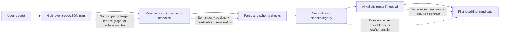
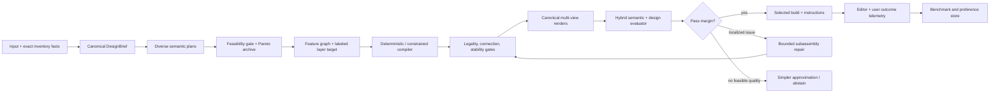

# LEGO Generation Quality Ceiling: Evidence-Backed Diagnosis and Improvement Program

Research date: 2026-07-17
Project: HackThe6ix inventory-constrained LEGO-style generator
Evidence base: live repository inspection, the verified project snapshot, and nine independently researched evidence tracks. External conclusions prioritize direct brick-generation and assembly research; adjacent evidence is used only where direct evidence is incomplete.

## 1. Executive diagnosis

The system has not primarily hit a **legality ceiling** or a proven **17-shape ceiling**. It has hit an **objective, representation, and search ceiling**.

The current pipeline is quite capable of returning schema-valid, inventory-valid, connected stacks. That is exactly what its deterministic feedback measures. It does not independently score whether a result resembles the requested object, realizes the selected suggestion's defining features, has good proportions, uses color intentionally, or looks like a crafted design. A pipeline cannot reliably optimize qualities that never become a selection or repair signal.

The second bottleneck is the transition from intent to geometry. The suggestion flow throws away `inventory_reasoning` and passes only `prompt_metadata`; the structure plan remains mostly prose; and one placement response must simultaneously solve semantic interpretation, proportion, discrete 3D layout, inventory allocation, support, connectivity, and long JSON serialization. Direct brick-generation research points toward connection-aware sequential or graph representations, explicit geometric targets, and verifier-guided rollback—not unconstrained one-shot pose sequences. [BrickNet](https://openaccess.thecvf.com/content/CVPR2026/html/Kulits_BrickNet_Graph-Backed_Generative_Brick_Assembly_CVPR_2026_paper.html), [BrickGPT](https://openaccess.thecvf.com/content/ICCV2025/html/Pun_Generating_Physically_Stable_and_Buildable_Brick_Structures_from_Text_ICCV_2025_paper.html), and earlier [constructable brick-sculpture work](https://diglib.eg.org/items/82e2ee53-fa57-4929-ac81-85acd0d9f855) all separate target/representation, legality, and physical or sequential checks more strongly than the current pipeline.

The highest-leverage next move is therefore not a blind model swap. It is to establish a small trustworthy quality benchmark, preserve a canonical design brief through every stage, and test whether a small pool of distinct plans contains better builds that a calibrated multi-view scorer can select. In parallel, instrument the Backboard tool trajectory and run a fixed-model native Gemini control. These tests identify how much quality is available without a rewrite and whether the longer-term target should be a hybrid semantic planner plus deterministic/search-based compiler.

### Ranked root causes

| Rank | Root cause | Confidence | Expected impact | Why it ranks here |
|---:|---|---|---|---|
| 1 | No trustworthy semantic/design-quality objective or benchmark | High | Very high, both flows | Legality already passes frequently while users remain dissatisfied; no current stage can reject a legal but bad design. |
| 2 | Lossy intent representation and raw one-shot coordinate placement | High | High, both flows | Important semantic state is prose or discarded, while exact placement carries too many coupled responsibilities in one long response. |
| 3 | Suggestion feasibility and continuity are not construction-grounded | High for mechanism; medium-high for lift | Very high for Problem A; medium for Problem B | Ideas are shown before any sketch/build is evaluated, and the selected reasoning is discarded. |
| 4 | One-candidate generation with no calibrated search, reranking, or local semantic repair | High for absence; medium for visual lift | Medium-high | Research shows candidate coverage can improve, but only a validated selector can turn coverage into product quality. |
| 5 | Stage/model/provider controls are under-measured and partly lost in translation | High for code facts; low-medium for causal contribution | Moderate reliability; low direct aesthetic impact | Flash-Lite is used for feasibility-sensitive stages, Backboard converts native schema to text, and tool trajectories are hidden; none is yet proven to cause the visual ceiling. |

**Catalog expressivity is a real constraint, but not yet a ranked root cause.** The existing deterministic car and daisy fixtures already demonstrate recognizable composition with the same rectangular catalog. The only defensible ceiling test is a same-inventory comparison against skilled or deterministic reference builds. BrickGPT also demonstrates broad object generation with a restricted eight-brick vocabulary, although its data, sizes, and construction assumptions differ materially from this product.

### Top three actions to start with

1. Freeze a 24-case diagnostic suite, add complete end-to-end outcome telemetry, and collect the first blinded pairwise quality baseline.
2. Introduce a persistent `DesignBrief` with stable feature IDs, feasibility claims, feature anchors, proportion bands, color/part budgets, and relaxation priorities; pass it through suggestion, planning, placement, repair, logs, and export.
3. Run two bounded offline tests: N=4 diverse semantic plans with human-oracle versus automatic selection, and Backboard versus native Gemini under the same model, prompt, inventory, schema, and tool outputs.

## 2. Current-system failure map

### Problem A: inventory-driven suggestions

```mermaid
flowchart LR
    I["Confirmed inventory"] --> S["One-pass suggestion call"]
    S --> O["Up to five prose ideas"]
    O --> C["User selects idea"]
    C --> L["Only prompt_metadata survives"]
    L --> P["Fresh structure plan"]
    P --> X["One-shot exact coordinates"]
    X --> V["Legality validation and repair"]
    V --> R["Rendered result"]

    S -. "No diversity history" .-> O
    S -. "No provisional build or feasibility gate" .-> O
    O -. "inventory_reasoning discarded" .-> L
    P -. "No stable feature IDs or geometric anchors" .-> X
    R -. "No semantic or design score" .-> V
```

The suggestion case fails because the system controls the noun but does not control the **design opportunity**. It asks a language model for plausible-sounding objects, not for a diverse set of construction-grounded concepts. Inventory fit is asserted in prose; impossible affordances can survive; and no provisional layer sketch, feature graph, part allocation, or quick build is scored before display. Repeated examples in the prompt and no cross-refresh archive further encourage common objects.

The selected build then drifts because the only persistent artifact is a user-ready sentence that was intentionally stripped of dimensions, piece counts, specific parts, and construction detail. The exact inventory rationale, feature feasibility, and intended approximation strategy vanish. The downstream planner reinterprets the idea, and placement reinterprets it again. There is no stable ID connecting “mug handle,” “hydrant side nozzles,” or “bench backrest” to a geometric region or final bricks.

### Problem B: direct user requests

Direct requests remove the ideation problem but retain the shared bottlenecks: weak geometric intent, overloaded coordinate emission, one candidate, legality-only acceptance, and global repair. This explains the observed pattern of technically valid but simplistic stacked masses. A stronger model can improve feature recall or spatial consistency, but it remains asked to maintain long hidden state without a quality-aware search loop.

### What is created, lost, and never measured

| Stage | Information created | Information lost or weakened | Missing evaluation |
|---|---|---|---|
| Suggestion | Label, prompt metadata, inventory rationale | Rationale and feasibility are discarded at click; no persistent candidate ID/brief | Novelty, cross-refresh diversity, build feasibility, expected final quality |
| Structure | Required features, budgets, prose strategy | No machine-checkable anchors, envelope, occupancy, symmetry, or dependency graph | Plan feasibility, feature completeness, internal contradictions |
| Placement | Exact bricks and coordinates | Semantic intent becomes free-form `feature` strings; no protected region/subassembly state | Resemblance, proportion, silhouette, feature realization |
| Validation | Strong legality diagnostics | “Valid” is easily mistaken for “good” | Aesthetics, creativity, semantic fidelity, assembly sequence, handling robustness |
| Repair | Can remove illegal inventory and rewrite invalid geometry | Full-model rewrite can regress good regions; no feature locks or edit radius | Targeted improvement, regression, edit locality |
| Product | Render and editor actions | No joined run-to-user-outcome record | Acceptance, regeneration, edits, abandonment, build completion |

## 3. Root-cause matrix

| Suspected cause | Project evidence | External evidence | Confidence | A/B impact | Smallest discriminating experiment | Confirmation / weakening result |
|---|---|---|---|---|---|---|
| Missing quality evaluator | Validator checks legality only; valid outputs remain disliked | Text-to-3D evaluation separates quality and alignment; TIFA-style decomposed questions expose missing features. [T3Bench](https://arxiv.org/abs/2310.02977), [TIFA](https://openaccess.thecvf.com/content/ICCV2023/html/Hu_TIFA_Accurate_and_Interpretable_Text-to-Image_Faithfulness_Evaluation_with_Question_Answering_ICCV_2023_paper.html) | High | Both | Rank fixed legal candidate pools with deterministic metrics, calibrated VLM, and blinded humans | Confirmed if calibrated ranking beats first-sample selection; weakened if human-oracle selection finds no better candidate. |
| Lossy semantic handoff | `inventory_reasoning` discarded; no feature IDs/anchors | Graph/program representations retain relational structure and editability. [BrickNet](https://openaccess.thecvf.com/content/CVPR2026/html/Kulits_BrickNet_Graph-Backed_Generative_Brick_Assembly_CVPR_2026_paper.html), [ShapeAssembly](https://arxiv.org/abs/2009.08026) | High | A very high; B medium | Current text vs text+rationale vs canonical brief, fixed downstream models | Confirmed by at least 10-point feature-retention lift from the brief. |
| Raw one-shot coordinates | Placement handles semantics, packing, inventory, legality, and serialization in one response | Direct brick work uses connection graphs, sequential checks, rejection, rollback, or explicit target geometry. [BrickGPT](https://openaccess.thecvf.com/content/ICCV2025/html/Pun_Generating_Physically_Stable_and_Buildable_Brick_Structures_from_Text_ICCV_2025_paper.html), [BrECS](https://openreview.net/forum?id=0mRfQOnkqk) | High mechanism; medium best replacement | Both | Prose/raw coordinates vs typed brief + layer target + deterministic/checking compiler | Confirmed by higher feature coverage, prefix survival, and preference under equal model/cost. |
| No search/candidate selection | One suggestion response, one plan, one placement; valid first sample returns | Repeated sampling improves coverage, while proxy selection and majority voting can plateau or regress. [Large Language Monkeys](https://arxiv.org/abs/2407.21787), [reward overoptimization](https://arxiv.org/abs/2210.10760) | High absence; medium quality lift | Both | N={1,2,4,8} per stage; measure oracle pass@N and automatic selection@N separately | Confirmed if pass@4 rises >=15 points and selector captures >=70% of the human-oracle gain. |
| Underpowered/misallocated models | Flash-Lite handles suggestion and structure; no stage isolation benchmark | Frontier models remain imperfect on 3D/spatial tasks; model capability spread is real. [Gemini 3.5 Flash card](https://deepmind.google/models/model-cards/gemini-3-5-flash/), [3DSRBench](https://openaccess.thecvf.com/content/ICCV2025/papers/Ma_3DSRBench_A_Comprehensive_3D_Spatial_Reasoning_Benchmark_ICCV_2025_paper.pdf) | Medium | Both | Freeze upstream artifacts and swap one stage/model/thinking level at a time | Confirmed by >=10-point legal-and-semantic or feature-recall lift; weakened if gains are mostly prose/schema. |
| Provider/tool translation | Schema becomes prompt text; inline inventory becomes optional retrieval; tool trace absent | Native Gemini supports schema and tools; multi-turn tool use remains fragile. [Gemini structured output](https://ai.google.dev/gemini-api/docs/structured-output), [BFCL](https://proceedings.mlr.press/v267/patil25a.html) | High facts; low causal confidence | Primarily reliability | Instrument 100 Backboard traces; fixed-model Backboard/native factorial | Confirmed by skipped/wrong retrieval, unheeded validation, or >=10-point native lift; weakened by complete traces and no outcome gap. |
| 17-shape catalog | Only rectangular bricks/plates, but strong deterministic fixtures exist | Restricted brick vocabularies can still produce diverse objects; broader catalogs add connection complexity | Unknown contribution | Both, object-family dependent | Skilled same-inventory references, then one-family-at-a-time expansions | Catalog is dominant only if human-reference gap is small and added families yield >=10 preference/feature points. |

Facts above come from the live code, verified snapshot, official documentation, or published experiments. Claims about which intervention will improve this exact product remain proposals until the specified paired tests are run.

## 4. Research synthesis

### The most transferable direct evidence

- **BrickGPT** shows that structured brick generation benefits from rejecting invalid actions and rolling back to a stable prefix. Its ablation separates basic validity from physical stability, demonstrating that one validator cannot stand in for all quality dimensions. The transfer is strong for incremental checking and rollback, but its training data, part vocabulary, and model sizes do not match this exact 17-shape inventory setting.
- **BrickNet** argues that relative typed connections are a better generative primitive than long absolute-pose sequences. It also shows that improved likelihood does not automatically produce better perceptual text alignment. The transfer is strong for connection-aware representations and separate perceptual evaluation; it is weaker for exact inventory conditioning, which the work identifies as unfinished.
- **Constructable brick-sculpture and budget-aware assembly systems** demonstrate that inventory/type constraints, connectivity, weak-point repair, color, and building instructions can be handled algorithmically when an explicit target exists. The key lesson is not “use a solver”; it is “give the solver a geometric/semantic target and keep hard constraints separate from perceptual objectives.”
- **Test-time search research** shows that more samples expand coverage, but selection becomes the bottleneck in non-verifiable domains. LEGO legality is executable; resemblance and craftsmanship are not. Best-of-N is therefore worthwhile only after measuring the gap between human-oracle and automatic selection.
- **Text-to-3D and faithfulness evaluation** supports canonical multi-view rendering and decomposed feature questions, but generic VLM or embedding scores require LEGO-specific calibration. A front-view-only score can reward a flat facade, and a prompt-aware judge can be gamed by labels or color cues.

### What does not transfer cleanly

- Large public LDraw or unrestricted-part corpora do not directly match small, exact-inventory, 17-shape builds. Part-set overlap, model size, official-set bias, unsupported connections, collision cleanup, licensing, and near-duplicate geometry must be audited.
- Math/code test-time compute has exact verifiers; LEGO aesthetics do not. Its coverage/selection distinction transfers, but reported pass@N gains do not predict visual-quality gains.
- Generic text-to-image metrics can detect missing colors or features but do not understand clutch, support, negative-space construction, or whether a detail is achieved with legal bricks.
- A global CP-SAT/MILP formulation does not create taste. Without semantic envelopes and a calibrated objective, it will return legal, compact, generic masses more consistently.

### Evidence-backed conclusion

The durable direction is a **hybrid pipeline**: AI owns open-ended interpretation, approximation choices, semantic features, and high-level geometric intent; deterministic code or checked search owns exact inventory, legal placements, connection constraints, and reproducibility; a separately calibrated evaluator owns candidate selection; local repair operates on named subassemblies and protected features.

## 5. Near-term improvement plan

### Within 48 hours

1. **Freeze a diagnostic suite.** Start with 24 prompt-inventory cases: 12 inventory-suggestion cases and 12 direct requests. Include easy iconic objects, proportion-sensitive objects, negative-space objects, symmetric animals/vehicles, color-dependent objects, and deliberate out-of-distribution requests. Run three baseline repeats per case.
2. **Join the lifecycle in telemetry.** Add `run_manifest`, `final_result`, `quality_scores`, `experiment_assignment`, `user_outcome`, and `edit_summary` events keyed by run/case/inventory/prompt/model/prompt-version/schema/renderer versions. Log candidate lineage, tool calls, validator inputs/results, repair diffs, tokens, latency, and cost.
3. **Define the first human rubric and render harness.** Fixed transparent-background RGB/mask renders from front, rear, left, right, top, and four upper-isometric views. Score recognizability, required features, silhouette, proportions, 3D depth, color blocking, detail economy, creativity, visible defects, and preference.
4. **Create same-inventory anchors.** Use the current deterministic car and daisy plus at least six new skilled builds across object families. They are lower-bound anchors, not universal gold answers.
5. **Instrument Backboard tool rounds before blaming the provider.** Record retrieval and validation calls, candidate hashes, outputs, and post-tool revisions. Fail the trace assertion if a placement finalizes without exact inventory grounding or validation of the precursor candidate.

### Within one to two weeks

1. **Add a canonical `DesignBrief`.** Required fields: stable `brief_id`; object and approximation policy; required/optional feature IDs; human-readable visual tests; anchor/envelope ranges; symmetry/proportion relations; dominant/accent color budgets; part-category budgets; target count; allowed fallbacks; forbidden affordances; and provenance from inventory facts.
2. **Make suggestion generation construction-aware.** Generate 12–20 cheap ideas, deduplicate by object family and silhouette descriptors, feasibility-check 6–8, require a coarse feature/layer sketch for finalists, and show five non-dominated candidates. Preserve the selected brief unchanged downstream.
3. **Run N=4 at the plan stage, not four expensive placements.** Keep two or three semantically distinct plans after hard feasibility gates; place only the best one or two. Measure oracle pass@N separately from automatic selection.
4. **Add a calibrated hybrid scorer.** Legality is a gate. Ranking uses weighted feature coverage, anchor error, silhouette/proportion/color measures, structural margin, human-calibrated multi-view judgment, diversity, and cost. Keep dimensions visible rather than collapsing them prematurely.
5. **Run provider/model factorial tests.** Backboard vs native Gemini; inline inventory vs forced retrieval; prompt-only schema vs native schema; Flash-Lite vs 3.5 Flash/Pro-class at one stage at a time. Hold everything else fixed.
6. **Change repair from rewrite to bounded issue resolution.** Critique emits issue objects with feature ID, region, view evidence, severity, confidence, protected invariants, edit radius, and brick budget. Accept only if the target improves, legality holds, protected scores do not regress, and unrelated-brick changes stay within budget.

### Expected signal, ceiling, cost, and rollback

| Change | Expected signal | Likely ceiling | Latency/token effect | Rollback criterion |
|---|---|---|---|---|
| Canonical brief | +10 points required-feature retention and suggestion/build agreement | Does not solve placement by itself | Small-to-moderate prompt growth | Two controlled replications fail to gain 5 preference points |
| Diverse feasibility-gated suggestions | Higher feasible precision and menu preference; fewer repeated families | Cheap sketches may weakly predict final geometry | More cheap planning calls; fewer wasted placements | Feasibility score fails to correlate with final preference |
| Native schema/provider control | Fewer parse/repair calls; more reliable grounding | Does not create aesthetics | Likely lower repair cost; provider-specific code | No reliability/cost benefit and no semantic lift in fixed-model A/B |
| N=4 semantic plans | Higher oracle pass@N and human-selected quality | Saturates if candidates are correlated or scorer is weak | Roughly 2–4x planning, not placement | Pass@4 gain <15 points or selector captures <70% of oracle gain |
| Multi-view scorer | Better candidate selection and localized diagnosis | Cannot rescue absent candidate quality | One render set + critic per finalist | Human agreement <75% or mutation tests reveal systematic gaming |
| Local repair | Higher defect fix rate with feature preservation | Local optimum; may need replan | Bounded extra pass | New-defect rate >10% or unrelated-brick median change >10% |

## 6. Longer-term architecture options

| Architecture | Semantic fidelity | Visual potential | Legality | Effort | Runtime cost | Data need | Main failure mode |
|---|---|---|---|---|---|---|---|
| Improved all-LLM stages | Medium | Medium | Medium-high with existing validator | Low-medium | Medium-high with candidates/critique | Internal benchmark and preferences | Correlated raw-coordinate failures; expensive global repair |
| **Semantic planner + deterministic/search compiler** | **High if brief/targets are strong** | **High with calibrated objective** | **High by construction** | **High** | **Controllable/anytime** | Reference briefs, targets, objective calibration | Legal but ugly optima; solver domain explosion |
| Candidate generation → render → critique → refine | High when coverage exists | High | High after gates | Medium-high | Highest | Human-calibrated multi-view preferences | Proxy gaming and latency |
| Domain-adapted graph/sequential brick generator | Medium-high | Potentially high | High with connection-aware decoding/rollback | Very high | Medium after training | Large licensed, normalized, inventory-conditioned corpus | Dataset mismatch and weak novel-object generalization |

The recommended target is the second architecture with a bounded portion of the third: a semantic/occupancy/connection compiler, followed by multi-view selection and at most one or two locality-constrained repairs. Keep an improved all-LLM path as the near-term baseline and fallback. Defer domain training until retrieval, search, and representation ablations establish residual value and a de-duplicated learning curve justifies the data cost.

## 7. Proposed target pipeline

| Stage | Produced artifact and contract | Persisted facts | Authority |
|---|---|---|---|
| Inventory normalization | Versioned inventory snapshot and digest | Part/color counts, dimensions, catalog version, confidence | Deterministic application |
| Intent | `DesignBrief` | Feature IDs, priority, visual tests, approximation rules, color/part budgets, proportion/symmetry constraints | AI authored, schema/feasibility checked |
| Candidate planning | 3–4 semantic plans | Feature graph, subassemblies, envelopes, anchors, dependency DAG, relaxation order | AI + deterministic consistency checks |
| Coarse geometry | Labeled layer/occupancy target | Required/preferred/empty cells, negative space, feature ownership | AI or retrieval, checked against bounds |
| Compilation | Legal candidate placements | Exact inventory allocation, connection edges, steps, objective vector | CP-SAT/constrained beam/procedural search |
| Hard validation | Validation record | Grid, overlap, counts, support, connectivity, connection semantics; later stability/accessibility | Deterministic authority |
| Visual evaluation | Canonical render bundle + score vector | Feature evidence by view, silhouette/proportion/color metrics, critic confidence | Deterministic metrics + calibrated model/human |
| Repair | Issue object + bounded patch | Protected features, edit radius, changed bricks, before/after scores | Search/AI under deterministic gates |
| Selection | Candidate decision record | All candidate scores, rejection reasons, selection margin, cost | Versioned policy |
| Feedback | User outcome/edit trace | Accept, regenerate, edit burden, abandonment, physical build feedback | Product telemetry with privacy controls |

For a fire hydrant, the brief might define a red central body envelope, two side-nozzle anchors mirrored about the centerline, a darker ground-contact base, a top-cap silhouette target, and explicit rectangular approximations for cylindrical features. The compiler can satisfy counts/support; the evaluator can ask whether both side nozzles are visibly distinct in left/right/isometric views; local repair can modify only the nozzle subassembly.

For a coffee mug, the handle must be represented as a required negative-space feature with two attachment anchors and a visible opening, not merely the word “handle.” If the inventory cannot support that geometry, the suggestion should be rejected or downgraded before display.

## 8. Evaluation and benchmark plan

### Offline benchmark

- **Phase 0 diagnostic:** 24 cases × 3 repeated generations for the current baseline. Twelve suggestion cases use varied inventories; twelve direct cases cover iconic, proportion-sensitive, symmetric, negative-space, color-dependent, and hard/OOD objects.
- **Phase 1 paired benchmark:** 60 prompt-inventory cases, balanced 30/30 across flows and stratified by inventory scarcity, shape mix, color scarcity, object family, symmetry, negative space, and target size. Use at least two independent generations per arm and analyze at the case level.
- **Human evidence:** target at least 120 independent paired comparisons per major decision, with three blinded ratings per comparison where feasible. Report majority preference, ties, case-cluster bootstrap intervals, and slice results. Do not count seeds or multiple judges on the same case as fully independent samples.
- **Reference ceiling:** two skilled builders and one deterministic/programmatic baseline on a smaller 6-inventory × 6-object-family subset using identical inventories, caps, and legality rules.
- **Holdouts:** keep object families, source geometries, and near-duplicates together. Maintain a hidden holdout for evaluator and prompt decisions.

### Metrics by authority

| Dimension | Automatic | Model-assisted | Human |
|---|---|---|---|
| Legality/inventory | Exact validator pass; error types; removed pieces | Not authoritative | Audit false accepts/rejects |
| Feature fidelity | Feature-tag coverage; anchor/envelope error | Multi-view feature questions with evidence | Blinded feature rubric |
| Silhouette/proportion | Masks, IoU to target/reference where available, axis ratios, symmetry difference | Multi-view comparison | Pairwise quality and recognizability |
| Color/detail | Region-level color distribution; distinct feature regions | View-grounded color/detail questions | Intentionality/craftsmanship rubric |
| Creativity/diversity | Object-family/descriptor distance; within-batch duplicate rate | Novelty explanation, not final authority | Menu preference and “would build” judgment |
| Buildability | Current hard checks; contact count; weak cuts; CoM heuristics | Diagnose but do not certify | Physical build completion, collapse, step difficulty |
| Product outcome | Acceptance, regeneration, edit distance/time, abandonment | Summarize edit patterns | User preference/interview |
| Efficiency | End-to-end and stage latency, tokens, cost, candidates, repair passes | — | Wait-time tolerance |

### Prevent evaluator gaming

- Hide exact aggregate weights from generation and keep prompt-blind evaluation variants.
- Use all canonical views; include adversarial legal masses, favorable-front-view facades, swapped feature labels, excess color match, and symmetry-without-resemblance negatives.
- Calibrate every automatic/VLM metric against blinded human pairs and report proxy-human divergence as N increases.
- Keep legality, semantic fidelity, and design quality as separate score dimensions and Pareto gates.
- Audit the top-scoring gains on a frozen hidden holdout before promotion.

### Online evaluation

Ship only variants that first win offline. Randomize eligible sessions with sticky assignment, log exposure, and measure suggestion selection, final acceptance, regeneration, edit burden, abandonment, latency, and cost. Estimate traffic and baseline variance before fixing a minimum detectable effect. Use precommitted stopping or always-valid sequential inference rather than repeatedly peeking at ordinary p-values. [Always Valid Inference](https://arxiv.org/abs/1512.04922)

## 9. Controlled experiments

| Experiment | Changed variable | Fixed variables | Dataset/scoring | Cost | Success threshold | Decision enabled |
|---|---|---|---|---|---|---|
| Stage-model allocation | Flash-Lite vs 3.5 Flash thinking levels vs Pro-class, one stage at a time | Cached upstream artifact, provider, schema, tools, candidates, evaluator | 60 cases; feature recall, legal+semantic pass@1, human preference | Medium | >=10-point lift or >=15-point preference at acceptable stage cost | Route model classes by stage/difficulty |
| Suggestion search | Current one-pass prompt vs 12–20 ideas + dedupe + feasibility gate | Inventory, downstream builder, displayed count | Suggestion benchmark; feasible precision, family diversity, menu preference | Low-medium | >=10-point feasibility and menu preference; lower duplicate rate | Replace one-pass suggestions |
| One vs best-of-N | N=1 vs N={2,4,8} at idea, plan, or placement | Model, prompts, total-stage controls, scorer | Oracle pass@N and automatic selection@N | Medium-high | pass@4 +15 points; selector captures >=70% of oracle gain | Choose stage and N; reject search if coverage absent |
| Disposable vs persistent intent | `prompt_metadata` only vs +rationale vs canonical brief | Selected idea, model, inventory, candidate count | 50–60 cases; weighted feature retention, anchor match, preference | Low | >=10-point feature lift and 60% preference | Adopt/iterate DesignBrief contract |
| Representation ablation | Prose/raw coordinates vs feature graph vs labeled layer map vs hybrid | Model, inventory, one candidate, target budget | 60 cases plus 20 oracle targets; feature/anchor/silhouette/prefix survival | High | >=10-point features or 15% silhouette; 60% preference | Commit to intermediate representation/compiler |
| Visual critic | No critic/first legal vs multi-view hybrid winner | Fixed pool of four legal candidates | Mutation suite + 60 cases; human agreement and preference | Medium | >=75% judge agreement; selected build 60% preferred | Enable production reranking/repair |
| Provider path | Current Backboard vs native Gemini; factorial schema/inventory transport | Same model ID, translated content, tools/results, thinking/output cap | 100 traces + 60 outcome cases | Medium | Trace >=99%; native gives >=10-point semantic/reliability or clear cost gain | Keep, fix, or replace adapter |
| Catalog expansion | Current 17 vs one added family at a time | Total pieces/colors, prompt, model, search budget | Same-inventory reference subset; preference/features/legality | Medium | Family +10 preference and feature points, <=2 legality loss | Evidence-based catalog roadmap |
| AI vs skilled/reference ceiling | Current AI vs deterministic baseline vs two skilled builders | Exact inventories, prompts, caps, validator | 6 inventories × 6 families; blinded pairs and feature coverage | Medium | References win >=65% with interval lower bound >50% | Decide whether current catalog has major algorithmic headroom |

Run the experiments in dependency order: telemetry/benchmark → intent continuity → candidate selection and critic calibration → model/provider factors → representation/compiler → catalog expansion/data/training. Best-of-N without a selector and a selector without human calibration are deliberately blocked.

## 10. Ranked roadmap

| Rank | Recommendation | Problem addressed | Evidence/rationale | Expected quality impact | Effort | Runtime/token cost impact | Dependencies | Principal risk | Validation experiment | Measurable success criterion |
|---:|---|---|---|---|---|---|---|---|---|---|
| 1 | Freeze benchmark + joined telemetry | All; prevents false progress | Current logs stop at AI calls and legality | Very high decision leverage | Low-medium | Minimal | None | Bad rubric/harness | Baseline instrumentation audit | >=95% joined runs; exact versions on 100% |
| 2 | Persistent canonical DesignBrief | Suggestion drift; weak direct plans | Intent/rationale currently discarded or prose-only | High | Medium | Small prompt increase | Benchmark | Over-specified briefs reduce creativity | Three-arm continuity test | +10 points feature retention; 60% preference |
| 3 | Calibrated multi-view evaluator | Legal-but-bad acceptance | Direct 3D evaluation separates alignment/quality; current system has neither | High selection/diagnosis | Medium | Render + critic for finalists | Human rubric, fixed views | Proxy gaming | Mutation and human-agreement test | >=75% agreement; detects all required-feature ablations |
| 4 | Diverse feasibility-gated suggestion/plan search | Repetition and one-candidate ceiling | Diversity/search only helps with gates and scorer | Medium-high | Medium | More cheap plans; bounded placements | 2, 3 | Correlated samples | pass@N/selection-gap test | pass@4 +15; selector captures >=70% gain |
| 5 | Full Backboard tool trace + native fixed-model control | Unknown grounding/schema loss | Adapter drops native controls and hides trajectories | Moderate reliability | Medium | Possibly lower repairs/latency | 1 | Confounded comparison | Provider factorial | >=99% trace; clear reliability/cost/semantic decision |
| 6 | Stage-specific model routing | Flash-Lite feasibility/planning limits | Capability classes differ; general spatial reasoning remains imperfect | Moderate | Low-medium | Adaptive rather than universal increase | 1, 3 | Paying for eloquence rather than geometry | Stage-isolated model A/B | >=10-point stage metric lift at bounded cost |
| 7 | Bounded local semantic repair | Global rewrite/regression | Direct brick work supports rollback; current repair lacks protected regions | Medium | Medium | One bounded extra pass | 2, 3 | Local repair cannot escape bad plan | Injected-defect test | >=70% fixes, <10% new defects, 50% fewer unrelated changes |
| 8 | Hybrid feature/layer target + constrained compiler prototype | Raw-coordinate bottleneck | Brick/assembly systems separate target from legal construction | Very high long-term | High | Anytime solver/search; fewer AI repairs | 2, benchmark/reference targets | Legal but ugly optima; domain explosion | Oracle-target representation/solver ablation | 60% preference; >=95% feasible-target legality |
| 9 | Same-inventory ceiling study and one-family expansions | Unknown catalog contribution | Existing fixtures show headroom; restricted vocabularies can work | High diagnostic | Medium | Offline only | 1, skilled references | Reference-builder bias | AI/reference + marginal family tests | Reference gap and >=10-point family threshold |
| 10 | Retrieval/data learning curve, then possible domain adaptation | Reusable design knowledge | Public data is large but mismatched/licensing-sensitive | Potentially high, uncertain | High-very high | Lower inference after training; data cost high | 8, normalized corpus, holdout | Leakage, license, mismatch | Retrieval then de-duplicated learning curve | >=5-point held-out-family gain beyond retrieval/search |

## 11. Anti-roadmap

- **Do not swap every stage to the newest or most expensive model.** Freeze the harness and isolate one stage; stop if gains are schema/prose-only or below the quality threshold.
- **Do not keep rewriting prompts without a held-out benchmark and prompt version IDs.** Two controlled replications below a 5-point preference lift should deprioritize the idea.
- **Do not launch four expensive placements from the same weak plan.** First measure plan-stage oracle pass@N and scorer selection.
- **Do not use deterministic legality as a ranker.** It is a gate and already fails to predict satisfaction.
- **Do not install a vision critic as an oracle.** Require canonical views, feature-level evidence, mutation stress tests, human calibration, and proxy-divergence monitoring.
- **Do not build a monolithic 100-piece SAT/MILP solver over an unbounded grid.** Bound features, subassemblies, envelopes, and candidate placements first.
- **Do not add many specialty parts at once.** Skilled same-inventory references and one-family marginal tests must show where the actual ceiling lies.
- **Do not fine-tune on unrestricted LDraw or captions split independently of source geometry.** Normalize part identities/connections, audit licenses, cluster near-duplicates, and show a held-out learning curve beyond retrieval/search.
- **Do not add memory as an inventory-grounding fix.** Inventory is authoritative application state; inject or force-retrieve it and trace the result.
- **Do not allow unbounded global repair.** Localize the first failing feature/subassembly, cap attempts, protect accepted features, and require score improvement.

## 12. Sources, uncertainty, and confidence

### Most important sources

- [BrickNet: Graph-Backed Generative Brick Assembly, CVPR 2026](https://openaccess.thecvf.com/content/CVPR2026/html/Kulits_BrickNet_Graph-Backed_Generative_Brick_Assembly_CVPR_2026_paper.html)
- [Generating Physically Stable and Buildable Brick Structures from Text (BrickGPT), ICCV 2025](https://openaccess.thecvf.com/content/ICCV2025/html/Pun_Generating_Physically_Stable_and_Buildable_Brick_Structures_from_Text_ICCV_2025_paper.html)
- [Budget-Aware Sequential Brick Assembly with Efficient Constraint Satisfaction](https://openreview.net/forum?id=0mRfQOnkqk)
- [Automatic Generation of Constructable Brick Sculptures](https://diglib.eg.org/items/82e2ee53-fa57-4929-ac81-85acd0d9f855)
- [Brick-by-Brick: Combinatorial Construction with Deep Reinforcement Learning](https://proceedings.neurips.cc/paper/2021/hash/2d4027d6df9c0256b8d4474ce88f8c88-Abstract.html)
- [T3Bench](https://arxiv.org/abs/2310.02977) and [TIFA](https://openaccess.thecvf.com/content/ICCV2023/html/Hu_TIFA_Accurate_and_Interpretable_Text-to-Image_Faithfulness_Evaluation_with_Question_Answering_ICCV_2023_paper.html)
- [Large Language Monkeys](https://arxiv.org/abs/2407.21787) and [Scaling Test-Time Compute Optimally](https://proceedings.iclr.cc/paper_files/paper/2025/hash/1b623663fd9b874366f3ce019fdfdd44-Abstract-Conference.html)
- [Gemini structured outputs](https://ai.google.dev/gemini-api/docs/structured-output), [function calling](https://ai.google.dev/gemini-api/docs/function-calling), and [release notes](https://ai.google.dev/gemini-api/docs/changelog)
- [Backboard message/tool documentation](https://docs.backboard.io/concepts/messages)
- [Berkeley Function Calling Leaderboard](https://proceedings.mlr.press/v267/patil25a.html)
- [LDraw contributor and parts-library policies](https://www.ldraw.org/docs-main/licenses/ldraw-org-contributor-agreement.html)

### Unresolved questions

- How often does the current Backboard path actually retrieve inventory, validate a candidate, and revise after tool feedback?
- Does the current model distribution already contain materially better plans/builds at N=4, and can a calibrated selector recover them?
- How much of the AI-to-human gap disappears when intent is supplied as a skilled canonical brief?
- Which intermediate representation gives the best fidelity/cost tradeoff for this catalog: feature graph, sparse layer target, or hybrid?
- How large is the skilled same-inventory reference gap, and which object families are genuinely shape-limited?
- Do cheap stability/contact heuristics predict real physical build failures well enough to justify a more detailed force model?

### Confidence assessment

Confidence is **high** that legality is not a quality proxy, that the suggestion handoff loses important intent, that the current system lacks candidate-quality selection, and that provider/tool behavior is insufficiently observable. Confidence is **medium-high** that a persistent brief plus calibrated plan search will produce meaningful near-term lift. Confidence is **medium** that the recommended hybrid representation/compiler is the best long-term implementation; the representation and oracle-target experiments must choose among credible variants. Confidence is **low** in any claim that a particular model, provider, added shape family, or dataset will solve the ceiling without the controlled measurements above.

Date-sensitive provider/model claims were researched as of 2026-07-17 and should be reverified before implementation. The evidence catalog below retains item-level sources, transfer limits, experiments, costs, and uncertainties.
